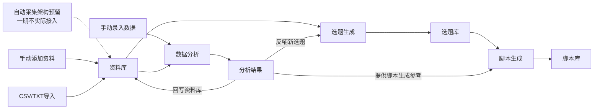
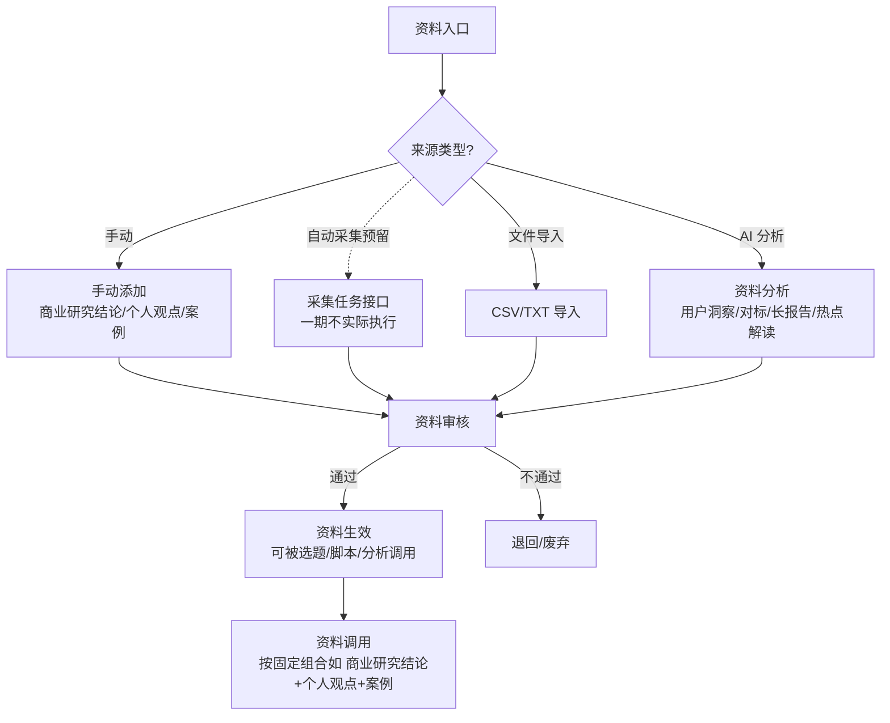
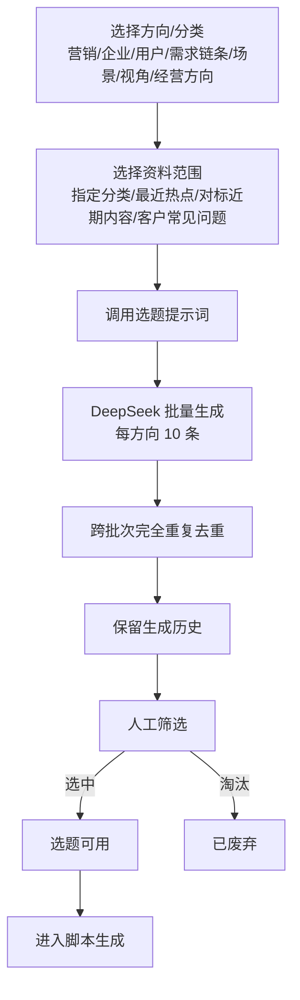
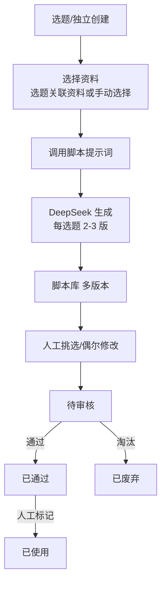
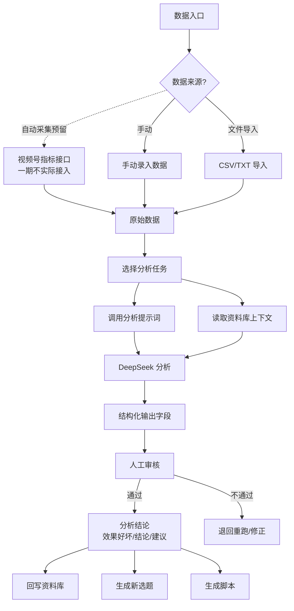

# 核心业务流程

> 状态：✅ 已确认主流程；细节待确认项已标注
> 权威层级：context/ > templates/ > prd-docs/

## 1. 总体业务闭环

## 2. 资料库业务流程

规则：

- 资料必须审核后才能使用（已确认）；
- 有效期起止和可信度都需要记录（已确认）；
- 来源链接视情况记录（已确认）；
- 资料调用按提示词固定组合（如 商业研究结论 + 个人观点 + 案例）（已确认）。
- 标签一期自由创建，标签组可选、不强制分组（D1）；
- 一期资料通过手动添加或 CSV/TXT 导入；自动采集仅预留架构，不执行采集任务（D5）；未来启用时采用人工触发，不做定时任务（D2）。

## 3. 选题生成流程

规则：

- 批量生成，每方向 10 条（已确认）；
- 可重复执行，保留历史记录（已确认）；
- 一期仅做完全重复去重，语义相近不自动合并；语义去重二期（D3）；
- 必须人工筛选后才能使用（已确认）；
- 判断"可以用"由人工决定（已确认）；
- 选题状态：待筛选、已生成脚本、已废弃（已确认）。

## 4. 脚本生成流程

规则：

- 每选题生成 2-3 版供挑选（已确认）；
- 脚本语言风格：专业严谨/轻松口语/讲故事（已确认）；
- 内容要素：案例、数据、个人观点都需要（已确认）；
- 人工偶尔修改（已确认）；
- 正式状态：待审核、已通过、已使用、已废弃；已使用由人工从已通过标记（D4）；
- ✅ 脚本生成规则（4.1 已确认）：**正常情况必须基于选题，偶尔可独立创建**——选题是主来源，独立创建为辅助路径；
- ✅ 脚本与选题关联（3.13 已确认）：**基于选题创建时必须关联并显示选题；独立创建时选题允许为空，可后补关联**；调用哪些资料、哪个提示词版本为可选追溯；
- ✅ 脚本修改历史（4.10 已确认）：每次修改生成新版本，支持对比和回退；
- ✅ 一期脚本审核仅提供管理员审核入口和简单状态流转，不做完整审批流或多角色审核。

## 5. 数据分析流程

规则：

- 一期尚无视频号账号，以手动录入 + CSV/TXT 导入为主；自动采集仅保留架构扩展点，不纳入 MVP（D5）；
- 一期只实现基础录入、导入、分析框架和状态流转，不把具体指标维度作为验收条件；深度分析二期（D6）；
- 分析周期不固定（已确认）；
- 结果需要人工审核后才能使用（已确认）；
- 结果回写资料库 + 反哺新选题（已确认）。
- 评论和私信、热点、报告等文本作为资料时由资料库消费；账号指标进入数据分析原始数据，二者共用预留的数据源/任务扩展结构。

## 6. 待确认流程项汇总

首轮 7 项中的脚本主路径、追溯、修改历史、审核人、标签创建、数据来源策略和权限隔离已于 2026-08-24 确认，不再列为待确认。当前流程层仍需确认：

| 编号 | 事项 | 影响 |
|---|---|---|
| 1 | 选题直接进入脚本生成的判断标准（3.12） | 筛选交互 |
| 2 | 脚本固定结构（4.4） | 提示词与输出结构 |
| 3 | 二期具体账号指标字段（5.5/5.6） | 已移出一期验收；二期数据模型 |
| 4 | 现有固定表格格式（5.7） | 导入映射 |
| 5 | 二期最优先分析类型（5.15） | 已移出一期验收；二期分析模板优先级 |
