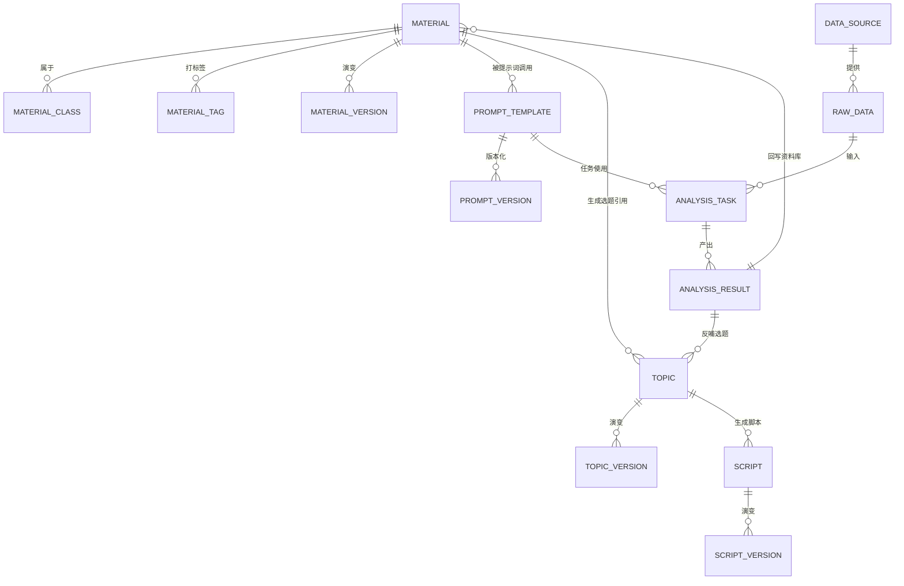

# 业务实体与关系

> 状态：✅ 实体已确认，关系以问卷结论为准；细节字段待确认处已标注
> 权威层级：context/ > templates/ > prd-docs/

## 1. 核心实体

## 2. 实体清单

### 2.1 资料库体系

| 实体 | 定义 | 创建者 | 来源 | 状态/审核 | 确认度 |
|---|---|---|---|---|---|
| 资料分类 | 资料类型分类（商业研究结论/案例包装/评论私信/个人观点/对标账号分析/相关热点） | 配置 | 问卷已确认分类 | - | ✅ |
| 资料条目 | 一条可被引用的资料内容 | 姐夫/指定成员/采集/AI | 手动/采集/导入/分析回写 | 审核后才能用 | ✅ |
| 资料标签 | 多维度标签（维度待确认） | 姐夫 | 手动 | - | ⚠️ 待确认 |
| 资料版本 | 资料修改历史/有效期/可信度 | 系统 | 自动 | - | ✅（有效期+可信度） |
| 资料来源 | 来源类型/链接 | 系统/手动 | 公众号/报告/社交媒体/客户沟通/思考/对标 | 视情况记录链接 | ✅ |

### 2.2 提示词体系

| 实体 | 定义 | 创建者 | 来源 | 确认度 |
|---|---|---|---|---|
| 提示词模板 | 选题/脚本/分析任务使用的提示词 | 姐夫配置 | 手动维护 | ✅（需求确认） |
| 提示词版本 | 提示词变更历史 | 系统 | 自动 | ⚠️ 建议保留，待确认 |

### 2.3 内容生产体系

| 实体 | 定义 | 创建者 | 来源 | 状态 | 确认度 |
|---|---|---|---|---|---|
| 选题 | 一篇文章内容方向 | AI生成+人工想法 | 批量生成/手动 | 待筛选/已生成脚本/已废弃 | ✅ |
| 选题版本 | 选题修改历史 | 系统 | 自动 | - | ⚠️ 待确认 |
| 脚本 | 一条可用的口播/内容脚本 | AI 生成 | 基于选题生成 | 待审核/已通过/已废弃 | ✅ |
| 脚本版本 | 每选题 2-3 版 + 修改历史 | AI/人工 | 生成/修改 | 供挑选 | ✅（2-3版）⚠️（历史待确认） |

### 2.4 数据与分析体系

| 实体 | 定义 | 创建者 | 来源 | 确认度 |
|---|---|---|---|---|
| 数据源 | 视频号自己账号/对标账号等 | 配置 | 自动采集/手动 | ✅ |
| 原始数据 | 播放/点赞/评论/粉丝等全量字段 | 采集/录入/导入 | 自动/手动/CSV | ✅ |
| 分析任务 | 一次分析执行（含提示词+资料上下文快照） | 系统 | 触发 | ✅ |
| 分析结果 | 结构化输出字段 + 结论 | DeepSeek | 分析 | ✅（需人工审核） |

## 3. 关键业务关系

| 关系 | 方向 | 语义 | 确认度 |
|---|---|---|---|
| 资料 → 选题 | 资料被选题生成引用 | 指定分类/热点/对标/客户问题 | ✅ |
| 资料 → 脚本 | 资料被脚本生成引用 | 选题关联的资料 | ✅ |
| 资料 → 分析 | 资料作为分析上下文 | 资料库上下文 | ✅ |
| 选题 → 脚本 | 脚本基于选题生成 | 必须基于选题（⚠️待确认）或可独立 | ⚠️ |
| 分析结果 → 资料库 | 分析结论回写 | 形成知识积累 | ✅ |
| 分析结果 → 选题 | 分析结论反哺新选题 | 数据反哺内容方向 | ✅ |
| 分析结果 → 脚本 | 结论触发脚本 | 建议，待细化 | ⚠️ |

## 4. 引用与追溯要求

- 选题/脚本/分析任务应记录使用了哪些资料（建议，3.13 待确认）；
- 提示词版本应随任务记录（建议，4.12 待确认）；
- 批次历史必须保留（选题批量历史已确认）；
- AI 生成产物与原始事实必须区分（结论）：
  - 原始资料（手动/采集/导入）：权威事实；
  - AI 分析结果回写：标记为 AI 产物，需审核后才可反哺。

## 5. 待确认关系

1. 选题是否记录资料引用（3.13）；
2. 脚本是否必须基于选题（4.1）；
3. 脚本是否记录提示词（4.12）；
4. 分析结果反哺脚本的具体范围。