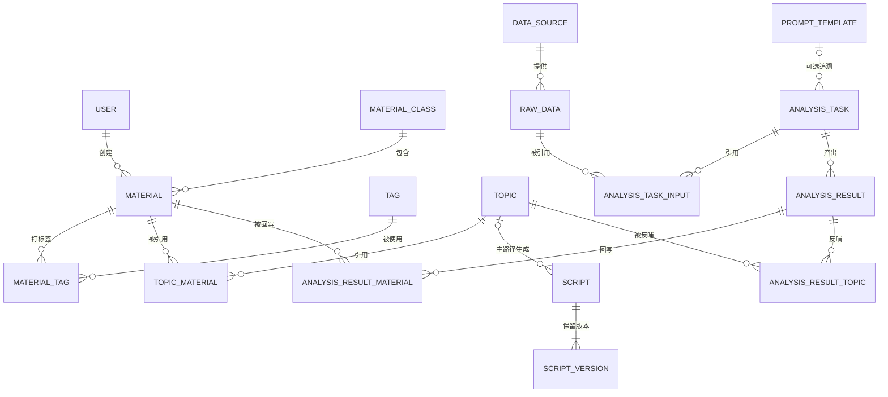

# 业务实体与关系

> 状态：✅ MVP 实体与关系已确认；待确认扩展实体已明确标注（2026-08-24 回写）
> 权威层级：context/ > templates/ > prd-docs/

## 1. 核心实体

## 2. 实体清单

### 2.1 资料库体系

| 实体 | 定义 | 创建者 | 来源 | 状态/审核 | 确认度 |
|---|---|---|---|---|---|
| 资料分类 | 资料类型分类（商业研究结论/案例包装/评论和私信/个人观点/对标账号分析/相关热点） | 配置 | 问卷已确认分类 | - | ✅ |
| 资料条目 | 一条可被引用的资料内容 | 管理员/成员/采集/AI | 手动/采集/导入/分析回写 | 审核后才能用 | ✅ |
| 资料标签 | 标签库 + 页面自由创建；标签组字段可选，不强制分组 | 管理员/成员（权限见 `context/06-系统边界与角色权限.md` §2.2） | 手动 | - | ✅（D1） |
| 资料版本 | 资料修改历史 | 系统 | 自动 | - | ⚠️ 二期候选实体，MVP 不单独建表 |
| 资料来源 | 来源类型/链接，作为资料条目字段保存 | 系统/手动 | 公众号/报告/社交媒体/客户沟通/思考/对标 | 视情况记录链接 | ✅ 非独立实体 |

### 2.2 提示词体系

| 实体 | 定义 | 创建者 | 来源 | 确认度 |
|---|---|---|---|---|
| 提示词模板 | 选题/脚本/分析任务使用的提示词 | 管理员配置 | 手动维护 | ✅（需求确认） |
| 提示词版本 | 提示词变更历史 | 系统 | 自动 | ⚠️ 新增建议，待确认；MVP 不作为必建独立表 |

### 2.3 内容生产体系

| 实体 | 定义 | 创建者 | 来源 | 状态 | 确认度 |
|---|---|---|---|---|---|
| 选题 | 一篇文章内容方向 | AI生成+人工想法 | 批量生成/手动 | 待筛选/已生成脚本/已废弃 | ✅ |
| 选题版本 | 选题修改历史；一期不建独立表，二期评估 | 系统 | 自动 | - | ✅ 二期（D8） |
| 脚本 | 一条可用的口播/内容脚本 | AI/人工 | 基于选题生成或独立创建 | 待审核/已通过/已使用/已废弃（草稿为派生） | ✅（D4） |
| 脚本版本 | 每选题 2-3 版 + 每次修改历史 | AI/人工 | 生成/修改/回退 | 供挑选、对比和回退 | ✅（4.10，2026-08-24） |

### 2.4 数据与分析体系

| 实体 | 定义 | 创建者 | 来源 | 确认度 |
|---|---|---|---|---|
| 数据源 | 一期手动录入/CSV 导入来源；自动采集数据源为架构预留 | 配置 | 手动/CSV；自动预留 | ✅（D5） |
| 原始数据 | 一期保存基础录入/导入数据，不固化深度指标 | 录入/导入 | 手动/CSV | ✅（D5/D6） |
| 分析任务 | 一次分析执行；原始数据通过任务输入引用集合形成多对多关系 | 系统 | 触发 | ✅ |
| 分析结果 | 结构化输出字段 + 结论 | DeepSeek | 分析 | ✅（需人工审核） |

### 2.5 用户与权限体系

| 实体 | 定义 | 创建者 | 来源 | 确认度 |
|---|---|---|---|---|
| 用户 | 管理员创建和停用的系统账号 | 管理员 | 后台管理 | ✅（6.7，2026-08-24） |
| 角色/权限 | 管理员/成员两级角色、功能权限和数据范围 | 管理员配置 | 基础权限隔离 | ✅；动作级口径见 `context/06-系统边界与角色权限.md` §2.2 |

## 3. 关键业务关系

| 关系 | 方向 | 语义 | 确认度 |
|---|---|---|---|
| 资料 → 选题 | 资料被选题生成引用 | 指定分类/热点/对标/客户问题 | ✅ |
| 资料 → 脚本 | 资料被脚本生成引用 | 选题关联的资料 | ✅ |
| 资料 → 分析 | 资料作为分析上下文 | 资料库上下文 | ✅ |
| 选题 → 脚本 | 脚本通常基于选题生成 | 基于选题创建时必须关联并显示；独立创建时允许为空，可后补关联 | ✅（2026-08-24） |
| 分析结果 → 资料库 | 分析结论回写 | 形成知识积累 | ✅ |
| 分析结果 → 选题 | 分析结论反哺新选题 | 数据反哺内容方向 | ✅ |
| 分析结果 → 脚本 | 结论触发脚本 | 建议，待细化 | ⚠️ |

## 4. 引用与追溯要求

- 选题/脚本使用资料的追溯为可选，不作为一期必填（3.13，2026-08-24）；
- 提示词版本追溯为可选，不作为一期必填（3.13，2026-08-24）；
- 批次历史必须保留（选题批量历史已确认）；
- AI 生成产物与原始事实必须区分（结论）：
  - 原始资料（手动/采集/导入）：权威事实；
  - AI 分析结果回写：标记为 AI 产物，需审核后才可反哺。

## 5. 待确认关系

1. 提示词版本是否需要作为 MVP 独立实体；
2. 资料版本是否在 MVP 单独建表；
3. 分析结果为脚本生成提供参考的具体范围。
