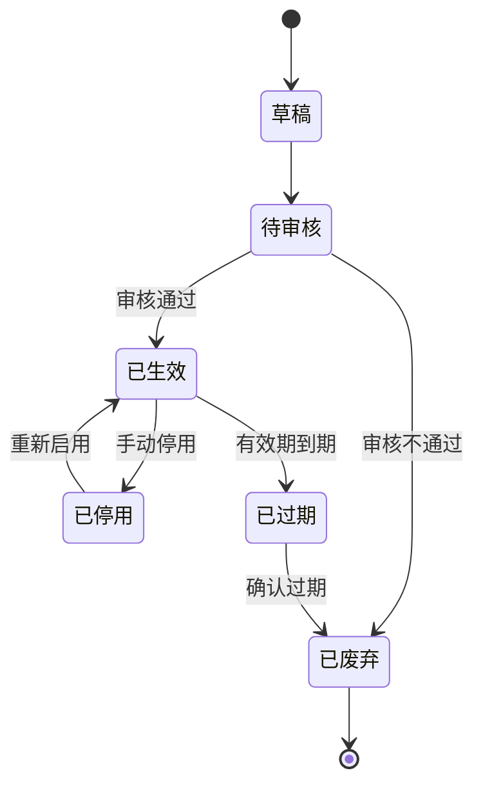
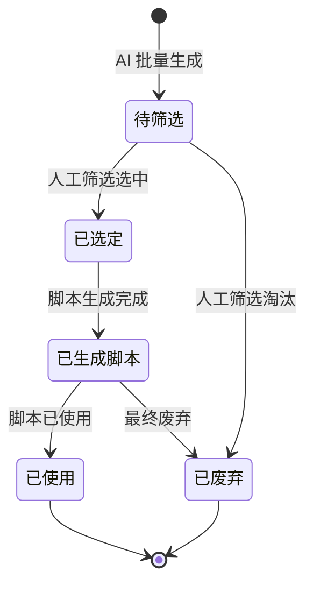
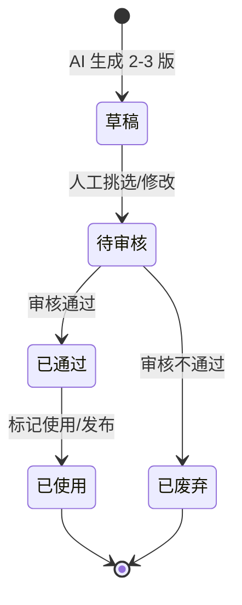
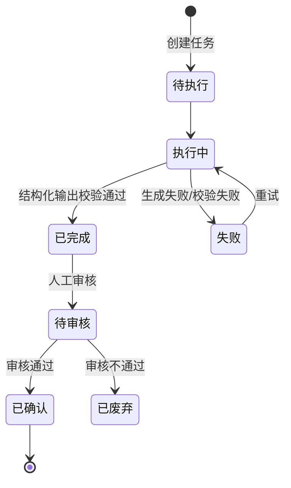

# 业务规则与状态机

> 状态：✅ 基于问卷结论；⚠️ 标注待确认项
> 权威层级：context/ > templates/ > prd-docs/

## 1. 资料状态机

规则：

- 资料必须审核后才能使用（已确认）；
- 记录有效期和可信度（已确认）；
- 审核通过前不可被选题/脚本/分析调用。

## 2. 选题状态机

规则：

- 必须人工筛选后才能用（已确认）；
- 状态已确认：待筛选、已生成脚本、已废弃（问卷原文）；"已选定/已使用"为补充分隔，实现时可按简化状态（已确认状态 + 内部派生）处理；
- 批量生成保留历史，跨批次去重（已确认）。

## 3. 脚本状态机

规则：

- 每选题生成 2-3 版供挑选（已确认）；
- 状态已确认：待审核、已通过、已废弃（问卷原文）；草稿/已使用为内部派生；
- 人工偶尔修改（已确认）；
- ✅ 脚本审核人（4.8 已确认）：MVP 只有自己（超级管理员），**预留多账号可扩展性**（RBAC）；
- ✅ 脚本修改历史（4.10 已确认）：**保留每一次修改的历史版本**，支持对比和回退。

## 4. 数据分析状态机

规则：

- 分析结果需要人工审核后才能使用（已确认）；
- 审核通过后才可回写资料库/反哺选题（已确认）；
- AI 输出需结构校验（合理默认）：空内容/截断/字段缺失处理、重试上限、保留原始响应。

## 5. 全局业务规则

| 编号 | 规则 | 确认度 |
|---|---|---|
| R1 | 资料必须审核后才能使用 | ✅ |
| R2 | 资料记录有效期内 + 可信度 | ✅ |
| R3 | 选题必须人工筛选 | ✅ |
| R4 | 选题批量生成按方向 10 条，保留历史，跨批次去重 | ✅ |
| R5 | 脚本每选题 2-3 版 | ✅ |
| R6 | 分析结果必须人工审核后使用 | ✅ |
| R7 | 分析结果回写资料库 + 反哺选题 | ✅ |
| R8 | AI 产物与原始事实区分，禁止循环引用原始事实被 AI 结果污染 | ✅（结论） |
| R9 | 脚本默认基于选题，可偶尔独立创建 | ✅（4.1 确认：选题为主、独立为辅） |
| R10 | 脚本必须关联选题；资料/提示词追溯可选 | ✅（3.13 确认：选题必显，追溯可有可无） |
| R11 | 脚本保留每次修改历史版本 | ✅（4.10 确认：保留历史，可对比回退） |

## 6. 建议实现状态简化原则

- 问卷未列出的过渡态（如"已选定""已使用""草稿"）不作为用户可见强状态，可由主状态派生；
- 每个单据/实体的状态机以问卷已确认状态为骨架，避免过度设计；
- 一期不引入审批流（脚本审核二期，见 01-业务背景与项目范围 的 Out of Scope）。