# Forge SCRM 产品结构图与核心流程

> 梳理范围：`context/` 业务规则与字段口径、`prd-docs/` 主 PRD 与八个模块 PRD、MVP 验收清单和核心字段清单；页面入口以 `frontend/src/App.tsx` 与 `frontend/src/layouts/MainLayout.tsx` 为准。
>
> 生成日期：2026-08-31。图中发布是系统外人工运营边界，飞书是当前已落地的报告输出通道。

## 1. 全系统产品结构图

```mermaid
flowchart LR
    subgraph ENTRY["数据入口层"]
        direction TB
        E_MANUAL["手动录入<br/>资料 / 运营数据"]
        E_IMPORT["文件导入<br/>资料 CSV/TXT / 运营数据 CSV"]
        E_COLLECT["自动采集<br/>对标账号 + 人工触发任务"]
    end

    subgraph MATERIALS["资料库"]
        direction TB
        M_LIST["资料列表 /materials<br/>新建 /materials/new<br/>导入 /materials/import"]
        M_META["分类 /material-classes<br/>标签 /tags"]
        M_RULE["关键边界<br/>有效期 + 可信度 + 来源<br/>原始事实与 AI 产物分离"]
        M_COMBO["固定资料组合<br/>供生成任务复用"]
        M_LIST --> M_META
        M_RULE -. "约束" .-> M_LIST
        M_LIST --> M_COMBO
    end

    subgraph TOPICS["选题库"]
        direction TB
        T_GEN["批量生成 /topics/generate<br/>每方向 10 条"]
        T_DEDUPE["跨批次完全重复去重<br/>语义去重预留"]
        T_SELECT["人工筛选 /topics<br/>待筛选 → 已选定"]
        T_BATCH["生成批次 /topics/batches<br/>保留历史"]
        T_EXPORT["按当前筛选导出 CSV<br/>入口 /topics"]
        T_GEN --> T_DEDUPE --> T_SELECT
        T_GEN --> T_BATCH
        T_SELECT --> T_EXPORT
    end

    subgraph SCRIPTS["脚本库"]
        direction TB
        S_GEN["基于选题生成 /scripts/generate<br/>每选题 2-3 版"]
        S_STANDALONE["独立创建 /scripts/new<br/>选题可为空、可后补"]
        S_EDIT["挑选与修改<br/>/scripts/:id/edit"]
        S_VERSION["版本历史 /scripts/:id/versions<br/>比较 + 回退"]
        S_USED["已通过 → 人工标记已使用"]
        S_GEN --> S_EDIT
        S_STANDALONE --> S_EDIT
        S_EDIT --> S_VERSION --> S_USED
    end

    PUBLISH["发布<br/>系统外人工运营边界"]

    subgraph DATA_AI["数据分析与研究助手"]
        direction TB
        D_SOURCE["数据源 /analysis/data-sources"]
        D_RAW["原始数据 /analysis/raw-data<br/>手动 / CSV / 采集"]
        D_TASK["分析任务 /analysis/tasks<br/>待执行 → 执行中 → 已完成 / 失败 → 已确认"]
        D_WRITEBACK["结果动作<br/>回写 AI 资料 + 反哺选题"]
        R_TASK["研究任务 /research/tasks<br/>选择资料 / 采集结果 / 时间窗"]
        R_REPORT["研究报告 /research/reports/:id<br/>引用追溯 + 下游生成"]
        D_SOURCE --> D_RAW --> D_TASK --> D_WRITEBACK
        R_TASK --> R_REPORT
    end

    subgraph REPORTS["数据报告与输出"]
        direction TB
        RP_LIST["数据报告 /reports<br/>运营报告 / 账号内容分析"]
        RP_TEMPLATE["报告模板 /report-templates"]
        RP_DETAIL["报告详情 /reports/:id<br/>来源追溯 + 推送记录"]
        FEISHU["飞书卡片推送<br/>失败可重试"]
        RP_TEMPLATE -. "生成结构" .-> RP_LIST
        RP_LIST --> RP_DETAIL --> FEISHU
    end

    subgraph ACCESS["账号与权限边界"]
        direction TB
        LOGIN["登录 /login<br/>个人密码 /profile"]
        MEMBER["成员<br/>在授权范围内使用业务能力"]
        ADMIN["管理员 /admin/users<br/>成员、权限、数据范围"]
        PROMPT["提示词模板 /admin/prompt-templates"]
        LOGIN --> MEMBER
        ADMIN --> PROMPT
    end

    E_MANUAL --> M_LIST
    E_IMPORT --> M_LIST
    E_COLLECT --> M_LIST
    M_COMBO --> T_GEN
    T_SELECT --> S_GEN
    S_USED --> PUBLISH
    PUBLISH -. "平台运营数据回收" .-> D_RAW
    E_MANUAL --> D_RAW
    E_IMPORT --> D_RAW
    E_COLLECT --> D_RAW
    M_LIST --> R_TASK
    E_COLLECT --> R_TASK
    D_WRITEBACK -->|"AI 资料"| M_LIST
    D_WRITEBACK -->|"选题建议"| T_SELECT
    R_REPORT -->|"沉淀资料"| M_LIST
    R_REPORT -->|"生成选题"| T_SELECT
    R_REPORT -->|"生成脚本"| S_EDIT
    D_TASK --> RP_LIST
    R_REPORT --> RP_LIST
    MEMBER -. "权限校验" .-> MATERIALS
    MEMBER -. "权限校验" .-> TOPICS
    MEMBER -. "权限校验" .-> SCRIPTS
    MEMBER -. "权限校验" .-> DATA_AI
    MEMBER -. "权限校验" .-> REPORTS
    ADMIN -. "管理边界" .-> ENTRY
```

### 1.1 结构解读

| 业务域 | 核心页面 | 上游 / 下游 | 边界 |
|:--|:--|:--|:--|
| 数据入口 | `/materials/new`、`/materials/import`、`/analysis/raw-data`、`/collection/benchmark-accounts`、`/collection/tasks` | 上游为人工、文件和外部内容源；下游进入资料库、分析或研究 | 自动采集已支持人工触发；定时调度和平台官方专用适配仍预留 |
| 资料库 | `/materials`、`/materials/:id`、`/material-classes`、`/tags` | 承接录入、导入、采集和 AI 回写；向选题、脚本、分析、研究提供上下文 | 有效期、可信度和来源必须保留；原始事实与 AI 产物分离；仅已生效资料进入生成上下文 |
| 选题库 | `/topics`、`/topics/generate`、`/topics/batches`、`/topics/new`、`/topics/:id`、`/topics/:id/edit` | 上游为资料、分析反哺和研究报告；下游进入脚本生成 | 每方向 10 条；跨批次只做标题完全重复去重；人工筛选后使用；不保留独立版本历史 |
| 脚本库 | `/scripts`、`/scripts/generate`、`/scripts/new`、`/scripts/:id`、`/scripts/:id/edit`、`/scripts/:id/versions` | 上游为选题或独立创建，也可由研究报告生成；下游为系统外发布 | 每选题 2-3 版；每次修改保留版本；“已使用”由人工标记，不代表平台发布动作 |
| 数据分析 | `/analysis/data-sources`、`/analysis/raw-data`、`/analysis/tasks`、`/analysis/tasks/:id` | 上游为手动数据、CSV、采集结果和资料上下文；下游回写资料、反哺选题并进入报告 | 原始数据不可被 AI 结论覆盖；两类回流动作独立留痕；失败任务可重试 |
| 研究助手 | `/research/tasks`、`/research/tasks/:id`、`/research/reports/:id` | 上游为资料、采集结果与时间范围；下游可创建资料、选题、脚本并进入数据报告 | 研究范围结构化保存；报告保留引用来源；下游动作创建新实体，不改写原始事实 |
| 数据报告 | `/reports`、`/reports/:id`、`/report-templates` | 汇总分析结果、采集结果和研究结论；下游为查看、资料沉淀和飞书推送 | 当前人工创建；定时生成预留；推送失败不改变报告生成结果 |
| 推送 | `/reports/:id` | 上游为已生成报告；下游为飞书卡片 | 当前只落地飞书；发送、重试、取消和删除遵循推送任务规则；微信预留 |
| 权限账号 | `/login`、`/profile`、`/admin/users`、`/admin/prompt-templates` | 为全部页面提供身份、角色、功能权限和数据范围约束 | 成员仅使用获授权能力；成员管理和提示词模板仅管理员可进入 |

## 2. 各链路边界说明

### 2.1 数据入口与资料链

1. 手动录入、CSV/TXT 导入和采集结果转入都必须保存来源；资料还必须记录有效期和可信度。
2. 原始资料是事实来源，AI 分析或研究沉淀形成的内容必须标识为 AI 产物，不能覆盖原始资料。
3. 固定资料组合只保存可复用的资料选择关系，不复制或改变资料本体。

### 2.2 选题与脚本链

1. 选题按内容方向批量生成，每方向 10 条；跨批次只阻断标题完全相同的记录，语义近似不在当前范围。
2. 选题经过人工筛选后才进入脚本生成；允许修改，但不建立选题版本表。
3. 脚本以选题生成 2-3 版为常规路径，也允许独立创建；每次修改生成新版本，可比较和回退。
4. 系统内“已使用”是人工标记；视频号、小红书的实际发布动作与平台流程属于系统外边界。

### 2.3 数据分析链

1. 数据源定义平台与来源口径，原始数据承接手动录入、CSV 导入和采集结果。
2. 分析任务保存输入快照、执行状态、失败信息和结果；只有用户可见的已确认结果进入后续回流。
3. 回写资料与反哺选题分别执行、分别记录；任何一侧失败都不能覆盖另一侧真实结果。

### 2.4 研究链

1. 研究任务必须先选择资料、采集结果或时间窗等范围，执行时固定输入快照。
2. 研究报告展示引用来源，并可分别创建资料、选题或脚本；创建后的业务实体进入各自模块规则。
3. 研究任务和数据分析并行提供洞察，不替代资料库、选题库或脚本库的业务边界。

### 2.5 报告与推送链

1. 数据报告可引用已确认分析结果、周期内采集结果和研究结论，报告模板约束输出结构。
2. 当前报告由人工创建和执行，定时生成预留；两类报告共享列表和详情入口。
3. 飞书推送是独立输出任务，失败可重试且不回滚报告；微信通道仍为预留能力。

### 2.6 权限边界

1. 登录用户按角色、功能权限和数据范围访问页面与数据；成员不因看见路径而自动获得权限。
2. `/admin/users` 和 `/admin/prompt-templates` 由管理员边界保护；`/profile` 供当前用户维护个人密码。
3. 侧栏分组只负责导航呈现，产品业务域以资料、选题、脚本、采集、研究、分析、报告、账号与推送能力划分。

## 3. PRD 与代码差异

| 差异项 | PRD / 历史描述 | 当前代码与本文采用口径 |
|:--|:--|:--|
| 自动采集 | 一期主 PRD 仅保留架构位置 | `/collection/benchmark-accounts`、`/collection/tasks` 已实现二期人工触发采集；定时能力仍预留 |
| 兼容路由 | 早期流程有独立管理页面 | `App.tsx` 仍有 `/materials/review`、`/scripts/review`，但侧栏不展示；图中使用当前可见主流程 |
| 提示词模板 | 旧数据分析 Demo 的页面路径与当前代码不一致 | 代码实际路由为 `/admin/prompt-templates` |
| 报告通道 | PRD 设计飞书与微信 | 当前 `/reports/:id` 仅落地飞书发送能力，微信标为预留 |
| 平台采集 | PRD 目标包括视频号、小红书 | 当前通用 HTTP/JSON 采集已落地，官方平台接口未验证 |
| 对象存储 | 技术架构要求媒体与大文件走对象存储 | 作为系统外存储边界保留；本地开发仍可能使用本地文件系统 |
| 侧栏分组 | PRD 按九类业务能力组织 | 代码将采集归入“内容管理”、研究归入“AI 模块”、报告归入“数据分析”；页面路径全部以 `App.tsx` 为准 |
