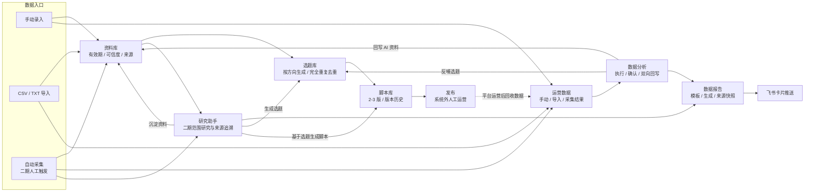
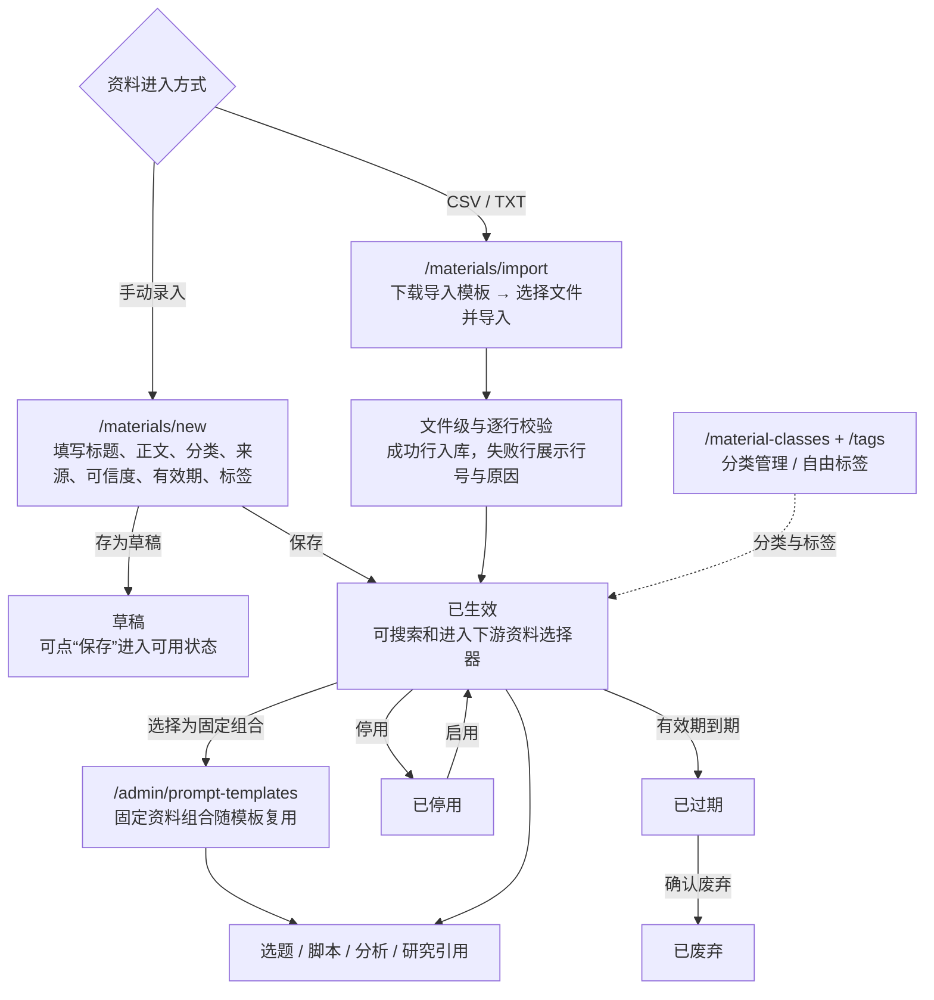
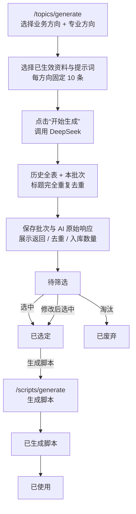
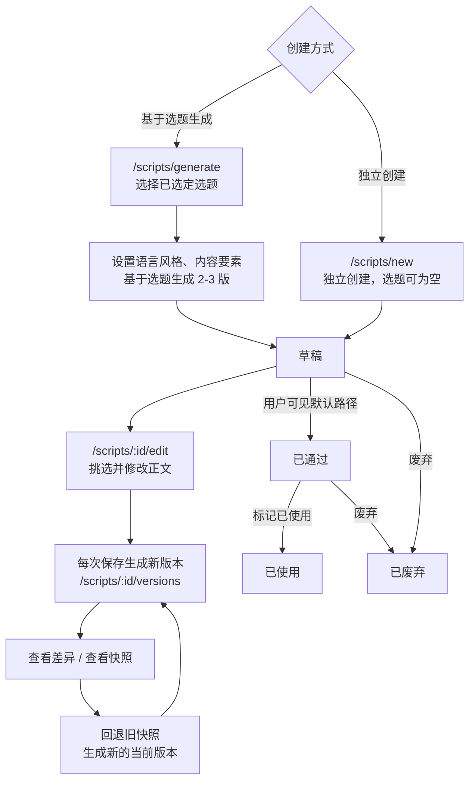
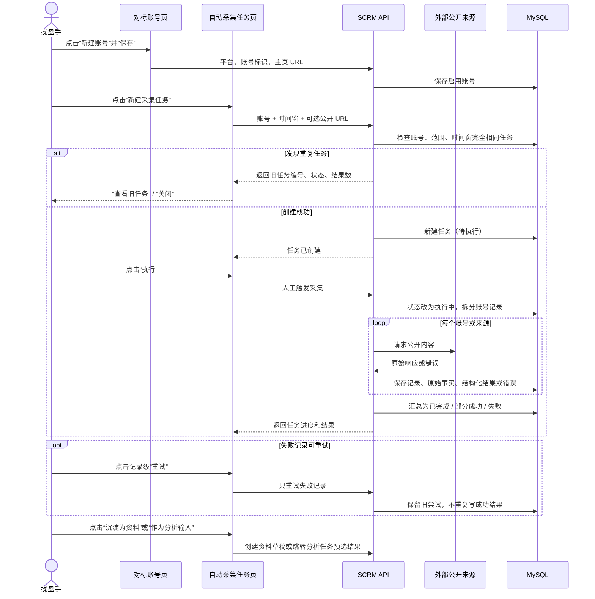
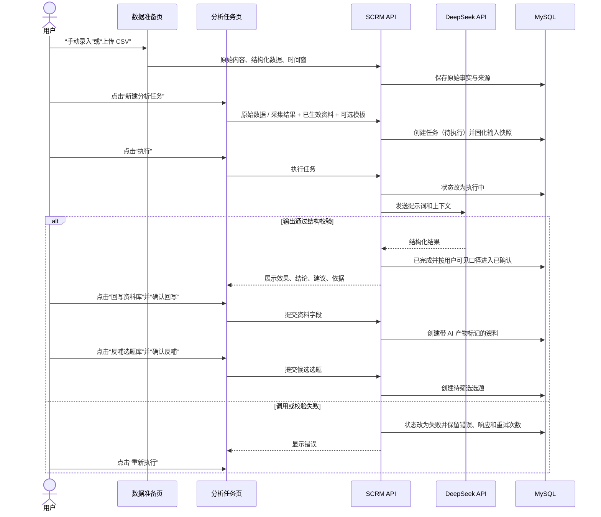
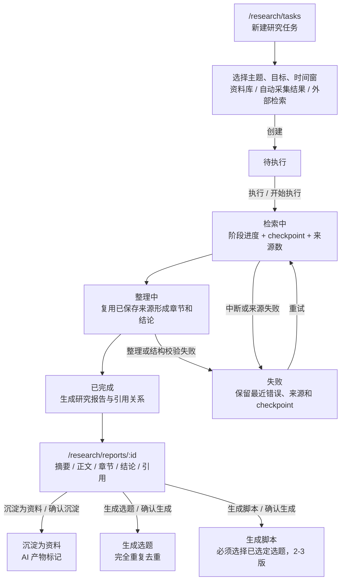
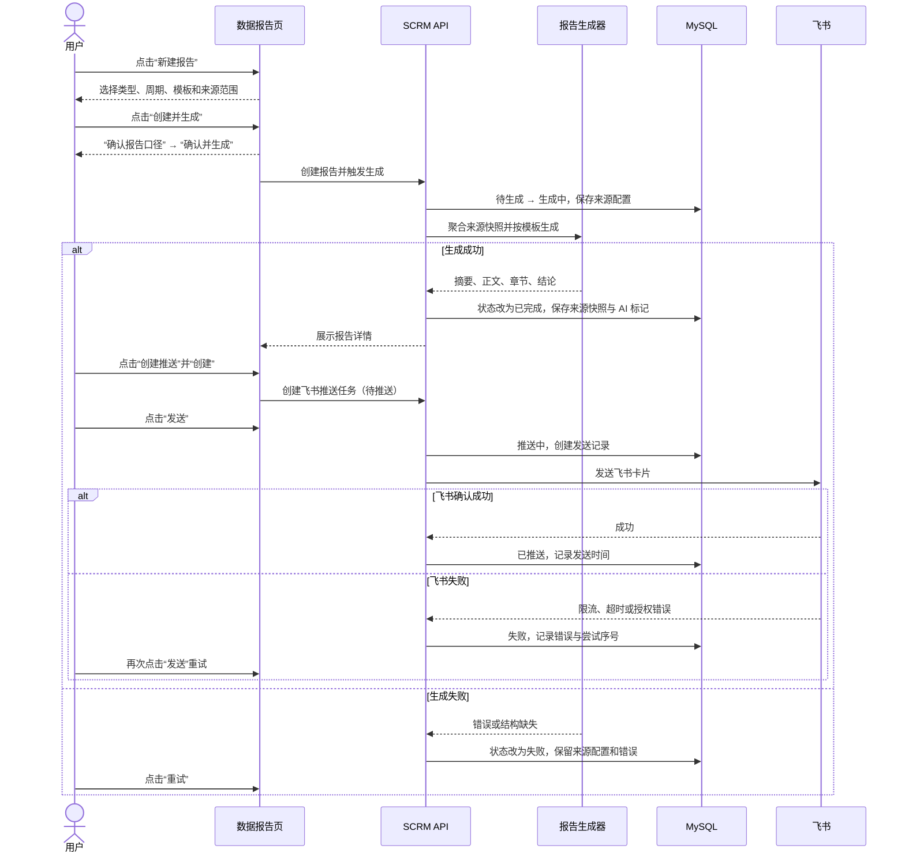

# Forge SCRM 业务流程与核心交互流程

> 信息口径：`context/` > `prd-docs/`；页面路径以 `frontend/src/App.tsx` 为准，菜单和前端权限边界以 `frontend/src/layouts/MainLayout.tsx` 及路由守卫为准，按钮文字取自当前前端源码。
>
> 文档快照：2026-08-31。历史说明：一期含管理员审核（已隐藏）；下文状态统一采用 `displayStatus` 映射后的用户可见口径，不展开隐藏状态名称。

## 1. 主业务闭环

主链以一期的资料、选题、脚本和基础分析为骨架。二期自动采集增加资料与运营数据入口；研究助手并行消费资料、采集结果和外部检索，数据报告汇总分析与研究产物，飞书负责系统外输出。

## 2. 各模块核心业务流程

### 2.1 资料库

**关键状态流转**：`草稿 → 已生效 → 已停用 → 已生效`；`已生效 → 已过期 → 已废弃`。只有已生效资料进入选题、脚本、分析和研究的资料选择器；原始资料与 AI 回写资料必须保留来源和产物标记。

| 涉及页面 | 关键动作按钮（源码原文） | 流转结果 |
|:--|:--|:--|
| `/materials` | `批量导入`、`新建资料`、`查询`、`编辑`、`停用`、`启用`、`确认废弃` | 查询与维护资料生命周期 |
| `/materials/new`、`/materials/:id` | `存为草稿`、`保存`、`取消` | 创建草稿或保存为当前可用口径 |
| `/materials/import` | `下载导入模板`、`选择文件并导入` | 成功行入库，失败行保留行号和原因 |
| `/material-classes`、`/tags` | `新建分类`、`编辑`、`保存`、`新建标签` | 维护资料分类与标签 |
| `/admin/prompt-templates` | `新建模板`、`保存` | 在提示词模板中选择固定资料组合 |

### 2.2 选题库

**关键状态流转**：`待筛选 → 已选定 / 已废弃`；`已选定 → 已生成脚本 → 已使用`。当前只做标题完全一致去重，保留批次历史；人工可修改选题，但不建立选题版本表。

| 涉及页面 | 关键动作按钮（源码原文） | 流转结果 |
|:--|:--|:--|
| `/topics` | `批量生成`、`导出 CSV`、`手动新增`、`详情`、`选中`、`淘汰` | 进入生成页、导出、创建或完成筛选 |
| `/topics/generate` | `+ 新增业务方向`、`+ 新增专业方向`、`开始生成`、`去列表筛选` | 生成 10 条候选并查看批次结果 |
| `/topics/batches` | `查看选题` | 按批次回看生成结果 |
| `/topics/:id` | `查看 AI 原始响应`、`修改`、`选中`、`淘汰`、`生成脚本` | 查看追溯、筛选或派生脚本 |
| `/topics/:id/edit`、`/topics/new` | `保存`、`取消` | 修改既有选题或手动新增 |

### 2.3 脚本库

**关键状态流转**：用户可见主路径为 `草稿 → 已通过 → 已使用`，草稿或已通过脚本可废弃。每次修改和回退都新增版本记录，不覆盖历史；“已使用”是人工标记，不代表已发布到内容平台。

| 涉及页面 | 关键动作按钮（源码原文） | 流转结果 |
|:--|:--|:--|
| `/scripts` | `独立创建`、`基于选题生成`、`详情`、`版本`、`标记已使用`、`废弃` | 进入创建、生成、版本或生命周期动作 |
| `/scripts/generate` | `开始生成`、`查看` | 为选题生成 2-3 版并进入详情 |
| `/scripts/new`、`/scripts/:id/edit` | `保存`、`取消` | 独立创建或保存修改；修改会生成新版本 |
| `/scripts/:id` | `版本历史`、`修改`、`标记已使用`、`废弃` | 维护当前脚本与业务状态 |
| `/scripts/:id/versions` | `查看差异`、`查看快照`、`回退`、`返回脚本` | 对比历史并以新版本方式回退 |

### 2.4 自动采集

**关键状态流转**：任务 `待执行 → 执行中 → 已完成 / 部分成功 / 失败`，失败任务可“重试”；记录 `待执行 → 执行中 → 已完成 / 失败`，可重试记录只处理失败项。采集结果是原始事实，默认不是 AI 产物。

| 涉及页面 | 关键动作按钮（源码原文） | 流转结果 |
|:--|:--|:--|
| `/collection/benchmark-accounts` | `新建账号`、`编辑`、`保存` | 维护可选对标账号 |
| `/collection/tasks` | `新建采集任务`、`创建`、`查看旧任务`、`执行`、`重试` | 创建、识别重复、执行任务或任务级重试 |
| `/collection/tasks` 展开行 | `详情`、`沉淀为资料`、`作为分析输入`、记录级 `重试` | 查看结果、进入资料库或分析链 |
| `/collection/tasks` 资料弹窗 | `保存资料`、`取消` | 补齐分类、可信度和有效期后生成资料草稿 |

### 2.5 数据分析

**关键状态流转**：`待执行 → 执行中 → 已完成 → 已确认`；执行失败进入 `失败`，点击“重新执行”后回到执行中。资料回写与选题反哺是两个独立动作，分别留痕，AI 资料不得覆盖原始事实。

| 涉及页面 | 关键动作按钮（源码原文） | 流转结果 |
|:--|:--|:--|
| `/analysis/data-sources` | `新增数据源`、`编辑`、`保存` | 维护数据来源口径 |
| `/analysis/raw-data` | `手动录入`、`下载导入模板`、`上传 CSV`、`保存` | 保存手动或导入的原始数据 |
| `/analysis/tasks` | `新建分析任务`、`创建`、`执行`、`重新执行`、`详情` | 创建、执行或重试分析任务 |
| `/analysis/tasks/:id` | `AI 原始响应`、`执行`、`重新执行`、`回写资料库`、`反哺选题库` | 查看追溯并发起下游动作 |
| `/analysis/tasks/:id` 回写弹窗 | `添加一条`、`确认回写`、`确认反哺` | 编辑候选并分别写入资料库或选题库 |

### 2.6 研究助手

**关键状态流转**：`待执行 → 检索中 → 整理中 → 已完成`；任一执行阶段失败进入 `失败`，重试时复用已保存来源和 checkpoint。报告与结论是 AI 产物，引用的原始资料、采集结果和外部 URL 保持独立。

| 涉及页面 | 关键动作按钮（源码原文） | 流转结果 |
|:--|:--|:--|
| `/research/tasks` | `新建研究任务`、`创建`、`执行`、`重试`、`详情`、`查看报告` | 创建、执行、恢复或查看研究任务 |
| `/research/tasks/:id` | `开始执行`、`重试`、`返回列表` | 查看阶段、进度、来源数、checkpoint 和错误 |
| `/research/reports/:id` | `沉淀为资料`、`生成选题`、`生成脚本` | 从报告发起三个独立下游动作 |
| `/research/reports/:id` 确认弹窗 | `确认沉淀`、`确认生成`、`取消` | 补齐目标字段后创建资料、选题或脚本 |

### 2.7 数据报告

**关键状态流转**：报告 `待生成 → 生成中 → 已完成 / 失败`，失败可重试；飞书推送 `待推送 → 推送中 → 已推送 / 失败`，未发送或失败任务可取消，失败任务可再次发送。推送失败不回滚报告状态。

| 涉及页面 | 关键动作按钮（源码原文） | 流转结果 |
|:--|:--|:--|
| `/reports` | `新建报告`、`创建并生成`、`确认并生成`、`生成`、`重试`、`查看` | 配置口径、生成、重试或查看报告 |
| `/report-templates` | `新建模板`、`编辑`、`设为默认`、`保存` | 维护两类报告的输出模板 |
| `/reports/:id` | `创建推送`、`推送任务`、`创建`、`发送`、`取消`、`删除` | 创建飞书任务并查看、执行或管理任务 |
| `/reports/:id` 推送任务抽屉 | `发送`、`取消`、`删除` | 展开每次发送记录、状态、错误和尝试序号 |

## 3. 权限边界

| 边界 | 管理员 | 成员 | 当前代码依据 |
|:--|:--|:--|:--|
| 登录与个人账号 | 账号密码登录；可在 `/profile` 查看账号并修改密码 | 同管理员 | `MainLayout` 无 token 跳转 `/login`；`Login.tsx`、`Profile.tsx` |
| 侧栏菜单 | 显示一期导航、内容管理、模板管理、AI 模块、权限管理 | 只显示首页及 `NAV_GROUPS`：资料库、选题库、脚本库、数据分析（含数据报告与报告模板） | `visibleGroups = isAdmin() ? ALL_NAV_GROUPS : NAV_GROUPS` |
| 管理员路由 | 可进入 `/admin/users`、`/admin/prompt-templates` | 路由守卫返回 403 | `App.tsx` 的 `RequireAdmin` |
| 一期业务动作 | 默认拥有全部功能权限 | 按 `functional_permissions` 显式授权，且受数据范围约束 | `useAuthStore.can()` 与后端 `require_permission()` |
| 二期采集与研究路由 | 菜单可见，可直接进入 | 菜单隐藏；`App.tsx` 未使用 `RequireAdmin` 包裹，直接路径的前端路由层不阻断 | 采集与研究的当前路由定义 |
| 报告与模板 | 报告入口可见；模板配置与推送动作按功能权限控制 | 数据分析组菜单可见；无相应权限时配置按钮隐藏或后端拒绝 | `/reports`、`/report-templates` 页面权限判断与后端依赖 |

菜单可见性不等于动作授权。成员即使能进入业务页面，也只能执行已显式授权且数据范围允许的动作；当前采集与研究的菜单隐藏和直接路由行为不完全等价，使用时应以页面、接口共同校验结果为准。

## 4. 口径差异与使用说明

| 事项 | PRD 流程推演 | 当前代码现状 | 本文处理 |
|:--|:--|:--|:--|
| 脚本流程资料 | 未找到独立《脚本库_业务流程推演.md》 | 主 PRD、业务规则规格和页面已覆盖生成、版本与使用流程 | 以 `context/04` 为先，结合脚本主 PRD、规则规格与代码落图 |
| 资料与分析状态 | 2026-08-24 推演保留早期阻塞节点 | 当前列表通过 `displayStatus` 呈现默认可用口径，相关独立菜单已隐藏 | 图中只写用户可见状态，保留一次历史说明 |
| 自动采集任务详情 | 推演规划独立任务、记录、结果区域 | 当前 `/collection/tasks` 使用表格展开行承载记录和结果，无独立详情路由 | 只引用真实路由，并标注“展开行” |
| 自动采集状态 | 推演将“部分成功”等标为待确认 | 当前类型和页面已实现待执行、执行中、已完成、部分成功、失败 | 采用代码现状，同时保留外部来源实测风险 |
| 研究阶段 | 推演将检索中、整理中、checkpoint 等标为新增建议 | 当前页面已展示检索中、整理中、阶段进度、checkpoint 和来源数 | 按当前实现画流程 |
| 研究报告生成脚本 | 推演含独立脚本路径 | 当前确认弹窗要求选择已选定选题，未提供报告直达独立脚本入口 | 图中只画“基于选题生成脚本” |
| 报告创建 | 推演描述先创建、后点击生成 | 当前新建弹窗为“创建并生成”，确认后连续创建与生成；列表仍为待生成报告提供“生成” | 主流程按当前连续动作，状态机保留待生成节点 |
| 报告推送 | 推演设计飞书与微信 | 当前页面渠道固定为飞书，并展示发送记录 | 只画飞书，微信列为预留 |
| 报告沉淀资料 | 推演包含报告沉淀资料动作 | 当前报告详情未提供该按钮 | 不纳入当前报告主流程，研究报告沉淀资料按已实现入口表达 |
| 成员二期菜单 | PRD 以角色和动作权限描述 | `MainLayout` 对成员隐藏采集、提示词模板和研究菜单，但采集与研究路由没有管理员守卫 | 在权限边界中如实登记，不推断未实现的前端阻断 |

本文是 2026-08-31 的 PRD 与代码快照。后续路由、按钮、状态映射、菜单分组或二期外部能力变化时，应同步更新本文件、`flowchart.md` 与渲染页验证记录。

## 5. 产品设计边界

- **系统外人工运营**：视频号、小红书的内容发布、上传和平台内运营由人员完成；系统内“已使用”不等于平台发布成功。
- **预留能力**：定时采集、微信推送、语义去重、内容平台直接发布和经验证的官方平台专用适配均不作为当前已落地能力。
- **DeepSeek API**：负责选题、脚本、分析、研究整理和报告生成；失败必须保留错误与可追溯响应，不由模型补造缺失事实。
- **飞书**：当前报告卡片输出通道；授权、接收人和限流属于外部依赖，发送失败不影响报告本身。
- **MySQL**：保存结构化业务数据、状态、任务和引用；媒体、导入原文件与大文件按架构进入对象存储，本地环境可能仍使用文件系统。
- **外部检索与采集来源**：必须遵守来源授权、服务条款和访问限制；不可达或不合规时明确失败，不伪造成功或引用。
