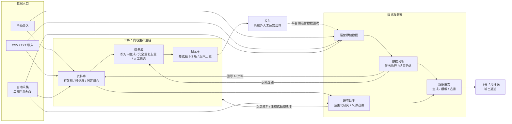

# Forge SCRM 产品架构图

> 信息口径：`context/` > `prd-docs/`，并以 `frontend/src/App.tsx`、`frontend/src/layouts/MainLayout.tsx` 交叉核对当前页面入口。
>
> 生成日期：2026-08-31

---

## 一、总览：内容运营闭环



闭环主轴是“资料 → 选题 → 脚本 → 发布 → 数据 → 洞察”。系统负责发布前内容生产、发布后数据沉淀与洞察回流；内容平台发布本身不在当前系统内执行。

---

## 二、Forge SCRM 模块全景

| 一级模块 | 二级功能 / 实际页面 | PRD 状态 | 说明 |
|:--|:--|:--:|:--|
| **资料库** | 资料列表与详情 `/materials`、`/materials/:id` | ✅ 一期 | 手动维护资料，记录分类、标签、有效期、可信度和来源 |
| | 新建与批量导入 `/materials/new`、`/materials/import` | ✅ 一期 | 支持手动录入及 CSV/TXT 导入 |
| | 分类、标签、固定组合 `/material-classes`、`/tags` | ✅ 一期 | 分类受控；标签自由创建；固定组合供生成任务复用 |
| **选题库** | 列表、详情、编辑 `/topics`、`/topics/:id`、`/topics/:id/edit` | ✅ 一期 | 人工筛选、人工修改、淘汰；不建立独立版本历史 |
| | 批量生成与批次 `/topics/generate`、`/topics/batches` | ✅ 一期 | 每方向 10 条，保留批次，跨批次按标题完全重复去重 |
| | 当前筛选结果导出 CSV `/topics` | ✅ 二期 | 导出核心字段，状态使用用户可见口径 |
| | 语义去重 | 预留 | 当前只做完全重复去重 |
| **脚本库** | 列表、详情与修改 `/scripts`、`/scripts/:id`、`/scripts/:id/edit` | ✅ 一期 | 基于选题或独立创建；基于选题时展示关联关系 |
| | 基于选题生成 `/scripts/generate` | ✅ 一期 | 每个选题生成 2-3 版候选脚本 |
| | 独立创建 `/scripts/new` | ✅ 一期 | 选题关联可为空，也可后补 |
| | 版本历史与回退 `/scripts/:id/versions` | ✅ 一期 | 每次修改保留版本，可比较和回退 |
| **自动采集** | 对标账号 `/collection/benchmark-accounts` | ✅ 二期 | 管理采集目标与平台标识 |
| | 采集任务 `/collection/tasks` | ✅ 二期 | 人工触发、重复识别、失败重试、结果查看、转资料和进入分析 |
| | 定时采集、官方平台专用适配 | 预留 | 当前不做定时任务；视频号/小红书官方接口可用性仍需验证 |
| **研究助手** | 研究任务 `/research/tasks`、`/research/tasks/:id` | ✅ 二期 | 选择资料、采集结果等范围后执行，支持失败恢复 |
| | 研究报告 `/research/reports/:id` | ✅ 二期 | 展示结论和引用来源，可沉淀资料或生成选题、脚本 |
| **数据分析** | 数据源 `/analysis/data-sources` | ✅ 一期 | 定义数据来源和平台口径 |
| | 原始数据 `/analysis/raw-data` | ✅ 一期 | 手动录入、CSV 导入并保留原始事实 |
| | 分析任务 `/analysis/tasks`、`/analysis/tasks/:id` | ✅ 一期 | 执行、失败重试、结果确认、回写资料与反哺选题 |
| **数据报告** | 报告列表与详情 `/reports`、`/reports/:id` | ✅ 二期 | 按来源生成运营数据报告或账号内容分析报告，保留追溯 |
| | 报告模板 `/report-templates` | ✅ 二期 | 管理生成结构与报告模板 |
| | 定时生成 | 预留 | 当前为人工创建与执行 |
| **权限账号** | 登录与个人密码 `/login`、`/profile` | ✅ 一期 | 账号密码登录，成员维护个人密码 |
| | 成员与权限 `/admin/users` | ✅ 一期 | 管理员维护成员、角色、权限和数据范围 |
| | 提示词模板 `/admin/prompt-templates` | ✅ 二期 | 管理员维护 AI 任务使用的提示词模板 |
| **推送** | 飞书卡片推送 `/reports/:id` | ✅ 二期 | 报告详情内创建推送任务，支持记录查看、重试、取消与删除规则 |
| | 微信推送 | 预留 | PRD 有设计，当前无发送器和页面入口 |

用户可见状态口径：资料使用“草稿 / 已生效 / 已停用 / 已过期 / 已废弃”；选题使用“待筛选 / 已选定 / 已生成脚本 / 已使用 / 已废弃”；脚本使用“草稿 / 已通过 / 已使用 / 已废弃”；分析任务使用“待执行 / 执行中 / 已完成 / 失败 / 已确认 / 已废弃”。

---

## 三、核心作业链

### 3.1 资料链

```text
手动录入 / CSV/TXT 导入 / 采集转入
  → 完整性与来源校验
  → 已生效资料（有效期 + 可信度）
  → 分类 / 标签组织
  → 固定资料组合
  → 供选题、脚本、分析与研究任务引用
```

历史规则说明：一期含管理员审核（已隐藏），当前文档只呈现用户界面可见状态；原始资料与 AI 回写资料必须区分，AI 产物不得覆盖原始事实。

### 3.2 选题链

```text
选择内容方向 + 资料 / 固定组合
  → DeepSeek 每方向批量生成 10 条
  → 跨批次标题完全重复去重
  → 人工筛选 / 修改 / 淘汰
  → 已选定选题
  → 进入脚本生成
```

当前去重边界是标题完全一致；语义近似去重为预留能力。选题允许人工修改，但不建立选题版本表。

### 3.3 脚本链

```text
已选定选题（常规）/ 独立创建（例外）
  → 每个选题生成 2-3 版脚本
  → 人工挑选与修改
  → 每次修改生成历史版本
  → 版本比较 / 回退
  → 已通过
  → 人工标记已使用
```

“已使用”只表示人工确认内容已投入运营，不等同于系统直接发布到视频号或小红书。

### 3.4 数据链

```text
手动录入 / CSV 导入 / 自动采集
  → 原始运营数据
  → 分析任务执行与结果确认
  → 回写 AI 资料 + 反哺选题
  → 生成数据报告
  → 飞书卡片推送
```

原始数据保持事实来源；回写资料必须带 AI 产物标识。资料回写与选题反哺是两个独立动作，一侧失败不应伪装成整体成功。

### 3.5 研究链

```text
选择研究范围（资料 / 采集结果 / 时间窗）
  → 执行研究任务
  → 形成带引用来源的研究报告
  → 沉淀资料 / 生成选题 / 生成脚本
  → 纳入数据报告或后续内容生产
```

研究结论属于 AI 产物，必须保留来源追溯；下游动作分别创建对应实体，不直接改写既有原始资料。

---

## 四、系统外部关系

```text
┌────────────────┐        生成 / 分析         ┌────────────────┐
│  DeepSeek API  │ ←────────────────────────→ │   Forge SCRM   │
└────────────────┘                            │                │
                                              │  资料→选题→脚本 │
┌────────────────┐   采集目标 / 运营数据边界   │  数据→洞察→回流 │
│ 视频号 / 小红书 │ ←───────────────────────── │                │
└────────────────┘                            └───────┬────────┘
                                                     │
                            ┌────────────────────────┼────────────────────────┐
                            │                        │                        │
                            ▼                        ▼                        ▼
                    ┌──────────────┐        ┌──────────────┐        ┌────────────────┐
                    │ 飞书卡片推送  │        │    MySQL     │        │   对象存储     │
                    │  二期已落地   │        │  结构化数据   │        │ 媒体 / 大文件  │
                    └──────────────┘        └──────────────┘        └────────────────┘
```

- **DeepSeek API**：用于选题与脚本生成、数据分析、研究和报告生成；调用失败必须保留任务轨迹并支持可控重试。
- **飞书**：当前已落地的报告输出通道，以卡片形式推送；推送失败不改变报告本身。
- **视频号 / 小红书**：二期采集目标；当前通用 HTTP/JSON 采集能力已落地，官方平台接口仍属于外部依赖。
- **MySQL / 对象存储**：MySQL 是结构化数据目标存储；媒体和大文件按架构走对象存储，本地开发环境仍可能使用本地文件系统。

---

## 五、与 Forge WMS / ERP 的关系

| 维度 | Forge SCRM | Forge WMS / ERP | 关系 |
|:--|:--|:--|:--|
| 业务域 | 新媒体资料、内容生产、运营数据与洞察 | 采购、销售、仓储、库存与履约 | 同一 Forge 产品矩阵下的独立系统 |
| 核心对象 | 资料、选题、脚本、采集任务、分析任务、研究报告、数据报告 | 商品、订单、作业单据、库存与流水 | 当前无对象级直接同步 |
| 数据关系 | 运营内容和平台数据自闭环 | 供应链和经营交易数据自闭环 | 当前无直接数据打通或共享主数据 |
| 方法论 | SSOT 字段、状态机、任务留痕、来源追溯、权限边界 | 主数据、单据链、库存边界、作业留痕、权限边界 | 产品设计与文档治理方法同源 |
| 未来协同 | 可在业务确认后接入企业经营事实作为内容选题输入 | 可输出商品、销售等经营事实 | 属于未来产品决策，不作为当前能力 |

---

## 六、PRD 与代码差异

| 差异项 | PRD / 历史口径 | 当前代码与本文处理 |
|:--|:--|:--|
| 自动采集范围 | 一期主 PRD 将自动采集视为架构预留 | 二期模块与路由已落地人工触发采集；定时采集仍标“预留” |
| 兼容页面 | 早期流程包含独立管理入口 | `App.tsx` 仍保留 `/materials/review`、`/scripts/review` 两条兼容路由，但侧栏与当前可见流程不展示，本文不将其列为产品入口 |
| 提示词模板路径 | 旧数据分析 Demo 的页面路径与当前代码不一致 | 实际路由为 `/admin/prompt-templates`，本文以代码为准 |
| 报告推送通道 | 数据报告 PRD 同时设计飞书与微信 | 当前仅飞书发送器及报告详情入口落地；微信标“预留” |
| 平台采集适配 | PRD 将视频号、小红书作为目标平台 | 当前为通用 HTTP/JSON 适配，官方平台接口可用性未验证 |
| 报告与研究下游动作 | 较早主 PRD / 验收快照未覆盖全部二期动作 | 当前已实现报告模板，以及研究、采集结果向资料/选题/脚本/分析的下游入口 |
| 大文件存储 | 技术方向要求媒体与大文件走对象存储 | 架构按对象存储表达；本地开发实现仍使用文件系统 |
| 菜单分组 | PRD 以业务模块组织 | 代码侧栏将自动采集放在“内容管理”、研究助手放在“AI 模块”、报告与模板放在“数据分析”；本文保留业务模块视角并使用实际路由 |
