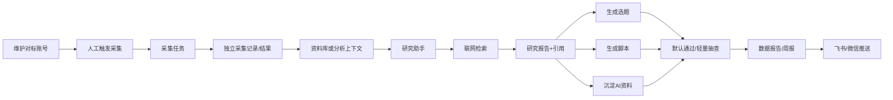
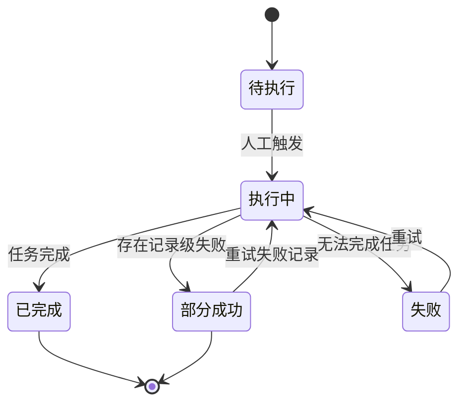
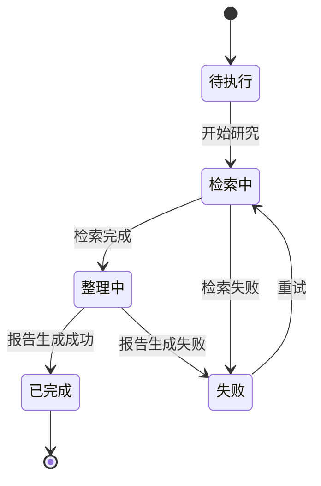
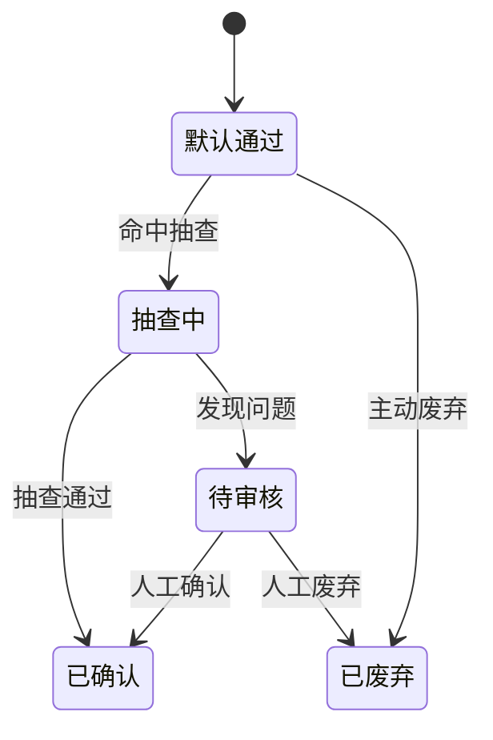

# Forge 新媒体运营系统二期总PRD

> 文件定位：二期产品总览、范围边界、跨模块依赖和审核流程变更
> 依据：`requirements/09-二期调研结论.md`（2026-08-26 用户拍板）
> 权威层级：`context/` > `templates/` > `prd-docs/`
> 状态：二期范围已拍板，技术细节和新增字段按“新增建议，待确认”管理

## 1. 模块概述

### 1.1 一句话定位

二期把 Forge 从“人工维护资料后批量生成内容”的系统，升级为“自动获取外部信息、开放式研究、默认低摩擦生成与周报沉淀”的操盘手工作台。

二期服务对象仍以管理员/操盘手为主，设备仍以桌面端为主；本期不扩展多人协作权限，不建设手机端专项，不接入抖音或公众号内容数据。

### 1.2 用户问题

一期已经覆盖资料库、选题库、脚本库、数据分析和权限账号，但操盘手每天仍面临三类高成本工作：

1. 手动盯对标账号、评论、热点和行业报告，信息采集耗时且容易漏掉变化。
2. 为一个选题做深度研究时，需要跨站搜索、整理证据和形成结构化报告，单周耗时超过 30 小时。
3. 选题、脚本和分析结果的逐条审核成为当前自用场景的主要瓶颈。

### 1.3 二期产品目标

| 目标 | 目标描述 | 主要衡量方向 |
|---|---|---|
| 降低采集成本 | 对标账号优先，人工触发即可完成一次采集并保留来源 | 采集任务成功率、人工录入减少量 |
| 缩短研究周期 | 输入主题后完成检索、整理、引用追溯和报告沉淀 | 研究任务完成时长、报告可引用率 |
| 降低审核负担 | 默认通过，AI 结果保留轻量抽查，原始采集事实直接信 | 审核操作量、抽查发现率 |
| 提高复盘频率 | P1 生成每周运营数据和市场分析周报 | 周报生成成功率、周报查看率 |
| 保持事实可追溯 | 原始采集数据、研究引用、AI 产物分别留痕 | 来源完整率、引用可回点率 |

### 1.4 与一期五模块的关系

| 一期模块 | 二期关系 | 变化边界 |
|---|---|---|
| 资料库 | 接收研究报告沉淀资料、接收采集结果转为资料的候选内容 | 原始采集记录先落独立采集表，不直接伪装为普通资料 |
| 选题库 | 接收研究助手和报告反哺的选题；默认通过规则覆盖人工筛选阻塞 | 保留现有选题字段和历史规则，新增来源追溯建议待确认 |
| 脚本库 | 接收研究助手基于报告生成的脚本；默认通过规则覆盖审核阻塞 | 保留脚本版本链和选题关联规则 |
| 数据分析 | 接收采集结果和周报所需运营数据；分析结果默认确认但保留抽查 | 不在本总览中固化二期深度指标字段 |
| 权限账号 | 二期暂不新增多人协作功能 | 数据结构可低成本预留创建人/来源人字段，是否扩展权限待确认 |

### 1.5 二期范围决策

#### P0：必须进入二期

1. 自动采集模块。
2. 研究助手模块。
3. 审核流程改为默认通过，同时保留原审核功能和轻量抽查能力。

#### P1：进入二期但不阻塞 P0 首发

1. 每周运营数据报告。
2. 市场分析周报。
3. 分析报告和生成结果推送飞书/微信给指定人或群。
4. 定时自动采集保留为 P1，不作为首个自动采集触发方式。

#### 本期不做

1. 手机端专项体验。
2. 权限/多人协作和完整自定义 RBAC。
3. 抖音内容接入。
4. 公众号内容接入。
5. 平台发布、上传和自动发帖。
6. 以“先访谈精确收敛采集范围”为前置条件；采用先全量给能力、再用反馈收敛的策略。

### 1.6 二期设计原则

1. **先给能力，再用行为收敛**：采集范围先覆盖对标账号、评论、热点、行业报告，再通过实际使用反馈缩减。
2. **原始事实与 AI 产物分离**：采集原文和来源保存在独立采集表，研究报告和生成结果标记 AI 产物。
3. **默认通过但不失控**：操盘手不需要逐条确认才能继续工作，但系统保留抽查、追溯、撤回和重新启用审核的入口。
4. **人工触发优先**：二期自动采集先由操盘手点击执行，定时任务属于 P1。
5. **来源先于结论**：研究报告的每个关键结论应能回到来源，采集数据应能回到账号、时间窗和采集任务。
6. **沿用一期事实口径**：不在二期文档中替换 context/05 已定义字段，不把待确认字段写成强制验收条件。
7. **不扩大平台范围**：视频号和小红书是当前内容方向；抖音、公众号内容数据本期不接入。

### 1.7 二期核心用户故事

1. 作为操盘手，我要维护对标账号并手动触发采集，以便快速知道对标账号近期更新、选题和高表现内容。
2. 作为操盘手，我要查看采集任务的来源、时间窗、成功失败记录和原始内容，以便判断数据是否可信。
3. 作为操盘手，我要输入一个主题，系统自动联网检索并整理报告，以便减少手工研究时间。
4. 作为操盘手，我要从研究报告直接生成选题和脚本，并保留报告引用关系，以便内容生产有依据。
5. 作为操盘手，我要让采集事实直接进入后续使用链路，同时对 AI 结果进行抽查，以便平衡效率与风险。
6. 作为操盘手，我要每周查看运营数据和市场趋势报告，以便复盘和决定下一批选题。
7. 作为操盘手，我要把报告或生成结果推送给指定的飞书/微信对象，以便在现有协作渠道查看。

### 1.8 依赖和假设

1. DeepSeek API 继续承担选题、脚本、分析和研究报告生成；研究联网能力是否由 DeepSeek 提供，待实测。
2. 第三方检索源可评估 Tavily 免费层或其他合规检索 API，成本、配额和稳定性待实测。
3. 自动采集优先官方 API；网页抓取只在合法性、robots、服务条款和频率限制允许时评估。
4. 对标账号信息和数据需记录来源 URL、平台、账号标识、采集时间和原始响应。
5. 一期已有 MySQL、FastAPI、对象存储边界可复用；新增实体的最终表结构在字段清单和技术评审后确定。
6. 多成员字段可低成本预留，但本期不借此扩展权限功能。

## 2. 功能清单

| # | 功能 | 优先级 | In/Out | 关键规则 |
|---|---|---:|---|---|
| 1 | 对标账号管理 | P0 | In | 账号信息可维护、可启停、可关联采集任务 |
| 2 | 人工触发采集任务 | P0 | In | R13 延续；二期拍板先人工触发 |
| 3 | 对标账号内容/数据采集 | P0 | In | 先全量给能力，对标账号优先 |
| 4 | 评论/热点/行业报告采集 | P0 | In | 次于对标账号，来源和合规性待实测 |
| 5 | 采集记录与采集结果独立落库 | P0 | In | 二期拍板；原始事实不得与 AI 产物混表 |
| 6 | 研究任务创建 | P0 | In | 输入主题、目标和范围，长任务可恢复 |
| 7 | 联网检索 | P0 | In | DeepSeek 联网/第三方源待实测 |
| 8 | 研究报告整理 | P0 | In | 结果需保留引用和生成追溯 |
| 9 | 报告沉淀资料库 | P0 | In | 标记 AI 产物，沿用资料字段 |
| 10 | 报告生成选题 | P0 | In | 研究报告可作为资料上下文 |
| 11 | 报告生成脚本 | P0 | In | 基于选题优先，独立路径遵循 R9/R10 |
| 12 | 默认通过 | P0 | In | 覆盖 R3/R6/R8 的强制人工阻塞，待回写 context |
| 13 | 轻量抽查 | P0 | In | 只对 AI 分析/生成结果抽查；原始采集数据直接信 |
| 14 | 审核入口保留和重启 | P0 | In | 审核能力不删除，可按配置重新启用 |
| 15 | 每周运营数据报告 | P1 | In | 数据范围和完整指标待实测/确认 |
| 16 | 市场分析周报 | P1 | In | 趋势、竞对动态和未知变化 |
| 17 | 飞书/微信推送 | P1 | In | 指定人或群；连接方式待确认 |
| 18 | 定时采集 | P1 | In | 先人工触发，定时任务后续建设 |
| 19 | 手机端专项 | - | Out | 用户拍板压后 |
| 20 | 多人协作/RBAC | - | Out | 用户拍板本期不做 |
| 21 | 抖音/公众号内容接入 | - | Out | 用户拍板本期不做 |

## 3. 交互流程

### 3.1 二期总流程

### 3.2 自动采集流程

1. 操盘手进入对标账号管理页。
2. 新增或启用一个对标账号，填写平台、账号标识、主页 URL 和采集范围。
3. 进入采集任务页，选择账号、采集对象、时间窗和执行方式。
4. 点击人工触发；系统创建任务并防止重复提交。
5. 系统按来源适配器执行，逐条记录成功、跳过和失败原因。
6. 原始响应和来源元数据落独立采集记录/结果表。
7. 采集结束后提供摘要，允许进入资料库或数据分析使用链路。

### 3.3 研究助手流程

1. 输入研究主题和研究目标。
2. 选择检索范围、时间范围和可用资料。
3. 系统创建长任务并展示阶段进度。
4. 检索源返回结果，系统保存来源信息和抓取摘要。
5. DeepSeek 组织报告，报告章节与引用建立关系。
6. 操盘手查看报告，可选择沉淀资料、生成选题或生成脚本。
7. 生成结果默认通过；AI 结果进入轻量抽查队列或由操盘手主动抽查。

### 3.4 报告与推送流程

1. 周期任务收集本周运营数据和市场分析输入。
2. 系统生成运营数据报告和市场分析周报。
3. 报告按二期默认通过规则可直接查看，同时记录是否抽查。
4. 操盘手选择飞书/微信目标后发送。
5. 保存推送记录、响应结果和失败原因；失败不影响报告本体。

## 4. 关键规则

### 4.1 一期规则依赖

| 规则 | 二期依赖方式 |
|---|---|
| R1 | 资料库仍记录有效期和可信度；采集原始记录不等同于资料条目 |
| R2 | 研究报告沉淀资料时继续填写有效期和可信度；采集记录保存采集时间窗 |
| R3 | 二期对 AI 生成选题采用默认通过；人工抽查或审核重启时仍可筛选 |
| R4 | 研究助手/报告反哺批量选题时沿用生成历史和完全重复去重；语义去重不强制 |
| R5 | 研究助手生成脚本仍按选题多版本规则执行，具体数量沿用一期 2-3 版 |
| R6 | 二期分析结果默认确认；原审核入口和轻量抽查保留 |
| R7 | 报告和分析结果仍可回写资料库、反哺选题 |
| R8 | 原始采集与 AI 产物分开；研究报告/生成结果标记 AI 产物 |
| R9 | 研究助手生成脚本默认基于选题，允许独立创建但需说明关联为空 |
| R10 | 研究报告和引用可作为可选追溯；基于选题生成时关联必须显示 |
| R11 | 脚本改写和回退仍保留版本历史 |
| R13 | 采集先人工触发；定时任务只做 P1 |
| R14 | 一期完全重复去重继续生效；语义去重仍为后续项 |
| R17 | 二期可增加深度指标，但具体字段不在总 PRD 中强制定稿 |
| R18/R20 | 二期不新增登录和多人权限行为；多成员字段仅作低成本预留建议 |

### 4.2 默认通过规则

1. “默认通过”是二期业务规则覆盖，不直接修改 context/04。
2. 选题生成结果默认按现有“已选定”派生态进入可用链路，具体落库映射为新增实现建议，待确认。
3. 研究助手生成脚本默认按现有“已通过”状态进入可使用链路，仍保留版本记录。
4. 分析任务完成后默认按现有“已确认”状态可用于回写/反哺，仍记录原始 AI 响应。
5. 研究报告沉淀资料默认按现有“已生效”可调用，同时 `is_ai_product=true`；这是二期默认通过下的业务覆盖，需回写 context/04 和字段口径确认。
6. 原始采集记录不经过 AI 审核状态，直接作为原始事实供后续流程引用；其来源、时间窗和完整性检查必须保留。
7. AI 结果必须进入抽查可见范围，但抽查不是每条结果的前置阻塞。
8. 抽查发现问题时，操盘手可将结果转入现有审核入口或标记废弃；新增抽查状态字段为新增建议，待确认。
9. 审核开关、抽查比例和触发方式不得写入密码或业务内容，配置字段需走后续技术评审。

### 4.3 采集和联网规则

1. 对标账号优先，行业报告、评论、热点次之。
2. 二期先全量提供能力，再根据真实使用反馈收敛；首发不因采集对象访谈不完整而阻塞。
3. 官方 API 优先，网页抓取必须先验证合规、robots、服务条款、频率和版权边界。
4. 研究检索源（DeepSeek 联网能力、Tavily 免费层或其他源）均标记“待实测”，不把某个供应商写成已确认依赖。
5. 采集器失败时保留任务级错误和记录级错误，允许人工重新执行。
6. 同一账号、同一时间窗、同一采集范围的重复任务需提示；幂等键为新增技术建议，待确认。

### 4.4 推送规则

1. 报告先落库，再执行推送；推送失败不回滚报告。
2. 目标为指定人或群，目标标识和连接方式属于新增建议，待确认。
3. 推送内容应包含报告标题、周期、摘要、详情链接和生成时间。
4. 不在二期实现公众号内容发布或抖音发布。

## 5. 状态机

### 5.1 自动采集任务建议状态

> “部分成功”为新增建议，待确认；若不新增状态，可用现有失败状态加成功/失败计数 DTO 表达。

### 5.2 研究任务建议状态

> “检索中/整理中”为新增建议，待确认；可复用一期“执行中”并用阶段字段区分。

### 5.3 审核与抽查覆盖

> “默认通过/抽查中”为新增建议，待确认；状态映射优先复用一期已定义状态，避免新增枚举成为开发阻塞。

## 6. 数据字段

### 6.1 复用一期字段

1. 资料条目沿用标题、内容、资料分类、标签、来源类型、来源链接、可信度、有效期、状态、`is_ai_product`、创建人和时间字段。
2. 选题沿用标题、方向、专业方向、场景、用户视角、经营方向、核心角度、状态、批次、提示词快照和 AI 原始响应。
3. 脚本沿用选题关联、当前版本号、正文、语言风格、内容要素、状态、审核人和修改时间字段。
4. 分析任务沿用输入集合、提示词快照、资料上下文快照、输出 schema、AI 原始响应、状态和重试记录。
5. 数据源和原始数据沿用业务对象、平台、账号标识、对标标记、原始内容、结构化数据和时间窗。

### 6.2 二期新增实体总览

| 实体 | 用途 | 确认度 |
|---|---|---|
| 对标账号 | 维护被采集的账号 | 新增建议，待确认 |
| 采集任务 | 记录一次人工或后续定时采集 | 新增建议，待确认 |
| 采集记录 | 记录单个来源响应、状态和错误 | 新增建议，待确认 |
| 采集结果 | 独立保存采集原始事实和结构化内容 | 新增建议，待确认 |
| 研究任务 | 保存主题、目标、检索过程和状态 | 新增建议，待确认 |
| 研究报告 | 保存章节、结论、摘要和生成追溯 | 新增建议，待确认 |
| 研究引用关系 | 报告与外部来源/采集结果/资料的关系 | 新增建议，待确认 |
| 周期报告 | 保存运营周报和市场分析周报 | 新增建议，待确认 |
| 报告模板 | 保存报告生成规则和输出结构 | 新增建议，待确认 |
| 推送记录 | 保存飞书/微信推送目标、结果和失败原因 | 新增建议，待确认 |

### 6.3 新增字段原则

1. 字段清单必须以 `context/05` 为基础，新增字段必须在对应模块字段清单标注“新增建议，待确认”。
2. 本总览不把具体播放量、点赞、评论、涨粉等字段写成已确认固定字段。
3. 采集原文、来源 URL、采集时间窗、账号标识是来源追溯所需的技术/业务映射建议，最终字段名和必填性待确认。
4. 研究引用的页码、段落、证据摘要和检索源类型属于引用增强字段，均为新增建议，待确认。
5. 周报指标集合不在总览固化，先通过 JSON/模板输出承载，再根据真实数据源收敛。

## 7. 权限

### 7.1 本期权限边界

1. 二期不做权限/多人协作产品功能，这是 `requirements/09` 2026-08-26 拍板结论。
2. 现有管理员/成员登录和权限结构不删除；是否允许成员使用二期能力沿用现有授权机制，具体动作授权属于待确认。
3. 由于当前主要使用者是管理员，P0 验收以管理员完成全流程为准。
4. 数据结构可以保留 `created_by`、`updated_by` 等低成本字段；是否启用多成员数据隔离是新增建议，待确认。

### 7.2 管理员动作

| 动作 | 管理员 |
|---|---|
| 维护对标账号 | ✅ |
| 创建/重试采集任务 | ✅ |
| 查看采集记录和原始结果 | ✅ |
| 创建/执行研究任务 | ✅ |
| 查看报告和引用 | ✅ |
| 沉淀资料、生成选题/脚本 | ✅ |
| 配置抽查或重新启用审核 | ✅，具体配置待确认 |
| 查看/生成周报 | ✅ |
| 推送到飞书/微信 | ✅，连接配置待确认 |

### 7.3 成员动作

成员动作本期不新增产品承诺。现有成员权限不因二期自动扩大；若未来允许成员执行采集、研究或推送，需要补充权限矩阵并回写相关权威文档。

## 8. 验收标准

### 8.1 二期总览验收

- [ ] P0/P1/不做范围与 `requirements/09` 2026-08-26 拍板一致。
- [ ] 自动采集、研究助手、默认通过列为 P0。
- [ ] 每周运营数据、市场分析周报、飞书/微信推送列为 P1。
- [ ] 手机端、权限/多人协作、抖音/公众号内容接入列为不做。
- [ ] 自动采集明确对标账号优先，评论/热点/行业报告次之。
- [ ] 采集先人工触发，定时任务为 P1。
- [ ] 采集结果落独立采集表并支持来源追溯。
- [ ] 原始采集数据直接信，AI 分析/生成结果保留轻量抽查。
- [ ] 审核功能保留，默认通过变更标注待回写 context/04。
- [ ] 新增实体和字段没有冒充 context/05 已确认字段。

### 8.2 跨模块验收

- [ ] 采集记录可以作为资料库/数据分析的输入，但原始事实与 AI 产物可区分。
- [ ] 研究报告可沉淀资料库并保留 AI 产物标记。
- [ ] 研究报告可生成选题和脚本，并能追溯报告及引用。
- [ ] 默认通过不会删除一期人工审核入口。
- [ ] P1 报告推送不会替代报告落库。
- [ ] 研究检索源和采集方式的合规风险已列为待实测/待确认。

## 9. 待确认事项

1. `context/04` 中 R3/R6/R8 的二期默认通过规则需要正式回写；本轮只在 `审核流程变更说明.md` 标注待回写。
2. 默认通过在现有状态字段上的精确映射需要后端确认，优先复用“已选定/已通过/已确认/已生效”。
3. 抽查比例、抽查触发策略、抽查结果字段和重新进入审核的状态映射待确认。
4. 对标账号采集的官方 API 可用性、授权方式、配额和数据范围待实测。
5. 网页采集的合规边界、robots、服务条款、版权和频率限制待实测。
6. DeepSeek 联网能力与 Tavily 等第三方搜索源的成本、稳定性和引用粒度待实测。
7. 研究任务是否需要独立“检索中/整理中”状态，或复用“执行中”加阶段字段，待确认。
8. 周报的运营指标集合、市场分析结构和模板可配置范围待确认。
9. 飞书和微信的连接方式、指定人/群标识、推送权限和失败重试策略待确认。
10. 多成员字段是否实际启用、成员可执行动作和数据范围继承方式待确认。
11. P1 定时采集的调度器、时区、频率和失败告警待确认。
12. 二期不进入手机端专项，不以响应式改造替代手机端产品决策。

