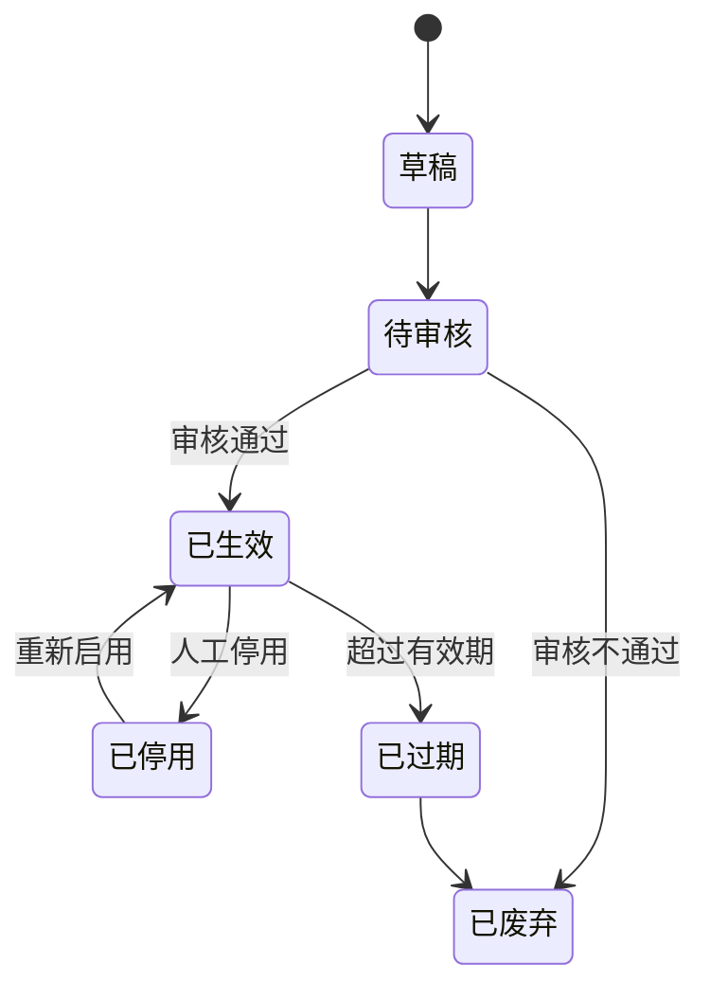

# 01-资料库 PRD

> 状态：✅ 初稿（基于 context 定稿产出）
> 模板：templates/prd-template.md
> 权威层级：context/ > templates/ > 本文件

## 1. 模块概述

资料库是系统的"知识底座"：收纳商业研究结论、案例、用户评论和私信文本、个人观点、对标账号内容/分析、行业报告、实时热点文本等可被内容生产引用的资料。资料经审核生效后，可被选题生成、脚本生成、数据分析按固定组合引用。后端统一承载采集基础设施，本模块消费内容资料；播放、点赞、评论数等账号指标由数据分析模块消费。

依赖关系：选题库（引用资料）、脚本库（引用选题关联资料）、数据分析（资料作为上下文）。

## 2. 功能清单

| # | 功能 | In/Out | 关键规则 |
|---|---|---|---|
| 1 | 资料手动添加 | ✅ In | 字段见 `context/05-术语与字段口径.md` §4.1；来源类型枚举：公众号/报告/社交/客户/思考/对标 |
| 2 | 资料分类 | ✅ In | 分类枚举见 `context/05-术语与字段口径.md` §2：商业研究结论/案例包装/评论和私信/个人观点/对标账号分析/相关热点 |
| 3 | 资料标签 | ✅ In | 标签库+灵活创建（问卷 2.11、首轮第5项确认）；成员创建权限待确认 |
| 4 | 资料搜索和调用 | ✅ In | 按分类/标签/关键词检索；按固定组合引用（如 商业研究结论+个人观点+案例） |
| 5 | 资料审核 | ✅ In | 审核后才能用（R1） |
| 6 | 有效期/可信度管理 | ✅ In | 记录有效期起止和可信度（R2） |
| 7 | 内容资料采集入口 | ✅ In | 内容资料采集范围见 `context/02-核心业务流程.md` §2；统一采集基础设施见 `context/06-系统边界与角色权限.md` §3 |
| 8 | AI 分析结果回写 | ✅ In | 标记 AI 产物，审核后才生效（R8） |

## 3. 交互流程

```mermaid
flowchart LR
    A[手动添加/自动采集/CSV导入(Should)] --> B[填写分类/标签/来源/有效期/可信度]
    B --> C[草稿/待审核]
    C -->|审核通过| D[已生效]
    C -->|审核不通过| E[已废弃]
    D --> F[被搜索/被引用]
    F --> G[选题生成/脚本生成/分析上下文]
```

## 4. 关键规则

- R1 资料必须审核后才能使用；
- R2 资料记录有效期起止和可信度；
- R8 AI 产物与原始事实区分，禁止循环引用原始事实被 AI 结果污染；
- 标签规则（问卷 2.11、首轮第5项确认）：标签库可灵活创建，在所需页面直接新建标签并立即使用；
- 调用规则：提示词中按固定组合调用部分资料（问卷确认）;
- 采集规则：见 `context/02-核心业务流程.md` §2；本模块消费评论和私信文本、对标内容、行业报告和相关热点文本，不消费账号指标。

## 5. 状态机



## 6. 数据字段

引用 `context/05-术语与字段口径.md` §4.1/§4.2，本模块涉及：

**资料条目**：id(主键)/标题(必填)/内容(必填)/资料分类(必填,枚举)/标签(多值,可新建)/来源类型(必填)/来源链接(视情况)/可信度(必填)/有效期起(必填)/有效期止(必填)/状态/审核人/审核时间/创建人/创建时间/是否AI产物/关联源资料

**资料分类**：分类名/父级(可选)

**标签**：标签名；标签组为“新增建议，待确认”字段

## 7. 权限

| 操作 | 管理员 | 成员 |
|---|---|---|
| 资料查看/搜索 | ✅ | ✅（受数据范围限制） |
| 资料新增/修改 | ✅ | ✅ |
| 资料审核 | ✅ | ✅ |
| 资料删除 | ✅ | 待确认 |
| 标签创建 | ✅ | 待确认 |
| 分类管理 | ✅ | ❌ |
| 内容资料采集配置 | ✅ | 由管理员授权 |

## 8. 验收标准

- [ ] 手动添加资料：填写分类/标签/来源/有效期/可信度 → 保存后状态为草稿；点击提交审核后状态为待审核；
- [ ] 审核通过 → 状态已生效；
- [ ] 审核不通过 → 已废弃；
- [ ] 在资料添加页面直接新建一个不存在的标签（如"制造业客户"）→ 立即可选且保存成功；
- [ ] 按分类/标签/关键词搜索资料，结果正确；
- [ ] 勾选固定组合（商业研究结论+个人观点+案例）→ 生成引用预览；
- [ ] 有效期过后自动标记"已过期"；
- [ ] AI 产物的资料（来源于分析回写）带标记，且必须审核后才能用；
- [ ] 自动采集至少一个内容资料来源（评论和私信文本或对标账号内容）成功入库。

## 9. 待确认事项

- 标签组的具体维度预设（客户行业/内容主题等）一期可先自由创建，不做强约束；
- 采集频率与触发方式（定时/手动触发）待正式开发时与姐夫确认。
