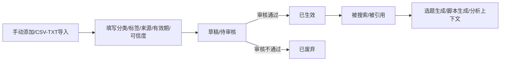
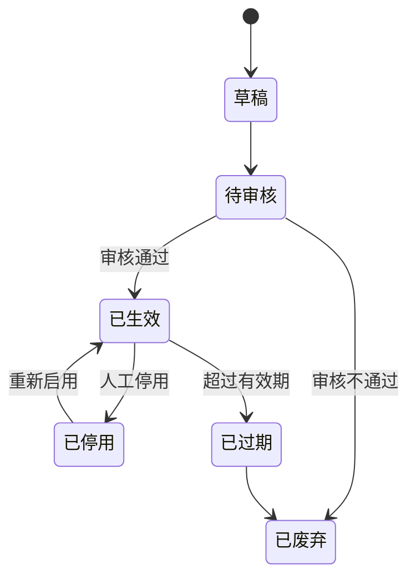

# 01-资料库 PRD

> 状态：✅ 已定稿（第二轮 9 项已回写）
> 模板：templates/prd-template.md
> 权威层级：context/ > templates/ > 本文件

## 1. 模块概述

资料库是系统的"知识底座"：一期通过手动添加或 CSV/TXT 导入收纳商业研究结论、案例、评论和私信文本、个人观点、对标账号内容/分析、行业报告、实时热点文本。资料经审核生效后，可被选题、脚本和数据分析引用。自动采集只保留数据源/任务/API 扩展位置，不执行实际采集（D5）。

依赖关系：选题库（引用资料）、脚本库（引用选题关联资料）、数据分析（资料作为上下文）。

## 2. 功能清单

| # | 功能 | In/Out | 关键规则 |
|---|---|---|---|
| 1 | 资料手动添加 | ✅ In | 字段见 `context/05-术语与字段口径.md` §4.1；来源类型枚举：公众号/报告/社交/客户/思考/对标 |
| 2 | 资料分类 | ✅ In | 分类枚举见 `context/05-术语与字段口径.md` §2：商业研究结论/案例包装/评论和私信/个人观点/对标账号分析/相关热点 |
| 3 | 资料标签 | ✅ In | 自由创建；标签组可选、不强制分组（R12/D1） |
| 4 | 资料搜索和调用 | ✅ In | 按分类/标签/关键词检索；按固定组合引用（如 商业研究结论+个人观点+案例） |
| 5 | 资料审核 | ✅ In | 审核后才能用（R1） |
| 6 | 有效期/可信度管理 | ✅ In | 记录有效期起止和可信度（R2） |
| 7 | CSV/TXT 导入 | ✅ In | 一期主路径（R16/D5） |
| 8 | 自动采集扩展结构 | 架构预留 | 不实际采集；未来启用时人工触发、不做定时（R13/R16） |
| 9 | AI 分析结果回写 | ✅ In | 标记 AI 产物，审核后才生效（R8） |

## 3. 交互流程

## 4. 关键规则

- R1 资料必须审核后才能使用；
- R2 资料记录有效期起止和可信度；
- R8 AI 产物与原始事实区分，禁止循环引用原始事实被 AI 结果污染；
- 标签规则（问卷 2.11、首轮第5项确认）：标签库可灵活创建，在所需页面直接新建标签并立即使用；
- 标签组可选、不强制分组（R12/D1）；
- 调用规则：提示词中按固定组合调用部分资料（问卷确认）;
- 一期通过手动添加/CSV/TXT 导入资料；自动采集仅预留架构（R16/D5），未来启用时仅人工触发、不做定时（R13/D2）。

## 5. 状态机

## 6. 数据字段

引用 `context/05-术语与字段口径.md` §4.1/§4.2，本模块涉及：

**资料条目**：id(主键)/标题(必填)/内容(必填)/资料分类(必填,枚举)/标签(多值,可新建)/来源类型(必填)/来源链接(视情况)/可信度(必填)/有效期起(必填)/有效期止(必填)/状态/审核人/审核时间/创建人/创建时间/是否AI产物/关联来源分析任务

**资料分类**：分类名/父级(可选)

**标签**：标签名；标签组可选、可为空，一期不强制分组（D1）

## 7. 权限

| 操作 | 管理员 | 成员 |
|---|---|---|
| 资料查看/搜索 | ✅ | ✅（受数据范围限制） |
| 资料新增/修改 | ✅ | ✅ |
| 资料审核 | ✅ | ✅ |
| 资料删除 | ✅ | 待确认 |
| 标签创建 | ✅ | 待确认 |
| 分类管理 | ✅ | ❌ |
| 自动采集配置 | 架构预留 | 架构预留 |

## 8. 验收标准

- [ ] 手动添加资料：填写分类/标签/来源/有效期/可信度 → 保存后状态为草稿；点击提交审核后状态为待审核；
- [ ] 审核通过 → 状态已生效；
- [ ] 审核不通过 → 已废弃；
- [ ] 在资料添加页面直接新建一个不存在的标签（如"制造业客户"）→ 立即可选且保存成功；
- [ ] 不选择标签组也可创建、保存和使用标签；
- [ ] CSV/TXT 导入资料成功，格式错误有提示；
- [ ] 按分类/标签/关键词搜索资料，结果正确；
- [ ] 勾选固定组合（商业研究结论+个人观点+案例）→ 生成引用预览；
- [ ] 有效期过后自动标记"已过期"；
- [ ] AI 产物的资料（来源于分析回写）带标记，且必须审核后才能用；
- [ ] 自动采集相关入口不作为一期可执行功能，仅确认后端接口/表结构存在扩展位置。

## 9. 待确认事项

无。标签组、采集触发和一期采集范围已按 D1/D2/D5 确认。
