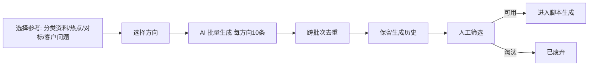
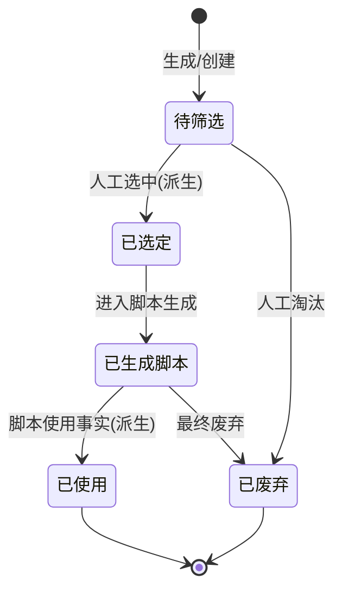

# 02-选题库 PRD

> 状态：✅ 初稿（基于 context 定稿产出）
> 模板：templates/prd-template.md
> 权威层级：context/ > templates/ > 本文件

## 1. 模块概述

选题库是内容方向的生产池：按专业方向批量生成选题（AI 生成 + 人工想法），支持跨批次去重、历史保留、人工筛选，筛选通过的选题进入脚本生成环节。选题是脚本的主要来源（4.1 确认：选题为主、独立为辅）。

依赖关系：资料库（选题生成引用指定分类资料/热点/对标/客户问题）、脚本库（选题 → 脚本）。

## 2. 功能清单

| # | 功能 | In/Out | 关键规则 |
|---|---|---|---|
| 1 | 批量选题生成 | ✅ In | 每方向10条（R4）；可重复执行；AI生成+自己想 |
| 2 | 跨批次去重 | ✅ In | 不同批次避免重复（R4） |
| 3 | 生成历史保留 | ✅ In | 历史记录必须保留（R4） |
| 4 | 人工筛选 | ✅ In | 必须人工筛选后才能使用；判断"可以用"由人工决定（R3） |
| 5 | 选题状态管理 | ✅ In | 待筛选/已生成脚本/已废弃 |
| 6 | 独立选题创建 | ✅ In | 人工直接录入选题（配合脚本独立创建路径） |
| 7 | 参考资料选择 | ✅ In | 指定分类资料/最近热点/对标账号近期内容/客户常见问题 |

## 3. 交互流程

## 4. 关键规则

- R3 选题必须人工筛选后才能使用；
- R4 批量生成按方向10条，保留历史，跨批次去重；
- 生成方式：AI 生成 + 自己想（问卷确认）；
- 选题维度按 `context/05-术语与字段口径.md` §3/§4.4 分列：方向/分类、专业方向、结合场景、用户视角、经营方向、核心角度、选题原则/选题角度；
- 引用（问卷确认）：指定分类资料、最近热点、对标账号近期内容、客户常见问题。

## 5. 状态机

## 6. 数据字段

引用 `context/05-术语与字段口径.md` §4.4，本模块涉及：

**选题**：id/标题/方向或分类/专业方向/结合场景/用户视角/经营方向/核心角度/选题原则或选题角度/状态/生成批次/AI原始响应/人工筛选结果/创建人和创建时间；引用资料、提示词版本均为可选追溯

**选题版本**：待确认扩展实体，不作为 MVP 必建表

## 7. 权限

| 操作 | 管理员 | 成员 |
|---|---|---|
| 选题生成 | ✅ | 由管理员授权 |
| 选题筛选 | ✅ | ✅ |
| 独立创建选题 | ✅ | 待确认 |
| 提示词/参考配置 | ✅ | 由管理员授权 |

## 8. 验收标准

- [ ] 按一个方向批量生成10条选题，AI 返回结果入库；
- [ ] 相同方向重复生成第二次 → 新批次与旧批次去重，不出现重复题；
- [ ] 生成历史可查（每次生成留痕，含时间/方向/条数）；
- [ ] 人工筛选：标记可用 → 状态"已选定"，标记淘汰 → "已废弃"；
- [ ] 已选定选题可一键进入脚本生成；
- [ ] 手动创建独立选题（不依赖AI）保存成功；
- [ ] 若用户选择记录资料追溯，则选题关联可见；不记录时不阻塞选题生成和筛选；
- [ ] 失败场景：AI 生成失败 → 提示重试，批次不丢；
- [ ] 边界：同批次内去重（生成内容完全相同只保留一条）。

## 9. 待确认事项

- 选题版本是否需要（选题本身修改频率低，建议二期）；
- 批次去重的阈值（完全重复 vs 语义相近）开发时按完全重复实现，语义去重二期。
