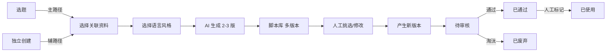
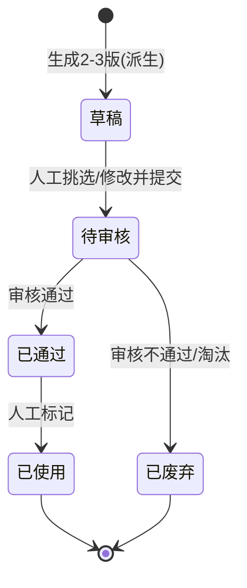

# 03-脚本库 PRD

> 状态：✅ 已定稿（第二轮 9 项已回写）
> 模板：templates/prd-template.md
> 权威层级：context/ > templates/ > 本文件

## 1. 模块概述

脚本库是内容产出单元：基于选题（偶尔独立）生成 2-3 版脚本，支持人工挑选、修改、多版本历史、管理员审核，并由人工把实际使用的已通过脚本标记为“已使用”（D4）。

依赖关系：选题库（脚本主要来源）、资料库（脚本生成引用选题关联的资料）。

## 2. 功能清单

| # | 功能 | In/Out | 关键规则 |
|---|---|---|---|
| 1 | 基于选题生成脚本 | ✅ In | 每选题2-3版（R5）；必须关联并显示选题（R10） |
| 2 | 独立创建脚本 | ✅ In | 偶尔可独立创建，选题允许为空、可后补关联（R9/R10） |
| 3 | 多版本历史 | ✅ In | **每次修改保留历史版本，可对比回退**（4.10 确认） |
| 4 | 语言风格选择 | ✅ In | 专业严谨/轻松口语/讲故事（问卷确认） |
| 5 | 内容要素 | ✅ In | 案例、数据、个人观点都需要（问卷确认） |
| 6 | 人工挑选/修改 | ✅ In | 人工偶尔修改（问卷确认） |
| 7 | 状态流转 | ✅ In | 待审核/已通过/已使用/已废弃；已使用由人工标记（R15） |

## 3. 交互流程

## 4. 关键规则

- R5 脚本每选题2-3版；
- R9 脚本默认基于选题，可偶尔独立创建（4.1 确认）；
- R10 基于选题创建时必须关联并显示选题；独立创建时选题允许为空、可后补关联；资料/提示词追溯可选；
- R11 脚本保留每次修改历史版本，可对比回退（4.10 确认）；
- R15 已使用为一期正式状态，由人工从已通过标记；该标记不代表系统向平台发布内容；
- 审核人一期仅管理员自己，预留多账号扩展（4.8 确认）；
- 语言风格：专业严谨/轻松口语/讲故事（问卷确认）；
- 内容要素：案例、数据、个人观点都需要（问卷确认）。

## 5. 状态机

**版本机制**（4.10 确认）：每次保存修改 → 生成新版本号（v1→v2→v3…）；历史版本保留；支持查看任意历史版本并回退。

“已使用”是一期正式状态和人工操作；可在界面展示为“已使用”，不使用“已发布”作为存储枚举，也不代表系统向平台发布内容。

## 6. 数据字段

引用 `context/05-术语与字段口径.md` §4.5，本模块涉及：

**脚本**：id/选题id（基于选题创建时必填，独立创建可为空并可后补）/当前版本号/正文/语言风格/内容要素/状态/审核人和审核时间/可选关联资料/可选提示词版本/创建修改人及时间

**脚本版本**：id/脚本id/版本号/正文快照/修改人/修改时间；修改备注为新增建议、待确认

## 7. 权限

| 操作 | 管理员 | 成员 |
|---|---|---|
| 脚本生成/挑选 | ✅ | ✅ |
| 脚本修改 | ✅ | 待确认 |
| 脚本审核 | ✅ | ❌（二期扩展） |
| 版本查看/对比 | ✅ | 待确认 |
| 版本回退 | ✅ | 待确认 |

## 8. 验收标准

- [ ] 从已选定选题生成2-3版脚本，选题必填且脚本卡片显示所属选题标题；
- [ ] 独立创建脚本（不选选题）→ 保存成功，选题字段允许为空，后续可补录关联；
- [ ] 修改脚本保存 → 版本号递增（v1→v2），历史中可看到 v1 内容；
- [ ] 回退操作：从 v3 回退到 v1 → 当前内容变为 v1 快照，且生成新的回退记录；
- [ ] 选择语言风格（专业严谨/轻松口语/讲故事）→ 生成结果风格符合；
- [ ] 审核通过 → 状态已通过；审核不通过 → 已废弃；
- [ ] 对已通过脚本执行“标记已使用” → 状态变为已使用；未通过脚本不能执行该操作；
- [ ] 脚本列表显示当前版本号与修改时间；
- [ ] 边界：脚本正文为空不允许保存；
- [ ] 边界：独立创建脚本后续再关联选题（补录选题）允许。

## 9. 待确认事项

无。已使用人工标记已按 D4 确认；资料/提示词追溯已确认可选。
