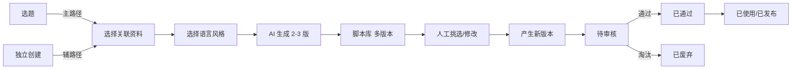
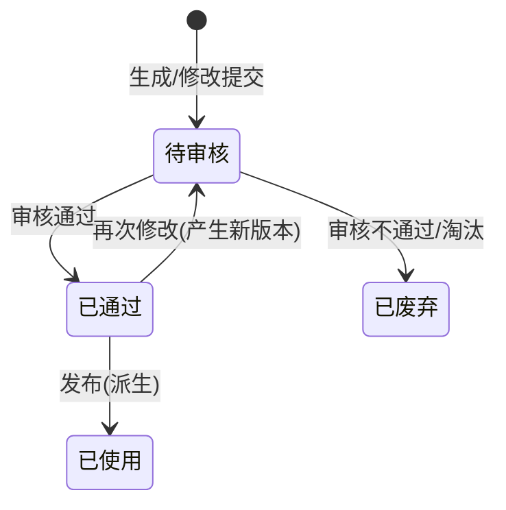

# 03-脚本库 PRD

> 状态：✅ 初稿（基于 context 定稿产出）
> 模板：templates/prd-template.md
> 权威层级：context/ > templates/ > 本文件

## 1. 模块概述

脚本库是内容产出单元：基于选题（偶尔独立）生成 2-3 版脚本，支持人工挑选、修改、多版本历史保留（每次修改留版本，可对比回退），状态流转至审核通过后供发布。脚本必须显示所属选题。

依赖关系：选题库（脚本主要来源）、资料库（脚本生成引用选题关联的资料）。

## 2. 功能清单

| # | 功能 | In/Out | 关键规则 |
|---|---|---|---|
| 1 | 基于选题生成脚本 | ✅ In | 每选题2-3版（R5）；必须显示所属选题 |
| 2 | 独立创建脚本 | ✅ In | 偶尔可独立创建（4.1 确认：选题为主、独立为辅） |
| 3 | 多版本历史 | ✅ In | **每次修改保留历史版本，可对比回退**（4.10 确认） |
| 4 | 语言风格选择 | ✅ In | 专业严谨/轻松口语/讲故事（问卷确认） |
| 5 | 内容要素 | ✅ In | 案例、数据、个人观点都需要（问卷确认） |
| 6 | 人工挑选/修改 | ✅ In | 人工偶尔修改（问卷确认） |
| 7 | 状态流转 | ✅ In | 待审核/已通过/已废弃 |

## 3. 交互流程

## 4. 关键规则

- R5 脚本每选题2-3版；
- R9 脚本默认基于选题，可偶尔独立创建（4.1 确认）；
- R10 脚本必须关联选题（必显）；资料/提示词追溯可选（3.13 确认）；
- R11 脚本保留每次修改历史版本，可对比回退（4.10 确认）；
- 审核人一期仅管理员自己，预留多账号扩展（4.8 确认）；
- 语言风格：专业严谨/轻松口语/讲故事（问卷确认）；
- 内容要素：案例、数据、个人观点都需要（问卷确认）。

## 5. 状态机

**版本机制**（4.10 确认）：每次保存修改 → 生成新版本号（v1→v2→v3…）；历史版本保留；支持查看任意历史版本并回退。

## 6. 数据字段

引用 context/05，本模块涉及：

**脚本**：id(主键)/选题id(必填,独立创建可为空)/标题(必填)/正文(必填)/版本号(当前版本)/语言风格(必填)/状态(必填)/审核人/审核时间/创建人/创建时间

**脚本版本**：id/脚本id/版本号/正文快照/修改人/修改时间/备注

## 7. 权限

| 操作 | 管理员（姐夫） | 普通成员 |
|---|---|---|
| 脚本生成/挑选 | ✅ | ✅ |
| 脚本修改 | ✅ | ✅ |
| 脚本审核 | ✅ | 预留（二期） |
| 版本回退 | ✅ | ✅ |

## 8. 验收标准

- [ ] 从已选定选题生成2-3版脚本，脚本卡片显示所属选题标题；
- [ ] 独立创建脚本（不选选题）→ 保存成功，选题字段为空但允许；
- [ ] 修改脚本保存 → 版本号递增（v1→v2），历史中可看到 v1 内容；
- [ ] 回退操作：从 v3 回退到 v1 → 当前内容变为 v1 快照，且生成新的回退记录；
- [ ] 选择语言风格（专业严谨/轻松口语/讲故事）→ 生成结果风格符合；
- [ ] 审核通过 → 状态已通过；审核不通过 → 已废弃；
- [ ] 脚本列表显示当前版本号与修改时间；
- [ ] 边界：脚本正文为空不允许保存；
- [ ] 边界：独立创建脚本后续再关联选题（补录选题）允许。

## 9. 待确认事项

- 脚本"已使用/已发布"标记是否需要人工操作（问卷未勾选，建议二期）；
- 脚本与提示词版本的追溯（3.13 确认"可有可无"，一期不强制）。