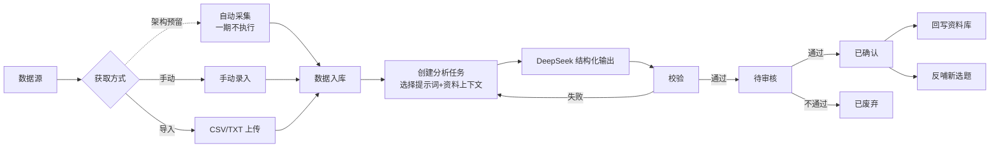
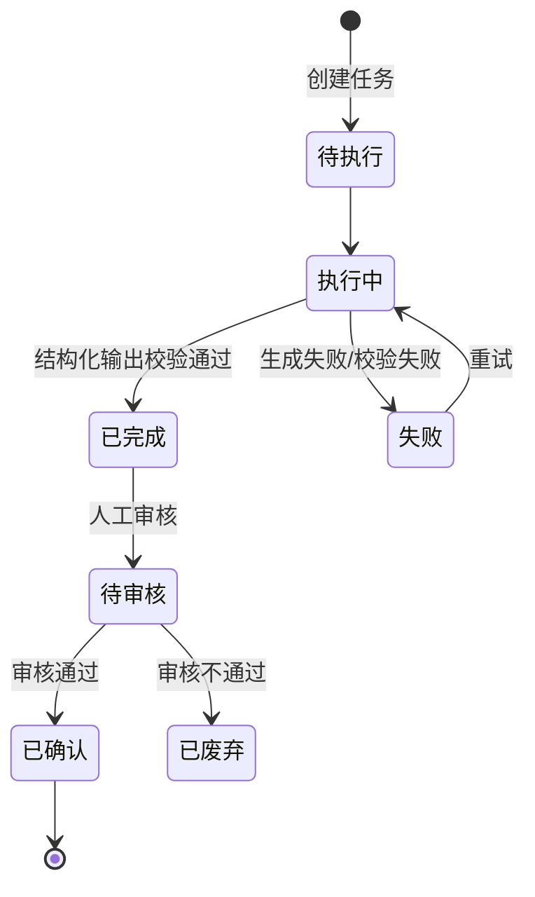

# 04-数据分析 PRD

> 状态：✅ 已定稿（第二轮 9 项已回写）
> 模板：templates/prd-template.md
> 权威层级：context/ > templates/ > 本文件

## 1. 模块概述

数据分析模块一期以手动录入 + CSV/TXT 导入为数据入口，提供通用分析框架、任务状态流转、人工审核和回写/反哺能力。当前无视频号账号，自动采集只保留架构扩展位置，不运行真实采集；具体指标和深度分析二期迭代（D5/D6）。

依赖关系：资料库（分析上下文 + 结果回写）、选题库（反哺新选题）。

## 2. 功能清单

| # | 功能 | In/Out | 关键规则 |
|---|---|---|---|
| 1 | 自动采集 | 架构预留 | 一期不接视频号、不运行采集；未来启用时仅人工触发（R13/R16） |
| 2 | 手动录入数据 | ✅ In | 数据字段可配置 |
| 3 | CSV/TXT 导入 | ✅ In | 一期主路径，原始文件入对象存储（R16） |
| 4 | 分析任务创建 | ✅ In | 提示词+资料上下文 → DeepSeek 结构化输出 |
| 5 | 人工审核结果 | ✅ In | 分析结果必须人工审核后才能用（R6） |
| 6 | 结果回写资料库 | ✅ In | 审核后回写（R7） |
| 7 | 反哺新选题 | ✅ In | 审核后生成新选题（R7） |
| 8 | 基础分析输出 | ✅ In | 通用结构化内容 + 状态；具体指标/深度分析二期（R17） |

## 3. 交互流程

## 4. 关键规则

- R6 分析结果必须人工审核后使用；
- R7 分析结果回写资料库 + 反哺选题；
- R8 AI 产物与原始事实区分，禁止循环引用原始事实被 AI 结果污染；
- 一期无视频号账号，手动录入 + CSV/TXT 导入为主；自动采集仅架构预留，不作为 MVP（R16/D5）；
- 未来启用自动采集时采用人工触发，不做定时任务（R13/D2）；
- 一期只做基础分析框架与状态流转，不固化播放/点赞/评论/涨粉等指标；深度分析二期（R17/D6）；
- 审核人：人工（姐夫）；
- 失败处理：生成失败/校验失败可重试，保留原始响应；
- 内容资料由资料库消费，基础账号数据通过手动录入/CSV 导入进入原始数据。

## 5. 状态机

## 6. 数据字段

引用 `context/05-术语与字段口径.md` §4.6/§4.7，本模块涉及：

**数据源**：id/名称/采集方式(手动录入/CSV导入；自动采集为预留枚举)/业务对象/平台/账号标识/对标标记；采集配置和启用状态只服务未来扩展

**原始数据**：id/数据源id/采集时间/原始数据内容或对象存储引用/结构化数据/采集时间窗/清洗去重记录

**分析任务**：id/类型/任务输入引用集合/可选提示词版本/可选资料上下文/输出字段schema/AI原始响应/状态/审核人和时间；任务名称、重试次数为新增建议、待确认

**分析结果**：id/任务id/分析结论/资料库回写状态(未回写/已回写)/选题反哺状态(未反哺/已反哺)/回写资料id/反哺选题id；两种回写动作可同时完成

一期不新增或固化具体业务指标字段；结构化数据与结果使用通用 JSON/schema 承载，深度指标二期（D6）。

## 7. 权限

| 操作 | 管理员 | 成员 |
|---|---|---|
| 自动采集配置 | 架构预留 | 架构预留 |
| 手动录入/导入 | ✅ | 待确认 |
| 数据分析查看 | ✅ | ✅（受数据范围限制） |
| 创建/执行分析任务 | ✅ | 待确认 |
| 审核分析结果 | ✅ | 待确认 |
| 回写/反哺 | ✅ | 待确认 |

## 8. 验收标准

- [ ] 手动录入一组基础数据 → 入库；不要求固定视频号指标维度；
- [ ] 上传 CSV/TXT 文件 → 解析入库成功，格式错误给出提示；
- [ ] 创建分析任务（选提示词 + 资料上下文）→ 任务状态从待执行→执行中→已完成；
- [ ] DeepSeek 返回符合基础 schema 的通用结构化结果；不验收深度指标；
- [ ] 校验失败 → 任务失败，可重试，原始响应保留可查；
- [ ] 审核通过 → 已确认；
- [ ] "回写资料库"按钮 → 生成一条带 AI 产物标记的资料（待审核）；
- [ ] "反哺新选题"按钮 → 生成一条待筛选选题；
- [ ] 未审核的结果不能被回写/反哺（按钮置灰或拦截）；
- [ ] 自动采集不要求真实数据接入，仅确认接口/表结构具有扩展位置。

## 9. 待确认事项

采集触发和视频号接入边界已按 D2/D5 确认；D6 已确认具体指标/深度分析不进入一期。二期启动前仍需确认具体账号指标字段（5.5/5.6）和优先分析类型（5.15），均不阻塞一期。
