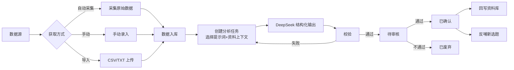
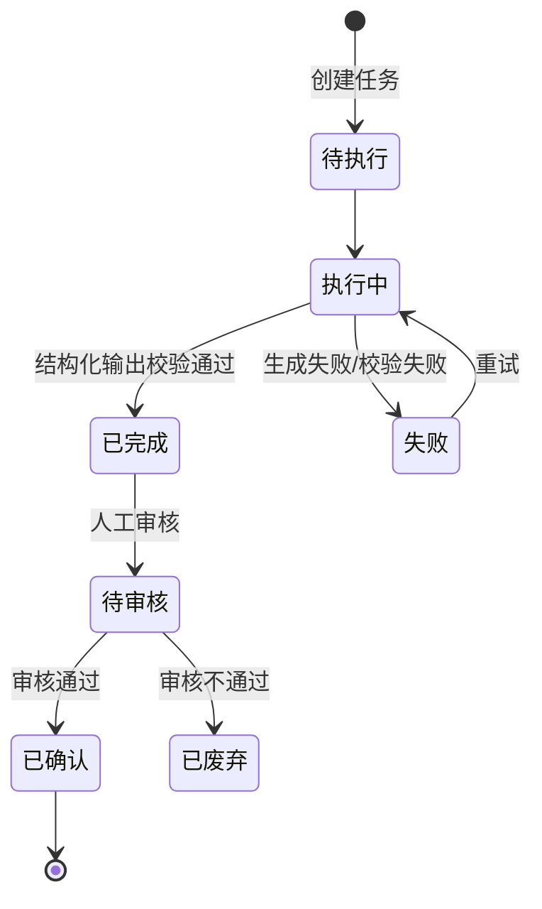

# 04-数据分析 PRD

> 状态：✅ 初稿（基于 context 定稿产出）
> 模板：templates/prd-template.md
> 权威层级：context/ > templates/ > 本文件

## 1. 模块概述

数据分析模块将账号运营数据转化为可复用的业务洞察：从数据源（自动采集/手动录入/CSV导入）获取原始数据，用提示词+资料上下文驱动 DeepSeek 产出结构化分析，经人工审核后回写资料库、反哺新选题，形成"数据 → 洞察 → 内容"闭环。

依赖关系：资料库（分析上下文 + 结果回写）、选题库（反哺新选题）。

## 2. 功能清单

| # | 功能 | In/Out | 关键规则 |
|---|---|---|---|
| 1 | 数据采集 | ✅ In | 自动采集：评论私信/对标账号信息/行业报告/实时热点（6 确认） |
| 2 | 手动录入数据 | ✅ In | 数据字段可配置 |
| 3 | CSV/TXT 导入 | ✅ In（希望有） | 原始文件入对象存储 |
| 4 | 分析任务创建 | ✅ In | 提示词+资料上下文 → DeepSeek 结构化输出 |
| 5 | 人工审核结果 | ✅ In | 分析结果必须人工审核后才能用（R6） |
| 6 | 结果回写资料库 | ✅ In | 审核后回写（R7） |
| 7 | 反哺新选题 | ✅ In | 审核后生成新选题（R7） |
| 8 | 分析维度 | ✅ In | 效果好坏/分析结论/建议（问卷确认） |

## 3. 交互流程

## 4. 关键规则

- R6 分析结果必须人工审核后使用；
- R7 分析结果回写资料库 + 反哺选题；
- R8 AI 产物与原始事实区分，禁止循环引用原始事实被 AI 结果污染；
- 分析数据范围：全维度（问卷确认），视频号为主，自己+对标都要；
- 输出结论维度：效果好坏、分析结论、建议（问卷确认）；
- 审核人：人工（姐夫）；
- 失败处理：生成失败/校验失败可重试，保留原始响应；
- 数据来源优先级（6 确认）：自动采集（评论私信/对标/报告/热点）为主，手动/CSV 兜底。

## 5. 状态机

## 6. 数据字段

引用 context/05，本模块涉及：

**数据源**：id(主键)/名称/类型(自己账号/对标账号/报告/热点/评论私信)/平台(视频号等)/采集配置/状态

**原始数据**：id(主键)/数据源id/采集时间/原始内容/结构化json/状态

**分析任务**：id(主键)/名称/类型/提示词版本(快照)/输入数据(原始数据id或资料id)/输出结果/状态/审核人/创建人/创建时间

**分析结果**：id(主键)/任务id/结果内容(结构化)/回写状态(未回写/已回写资料库/已生成选题)/生成选题id

## 7. 权限

| 操作 | 管理员（姐夫） | 普通成员 |
|---|---|---|
| 数据采集配置 | ✅ | 预留 |
| 手动录入/导入 | ✅ | ✅ |
| 创建/执行分析任务 | ✅ | ✅ |
| 审核分析结果 | ✅ | ✅ |
| 回写/反哺 | ✅ | ✅ |

## 8. 验收标准

- [ ] 手动录入一条视频号数据（播放/点赞/评论字段）→ 入库；
- [ ] 上传 CSV 文件 → 解析入库成功，格式错误给出提示；
- [ ] 创建分析任务（选提示词 + 资料上下文）→ 任务状态从待执行→执行中→已完成；
- [ ] DeepSeek 返回结构化结果（效果好坏/结论/建议字段完整）；
- [ ] 校验失败 → 任务失败，可重试，原始响应保留可查；
- [ ] 审核通过 → 已确认；
- [ ] "回写资料库"按钮 → 生成一条带 AI 产物标记的资料（待审核）；
- [ ] "反哺新选题"按钮 → 生成一条待筛选选题；
- [ ] 未审核的结果不能被回写/反哺（按钮置灰或拦截）；
- [ ] 自动采集任务（评论私信或对标账号）成功拉取数据入库；
- [ ] 边界：采集失败不影响手动录入；手动/CSV 可完全兜底。

## 9. 待确认事项

- 自动采集的视频号官方 API 可用性（企业认证/OAuth/字段范围）待验证，无 API 时手动/CSV 兜底；
- 数据采集频率（每天/每周）待正式开发确认；
- 分析维度默认字段（播放量/点赞/评论/涨粉等）一期全量采集，不做筛选。