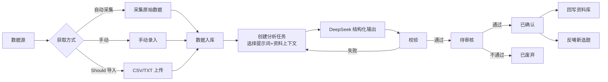
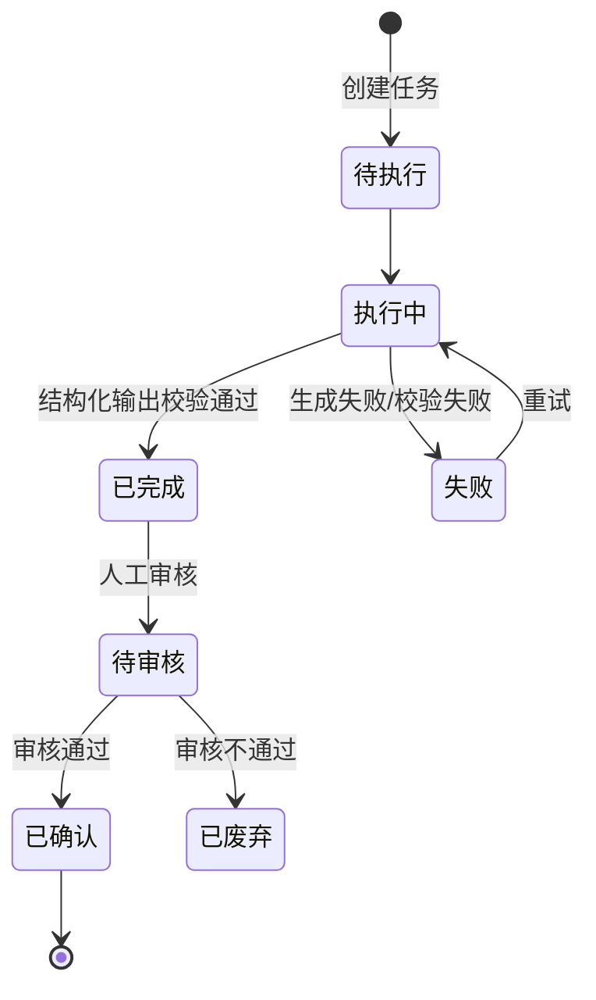

# 04-数据分析 PRD

> 状态：✅ 初稿（基于 context 定稿产出）
> 模板：templates/prd-template.md
> 权威层级：context/ > templates/ > 本文件

## 1. 模块概述

数据分析模块将账号运营指标转化为可复用的业务洞察：通过后端统一采集基础设施获取播放、互动、涨粉等账号指标，或使用手动录入/CSV 导入，用提示词+资料上下文驱动 DeepSeek 产出结构化分析，经人工审核后回写资料库、反哺新选题，形成"数据 → 洞察 → 内容"闭环。评论和私信文本、对标内容、报告与热点文本作为内容资料时由资料库消费。

依赖关系：资料库（分析上下文 + 结果回写）、选题库（反哺新选题）。

## 2. 功能清单

| # | 功能 | In/Out | 关键规则 |
|---|---|---|---|
| 1 | 账号指标采集 | ✅ In | 采集归属见 `context/06-系统边界与角色权限.md` §3 |
| 2 | 手动录入数据 | ✅ In | 数据字段可配置 |
| 3 | CSV/TXT 导入 | Should（非阻塞） | 原始文件入对象存储 |
| 4 | 分析任务创建 | ✅ In | 提示词+资料上下文 → DeepSeek 结构化输出 |
| 5 | 人工审核结果 | ✅ In | 分析结果必须人工审核后才能用（R6） |
| 6 | 结果回写资料库 | ✅ In | 审核后回写（R7） |
| 7 | 反哺新选题 | ✅ In | 审核后生成新选题（R7） |
| 8 | 分析维度 | ✅ In | 效果好坏/分析结论/建议（问卷确认） |

## 3. 交互流程

## 4. 关键规则

- R6 分析结果必须人工审核后使用；
- R7 分析结果回写资料库 + 反哺选题；
- R8 AI 产物与原始事实区分，禁止循环引用原始事实被 AI 结果污染；
- 分析数据范围：全维度（问卷确认），视频号为主，自己+对标都要；
- 输出结论维度：效果好坏、分析结论、建议（问卷确认）；
- 审核人：人工（姐夫）；
- 失败处理：生成失败/校验失败可重试，保留原始响应；
- 数据来源策略：账号指标自动采集为主、手动录入兜底，CSV/TXT 为 Should；内容资料由资料库消费。

## 5. 状态机

## 6. 数据字段

引用 `context/05-术语与字段口径.md` §4.6/§4.7，本模块涉及：

**数据源**：id/名称/采集方式(自动采集/手动录入/CSV导入)/业务对象(自己账号/对标账号/行业报告/相关热点/评论和私信)/平台/账号标识/对标标记；采集配置和启用状态为新增建议、待确认

**原始数据**：id/数据源id/采集时间/原始数据内容或对象存储引用/结构化数据/采集时间窗/清洗去重记录

**分析任务**：id/类型/任务输入引用集合/可选提示词版本/可选资料上下文/输出字段schema/AI原始响应/状态/审核人和时间；任务名称、重试次数为新增建议、待确认

**分析结果**：id/任务id/分析结论/资料库回写状态(未回写/已回写)/选题反哺状态(未反哺/已反哺)/回写资料id/反哺选题id；两种回写动作可同时完成

## 7. 权限

| 操作 | 管理员 | 成员 |
|---|---|---|
| 数据采集配置 | ✅ | 由管理员授权 |
| 手动录入/导入 | ✅ | 待确认 |
| 数据分析查看 | ✅ | ✅（受数据范围限制） |
| 创建/执行分析任务 | ✅ | 待确认 |
| 审核分析结果 | ✅ | 待确认 |
| 回写/反哺 | ✅ | 待确认 |

## 8. 验收标准

- [ ] 按已配置字段手动录入一组视频号账号指标 → 入库；5.5/5.6 具体指标未确认前不固化字段；
- [ ] （Should，非阻塞）上传 CSV 文件 → 解析入库成功，格式错误给出提示；
- [ ] 创建分析任务（选提示词 + 资料上下文）→ 任务状态从待执行→执行中→已完成；
- [ ] DeepSeek 返回结构化结果（效果好坏/结论/建议字段完整）；
- [ ] 校验失败 → 任务失败，可重试，原始响应保留可查；
- [ ] 审核通过 → 已确认；
- [ ] "回写资料库"按钮 → 生成一条带 AI 产物标记的资料（待审核）；
- [ ] "反哺新选题"按钮 → 生成一条待筛选选题；
- [ ] 未审核的结果不能被回写/反哺（按钮置灰或拦截）；
- [ ] 自动采集一组视频号自己账号或对标账号指标并入原始数据；
- [ ] 边界：采集失败不影响手动录入；手动录入可兜底，CSV/TXT 在 Should 交付后作为额外兜底。

## 9. 待确认事项

- 自动采集的视频号官方 API 可用性（企业认证/OAuth/字段范围）待验证，无 API 时手动/CSV 兜底；
- 数据采集频率（每天/每周）待正式开发确认；
- 分析维度默认字段（播放量/点赞/评论/涨粉等）一期全量采集，不做筛选。
