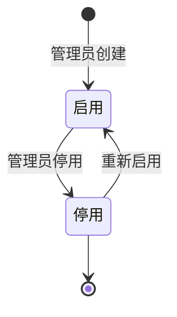

# 05-权限与账号 PRD

> 状态：✅ 初稿（基于 context 定稿产出）
> 模板：templates/prd-template.md
> 权威层级：context/ > templates/ > 本文件

## 1. 模块概述

权限与账号模块提供系统的访问控制基础：管理员/成员两级角色（6.7 确认），一期实现基础权限隔离，完整 RBAC 自定义角色体系与操作审计二期。管理员可创建成员账号、分配角色、功能权限与数据范围。

依赖关系：所有业务模块（资料/选题/脚本/分析）都受本模块权限控制。

## 2. 功能清单

| # | 功能 | In/Out | 关键规则 |
|---|---|---|---|
| 1 | 登录/登出 | ✅ In | 需要身份验证；具体登录方式待确认，账号密码为当前建议 |
| 2 | 账号管理 | ✅ In | 管理员创建/停用成员账号（6.7 确认） |
| 3 | 角色分配 | ✅ In | 管理员/成员两级 |
| 4 | 数据权限 | ✅ In（基础） | 管理员可配置成员可见数据范围 |
| 5 | 登录凭证管理 | ✅ In | 用户更新自己的登录凭证；具体凭证形态随待确认登录方式确定 |
| 6 | 完整 RBAC/操作审计 | Out（二期） | 主PRD §9 |

## 3. 交互流程

## 4. 关键规则

- 6.7 确认：先做权限隔离功能（RBAC 预留），后台管理员分配账号、配置权限和数据；
- 4.8 确认：脚本审核 MVP 仅自己（管理员），预留扩展；
- 一期两级角色：管理员/成员；“姐夫”“账号操盘手”是管理员的业务称谓；
- 权限矩阵见 `context/06-系统边界与角色权限.md` §2.2；
- 完整 RBAC 角色体系与操作审计二期（主PRD §9）。

## 5. 状态机

## 6. 数据字段

引用 `context/05-术语与字段口径.md` §4.8，本模块涉及：

**用户**：id/账号标识(唯一)/角色(管理员/成员)/状态(启用/停用)/功能权限/数据范围/创建人和创建时间；凭证摘要、最后登录时间为新增建议、待确认

**一期权限模型**：管理员/成员两级角色 + 管理员分配的功能权限和数据范围；完整 RBAC 自定义角色体系二期

## 7. 权限

| 操作 | 管理员 | 成员 |
|---|---|---|
| 登录 | ✅ | ✅ |
| 创建/停用账号 | ✅ | ❌ |
| 分配角色/功能权限/数据范围 | ✅ | ❌ |
| 更新自己的登录凭证 | ✅ | ✅ |

## 8. 验收标准

- [ ] 管理员登录成功，看到账号管理入口；
- [ ] 成员登录成功，看不到账号管理入口（权限隔离生效）；
- [ ] 管理员创建新成员账号 → 成员可用新账号登录；
- [ ] 管理员停用账号 → 该账号无法再登录；
- [ ] 管理员给成员分配"仅指定分类资料"的数据范围 → 成员只能看到该分类资料；
- [ ] 成员按已确认登录方式更新自己的登录凭证，旧凭证失效；
- [ ] 未登录访问业务页面 → 跳转登录；
- [ ] 边界：登录凭证错误时拒绝访问并记录失败；锁定/限流阈值待确认。

## 9. 待确认事项

- 具体登录方式待确认；当前默认建议一期账号密码，企业微信/验证码等二期评估；
- 成员数量上限待确认；
- 登录失败锁定/限流阈值待确认；
- 管理员自停用保护为新增建议，待确认。
