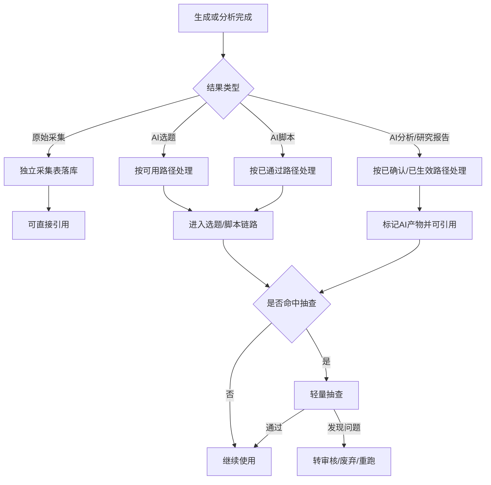
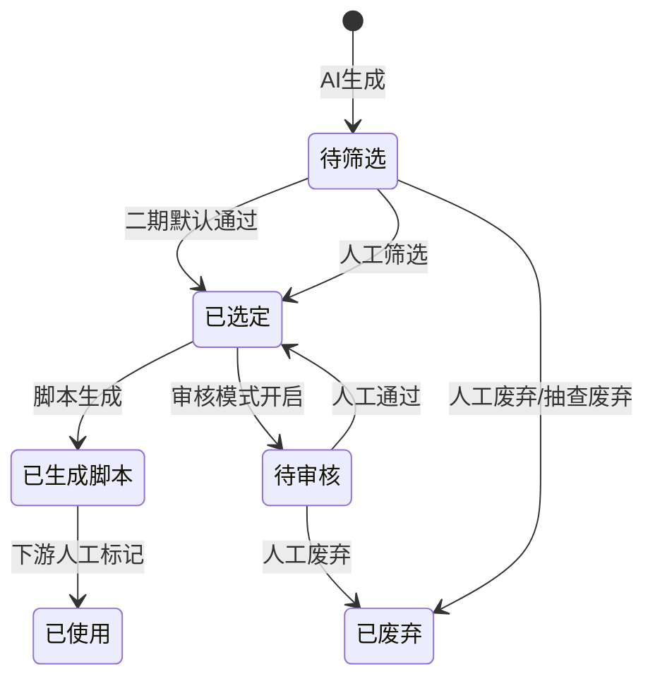
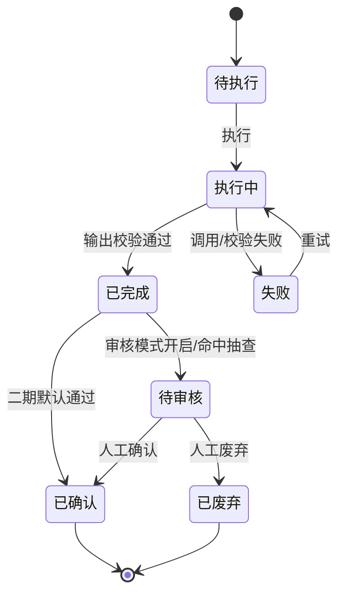
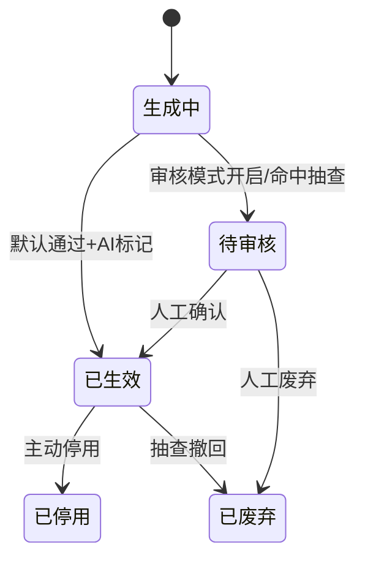

# 审核流程变更说明

> 文件定位：二期默认通过、轻量抽查和一期审核能力保留的变更说明
> 依据：`requirements/09-二期调研结论.md`，用户 2026-08-26 拍板
> 重要：本文件不修改 `context/04-业务规则与状态机.md`；所有变化均标注“待回写 context/04”

## 1. 模块概述

### 1.1 变更目的

一期审核设计以质量控制为优先：选题必须人工筛选，分析结果必须人工审核，AI 回写资料必须审核后才能使用。二期面对操盘手自用场景，确认当前最大成本来自逐条审核和批量导入，而不是缺少审核能力，因此将默认路径改为直接可用，同时保留人工审核和抽查能力。

### 1.2 适用范围

本说明覆盖三条规则：

1. R3：选题必须人工筛选。
2. R6：分析结果必须人工审核后使用。
3. R8：AI 产物与原始事实区分，AI 产物审核后才可用。

本说明同时覆盖研究助手生成结果、自动采集原始结果、周报结果和一期既有脚本/资料审核入口的二期行为。

### 1.3 不变的产品底线

1. 原始采集数据与 AI 产物仍然分开。
2. 所有结果保留来源、输入、原始响应或生成追溯。
3. 审核能力不删除，后续可重新启用。
4. 默认通过不等于取消错误处理、废弃、撤回和抽查。
5. 本说明不改变登录、角色枚举和一期数据库结构。

## 2. 功能清单

| # | 功能 | 一期行为 | 二期默认行为 | 备注 |
|---|---|---|---|---|
| 1 | 选题生成后使用 | 进入待筛选 | 默认按已选定/可用路径处理 | R3 变更，待回写 context/04 |
| 2 | 选题人工筛选 | 前置必做 | 变为主动抽查/审核重启时使用 | 入口保留 |
| 3 | 分析结果确认 | 待审核后才可回写 | 默认按已确认处理 | R6 变更，待回写 context/04 |
| 4 | 分析结果审核 | 回写前置 | 轻量抽查或审核重启时使用 | 入口保留 |
| 5 | AI 资料生效 | 待审核后使用 | 默认可用但保持 AI 产物标记 | R8 变更，待回写 context/04 |
| 6 | 原始采集结果 | 一期未执行 | 独立采集表落库后直接可信 | 不进入 AI 审核队列 |
| 7 | AI 选题/脚本抽查 | 一期没有统一抽查 | 按抽查策略抽取 | 抽查配置待确认 |
| 8 | 审核模式切换 | 固定审核前置 | 默认通过/审核前置可切换 | 开关字段新增建议，待确认 |
| 9 | 问题结果处理 | 驳回/废弃 | 抽查发现后转现有审核或废弃 | 不覆盖原始采集事实 |

## 3. 交互流程

### 3.1 默认通过主流程

### 3.2 重新启用人工审核

1. 管理员在审核设置中选择模块或结果类型。
2. 系统将对应结果的后续处理切换为一期审核前置。
3. 新生成结果进入既有待审核状态或等价映射。
4. 审核通过后进入现有已选定、已通过、已确认或已生效状态。
5. 审核不通过沿用已废弃或现有驳回路径。
6. 已经默认通过的历史结果不自动回滚；如需复核，由管理员主动发起抽查或复核任务。

### 3.3 轻量抽查流程

1. 系统按抽查策略选取 AI 结果。
2. 抽查列表展示结果内容、输入来源、生成时间、AI 原始响应和关联对象。
3. 操盘手选择通过、转人工审核、废弃或重新生成。
4. 抽查结论记录，但不修改原始采集记录。
5. 若结果已沉淀资料库，复核动作只影响该 AI 产物，不删除原始来源。

## 4. 关键规则

### 4.1 R3：选题筛选变化

| 项目 | 一期 | 二期 |
|---|---|---|
| 生成后初始路径 | 待筛选 | 默认按已选定/可用路径处理 |
| 人工筛选 | 使用前必须做 | 不再是使用前阻塞，保留主动筛选入口 |
| 完全重复去重 | 生成时执行 | 继续执行 |
| 语义去重 | 不做 | 本轮仍不强制做 |
| 人工修改 | 可修改，无版本表 | 沿用一期修改规则，版本表另行评估 |
| 异常处理 | 人工废弃 | 抽查发现后可废弃或转审核 |

二期新增规则：AI 生成选题在默认模式下直接进入后续脚本链路。来源：`requirements/09-二期调研结论.md` 2026-08-26 拍板。该规则**待回写 context/04**。

### 4.2 R6：分析审核变化

| 项目 | 一期 | 二期 |
|---|---|---|
| 分析完成后 | 已完成→待审核 | 默认按已确认处理 |
| 回写资料 | 已确认后允许 | 默认可执行；保留 AI 产物标记 |
| 反哺选题 | 已确认后允许 | 默认可执行；选题按默认通过规则处理 |
| 失败重试 | 保留 | 保留 |
| 人工审核 | 强制前置 | 轻量抽查或审核模式开启时前置 |

二期新增规则：分析结果默认确认，但每次分析仍保留结构化输出校验、原始响应和错误记录。来源：`requirements/09-二期调研结论.md` 2026-08-26 拍板。该规则**待回写 context/04**。

### 4.3 R8：AI 产物区分变化

1. R8 的“区分”不变：AI 产物仍必须有 `is_ai_product=true` 或等价标识。
2. R8 的“审核后才可用”在二期默认通过模式下变更为“默认可用，但保留 AI 产物标识、抽查和撤回能力”。
3. 原始采集数据不是 AI 产物，落独立采集表，直接作为原始事实使用。
4. 研究报告是 AI 整理产物，必须保留引用关系和生成输入。
5. 研究报告生成的选题/脚本是 AI 产物，必须保留研究报告关联。
6. 分析结果回写资料仍应保留来源分析任务关联。
7. 抽查不应把 AI 产物改写成原始事实。

该变化来源于二期拍板“原始采集数据直接信、AI 分析/生成结果保留轻量抽查”，**待回写 context/04 和 context/05**。

### 4.4 默认通过的状态映射

为避免新造枚举，二期优先复用一期已存在的状态：

| 结果 | 默认映射建议 | 确认度 |
|---|---|---|
| AI 选题 | `已选定`（选题已有派生状态） | 新增映射建议，待确认 |
| AI 脚本 | `已通过` | 新增映射建议，待确认 |
| AI 分析结果 | `已确认` | 新增映射建议，待确认 |
| AI 研究报告沉淀资料 | `已生效` + `is_ai_product=true` | 新增映射建议，待确认 |
| 原始采集结果 | 独立采集记录状态，不使用资料审核状态 | 新增实体/状态建议，待确认 |

如果后端认为必须保留“待审核”作为技术中间态，可以在同一事务内创建后立即自动完成默认审核；最终用户可用状态不应被待审核阻塞。

### 4.5 轻量抽查规则

1. 抽查对象：AI 选题、AI 脚本、AI 分析结果、AI 研究报告和 AI 回写资料。
2. 非抽查对象：原始采集数据；原始事实直接信，但仍检查格式、来源和采集完整性。
3. 抽查时机：生成完成后抽取、定期抽取或管理员主动抽取，具体策略待确认。
4. 抽查粒度：以结果为单位，研究报告可增加章节/引用级抽查，具体粒度待确认。
5. 抽查通过：保持当前可用状态，记录抽查时间和操作者。
6. 抽查发现问题：转现有人工审核、废弃或重新生成；不得静默覆盖原始响应。
7. 抽查比例：新增配置建议，待确认，不作为 P0 固定数值。
8. 抽查结果字段：新增建议，待确认；可先用现有 reviewer/reviewed_at 或独立日志承载。

### 4.6 审核能力加回规则

1. 审核入口继续显示在资料、选题、脚本和分析相关页面中，但默认模式下不成为主流程阻塞。
2. 管理员可以从结果详情主动发起审核。
3. 开启审核前置后，新结果按对应模块既有待审核状态进入队列。
4. 关闭审核前置只影响新结果，不自动改变历史结果。
5. 审核能力的开关、作用域和生效时间是新增配置建议，待确认。
6. 不做完整多角色审批流，不引入会签、转交、节点配置等未拍板能力。

### 4.7 幂等与追溯

1. 默认通过不能重复创建同一份回写资料或选题。
2. 抽查、审核、废弃、重跑操作需要幂等。
3. 研究报告和生成结果保留输入快照或关联 ID。
4. 采集原始数据保留原始响应、来源、账号和时间窗。
5. 推送失败不影响结果状态，不触发结果回滚。

## 5. 状态机

### 5.1 选题默认通过覆盖

“二期默认通过”是覆盖规则，**待回写 context/04**；状态名称优先复用一期枚举。

### 5.2 分析结果默认通过覆盖

“已完成→已确认”的默认转移为新增业务覆盖，**待回写 context/04**。

### 5.3 AI 资料默认通过覆盖

“生成中”为流程态，“默认通过”及其映射为新增建议，待确认；不得覆盖原始资料事实。

## 6. 数据字段

### 6.1 复用字段

1. 选题继续使用 `status`、`screening_result`、`batch_no`、`ai_raw_response` 等一期字段。
2. 分析任务继续使用 `status`、`reviewer_id`、`reviewed_at`、`ai_raw_response` 等一期字段。
3. 资料继续使用 `is_ai_product`、`source_analysis_task_id`、`reviewer_id`、`reviewed_at` 和状态字段。
4. 脚本继续使用 `status`、审核字段和脚本版本字段。

### 6.2 新增建议字段

| 字段 | 适用对象 | 说明 | 确认度 |
|---|---|---|---|
| approval_mode | 模块/任务 | 默认通过或审核前置 | 新增建议，待确认 |
| spot_check_required | AI结果 | 是否命中抽查 | 新增建议，待确认 |
| spot_check_status | AI结果 | 抽查中/通过/转审核/废弃 | 新增建议，待确认 |
| spot_checked_by | AI结果 | 抽查人 | 新增建议，待确认 |
| spot_checked_at | AI结果 | 抽查时间 | 新增建议，待确认 |
| source_type | 结果 | 采集/研究/分析/生成来源 | 新增建议，待确认；不得与 context/05 的资料 source_type 直接混用 |
| source_record_id | 结果 | 原始采集或研究来源关联 | 新增建议，待确认 |

字段可先通过 DTO 或审核日志承载，是否建表字段由技术评审决定。

## 7. 权限

| 动作 | 管理员 | 成员 | 说明 |
|---|---|---|---|
| 查看默认通过结果 | ✅ | 沿用现有授权 | 本期不新增成员权限 |
| 主动发起审核 | ✅ | 沿用现有授权 | 不扩大已有动作权限 |
| 配置审核模式 | ✅ | ❌ | 新增配置权限建议，待确认 |
| 执行抽查 | ✅ | 沿用现有授权 | 具体授权待确认 |
| 废弃/撤回 AI 结果 | ✅ | 沿用现有授权 | 不影响原始采集记录 |
| 查看原始采集事实 | ✅ | 沿用数据范围 | 原始数据不等同于 AI 产物 |

二期不建设多人协作、会签、权限分组或移动端审核体验。

## 8. 验收标准

- [ ] 新生成选题在默认模式下不被人工筛选阻塞。
- [ ] 选题人工筛选入口仍可访问并可主动执行。
- [ ] 分析任务完成后默认可回写资料和反哺选题。
- [ ] 分析原审核入口仍可访问。
- [ ] 研究报告沉淀资料默认可用且标记 AI 产物。
- [ ] 原始采集数据不进入 AI 审核阻塞队列。
- [ ] AI 选题、脚本、分析、研究结果支持轻量抽查。
- [ ] 抽查发现问题后可转审核、废弃或重跑。
- [ ] 关闭/开启审核模式的具体配置不影响原始采集数据可信边界。
- [ ] 结果来源和原始响应可追溯。
- [ ] 重复点击默认通过、抽查、审核、回写不产生重复结果。
- [ ] 未修改 `context/04`、`context/05`、requirements 原文和一期 PRD。

## 9. 待确认事项

1. 本文件提出的 R3/R6/R8 二期覆盖规则**待回写 context/04**。
2. `已选定/已通过/已确认/已生效` 的精确自动映射待后端确认。
3. 审核模式开关的作用域：全局、模块、任务类型或单次任务，待确认。
4. 轻量抽查比例、抽查算法、抽查时机和抽查粒度，待确认。
5. 抽查状态是否新增字段，还是复用 reviewer/reviewed_at 与审核日志，待确认。
6. 默认通过后的撤回、失效、重跑是否需要新增状态或动作，待确认。
7. AI 研究报告的引用完整性是否作为默认通过的硬校验，待确认。
8. 采集结果的原始事实状态是否独立于资料状态，待确认。
9. 二期是否需要审计日志承载审核/抽查动作；一期明确不做完整操作审计。
10. 以上事项确认后再回写 context/04/context/05，不在本轮直接修改权威文件。

