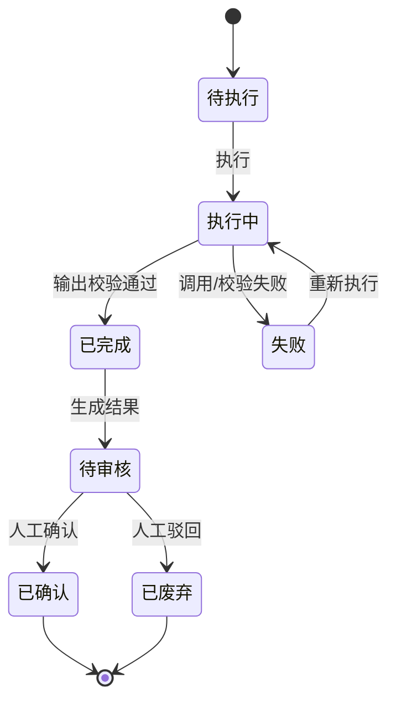

# 数据分析_业务规则规格

> 文件定位：分析任务状态、输入校验、审核、回写和权限规格

## 一、状态机

| 当前状态 | 动作 | 目标状态 | 校验 |
|---|---|---|---|
| 新建 | 创建 | 待执行 | 至少一个 raw_data_id |
| 待执行 | 执行 | 执行中 | 有效输入和可用提示词 |
| 执行中 | 成功 | 已完成→待审核 | 结构化输出校验通过 |
| 执行中 | 失败 | 失败 | 保留错误和原始响应 |
| 失败 | 重新执行 | 执行中 | 可重试 |
| 待审核 | 确认 | 已确认 | 人工审核 |
| 待审核 | 驳回 | 已废弃 | 人工审核 |

## 二、输入与输出规则

- 原始数据通过 analysis_task_input 多对多集合输入。
- 资料上下文只允许选择已生效资料，生成快照。
- 提示词模板可选；缺省使用内置模板。
- `output_schema` 是任务输出定义；一期使用通用 JSON，不固化深度指标。
- AI 原始响应必须留档，失败也保留可追溯信息。

## 三、审核与双向回写

| 条件 | 行为 |
|---|---|
| 非已确认结果 | 回写/反哺按钮置灰或后端拒绝 |
| 已确认结果→资料库 | 生成 AI 产物资料，初始待审核 |
| 已确认结果→选题库 | 生成待筛选选题 |
| 资料已回写 | 禁用资料回写按钮，topic 回写仍可用 |
| 选题已反哺 | 禁用选题反哺按钮，material 回写仍可用 |

## 四、字段校验

| 字段 | 规则 |
|---|---|
| name | 可空；若填写按接口长度限制 |
| type | 必须为 meta `analysis_task_type` 值 |
| raw_data_ids | 至少一条 |
| material_ids | 可空，服务端过滤未生效资料 |
| structured JSON | 手动录入时必须为合法 JSON |
| window_start/end | 必填，结束不得早于开始 |

## 五、导入规则

- 原始数据页接受 `.csv,.txt`；固定模板。
- 成功行入库，失败行返回行号和原因；原文件留档。
- 失败不阻塞其他成功行。

## 六、权限规则

| 动作 | 管理员 | 成员 | 来源 |
|---|---|---|---|
| 手动录入/CSV 导入 | ✅ | 待确认 | context/06 §2.2 |
| 数据分析查看 | ✅ | ✅（数据范围） | context/06 §2.2 |
| 创建/执行 | ✅ | 待确认 | context/06 §2.2 |
| 结果审核 | ✅ | 待确认 | context/06 §2.2 |
| 回写/反哺 | ✅ | 待确认 | context/06 §2.2 |

## 七、异常与幂等

- 同一任务执行按钮 loading 期间禁止重复执行。
- 失败重试不得覆盖原始 AI 响应。
- 审核、回写和反哺重复点击应幂等。
- 自动采集不作为一期可执行入口；相关 config/status 仍是待确认扩展字段。

## 八、实现差异

- 当前前端任务详情把“确认结果”按钮按权限显示，管理员/成员具体审核授权仍以 context/06 为准。
- 当前 DataSources 页面提供启用/停用状态，但该状态字段在 context/05 标为新增建议、待确认。

## 九、修订记录

| 日期 | 变更 |
|---|---|
| 2026-08-24 | 初稿：状态、输入、审核、回写、权限和实现差异 |
