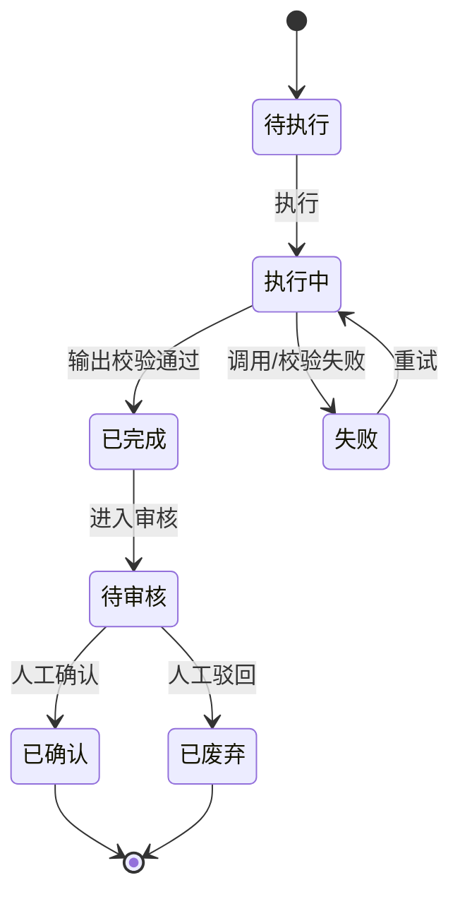

# 数据分析主PRD

> 文件定位：数据分析模块主 PRD（背景、范围、定位、场景、规则摘要、验收）
> 权威层级：context/ > templates/ > prd-docs/
> 配套文档：数据分析字段清单.md / 数据分析_业务规则规格.md / 数据分析_业务流程推演.md / 数据分析_用例数据推演.md / 数据分析_Demo_*.md

## 1. 业务背景

数据分析模块将手动录入或 CSV/TXT 导入的基础数据转化为可审核的结构化分析结果，并在确认后回写资料库、反哺选题。当前一期没有视频号账号，自动采集只保留架构扩展，不纳入 MVP（D5）。具体深度指标和优先分析类型属于二期待确认（D6）。

## 2. 功能范围

### 2.1 In Scope（一期）

| # | 功能 | 关键规则 |
|---|---|---|
| 1 | 数据源登记 | 区分采集方式、业务对象、平台、账号标识和对标标记 |
| 2 | 手动录入原始数据 | 绑定数据源，填写原始内容和统计时间窗 |
| 3 | CSV/TXT 导入 | 固定模板、逐行错误提示、原文件留档 |
| 4 | 分析任务 | 选择原始数据、已生效资料上下文和可选提示词 |
| 5 | 同步执行与重试 | 待执行→执行中→已完成/失败；一期不做异步队列 |
| 6 | 人工审核 | 已完成结果进入待审核，确认或废弃（R6） |
| 7 | 回写与反哺 | 已确认结果分别回写资料库、反哺选题（R7） |
| 8 | 基础结构化输出 | 通用 JSON/schema，不固化深度指标（D6） |

### 2.2 Should（非阻塞）

暂无已确认独立 Should；具体指标字段和深度分析不作为一期验收。

### 2.3 Out of Scope / NIS

- 视频号/其他平台自动采集及定时任务（二期/架构预留，D2/D5）
- 播放量、点赞、评论、涨粉等固定深度指标字段（D6）
- 复杂分析仪表盘和导出
- 多角色审核流

## 3. 模块定位

```mermaid
flowchart LR
    A[手动录入/CSV-TXT] --> R[原始数据]
    R --> T[分析任务]
    M[已生效资料] --> T
    P[提示词模板] --> T
    T --> AI[DeepSeek基础分析]
    AI --> Q[待审核]
    Q -->|确认| C[已确认]
    C --> W[回写资料库]
    C --> N[反哺选题]
```

## 4. 业务场景

### 场景 1：手动录入并分析

管理员创建数据源，手动录入一组基础数据，选择数据和资料上下文创建任务，点击执行等待同步结果，审核后确认。

### 场景 2：CSV 导入

用户在原始数据页下载模板并上传 CSV/TXT。成功行入库，失败行逐行展示原因，原文件留档，之后作为分析任务输入。

### 场景 3：审核结果并双向回写

管理员在任务详情确认结果；分别打开“回写资料库”和“反哺选题”编辑候选，两个动作可独立完成，状态分别记录。

## 5. 状态机

## 6. 核心业务规则

| 编号 | 规则 | 来源 |
|---|---|---|
| R6 | 分析结果必须人工审核后使用 | context/04 §4/§5 |
| R7 | 结果回写资料库 + 反哺选题 | context/04 §4/§5 |
| R8 | AI 产物与原始事实区分 | context/04 §5 |
| R13 | 自动采集未来启用时人工触发、不做定时 | D2 |
| R16 | 一期自动采集仅预留，手动/CSV 为主 | D5 |
| R17 | 一期基础分析框架，深度指标二期 | D6 |

## 7. 权限设计

| 动作 | 管理员 | 成员 |
|---|---|---|
| 数据源配置 | 架构预留/管理员 | 架构预留 |
| 手动录入/导入 | ✅ | 待确认 |
| 查看分析 | ✅ | ✅（数据范围） |
| 创建/执行任务 | ✅ | 待确认 |
| 结果审核 | ✅ | 待确认 |
| 回写/反哺 | ✅ | 待确认 |

## 8. 边界与异常

| 场景 | 处理 |
|---|---|
| 无原始数据 | 不允许创建任务 |
| 资料未生效 | 不出现在上下文选择器 |
| JSON 非法 | 前端阻止保存并提示 |
| AI 失败 | 任务进入失败，可重新执行，保留响应/错误 |
| 未审核回写 | 按钮置灰或后端拒绝 |
| 一项回写已完成 | 另一项仍可独立执行 |

### 8.1 删除与归档策略

| 对象 | 当前口径 |
|---|---|
| 数据源 | 待确认；当前实现为管理员直接删除，保留期限和关联保护规则待定稿 |
| 原始数据 | 待确认；当前实现为管理员直接删除，保留期限和关联保护规则待定稿 |
| 分析任务 | 待确认；当前实现为管理员直接删除，保留期限和关联保护规则待定稿 |

## 9. 验收重点

- [ ] 手动录入和 CSV/TXT 导入均可创建原始数据
- [ ] 原始数据按数据源和时间窗展示
- [ ] 任务状态闭环含失败重试
- [ ] 通用基础 schema 输出，不要求深度指标
- [ ] 结果必须人工确认后才能回写/反哺
- [ ] 回写资料标 AI 产物且进入待审核
- [ ] 反哺选题进入待筛选
- [ ] 两个回写状态可独立完成

## 10. 修订记录

| 日期 | 变更 |
|---|---|
| 2026-08-24 | 由原 04-数据分析PRD.md 扩展为套件，对齐前端分析页面和 D2/D5/D6 |
