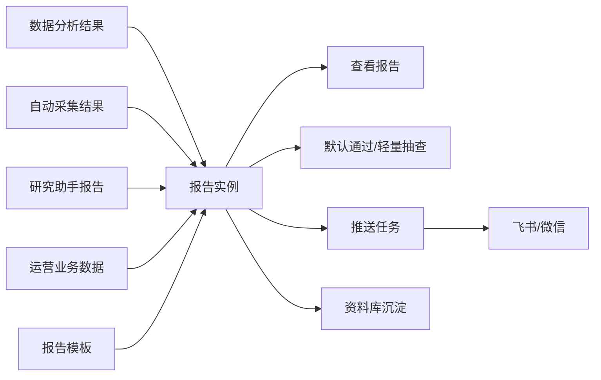
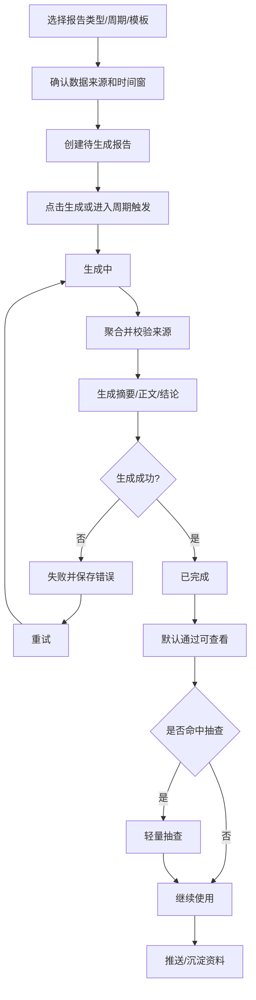
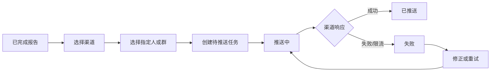
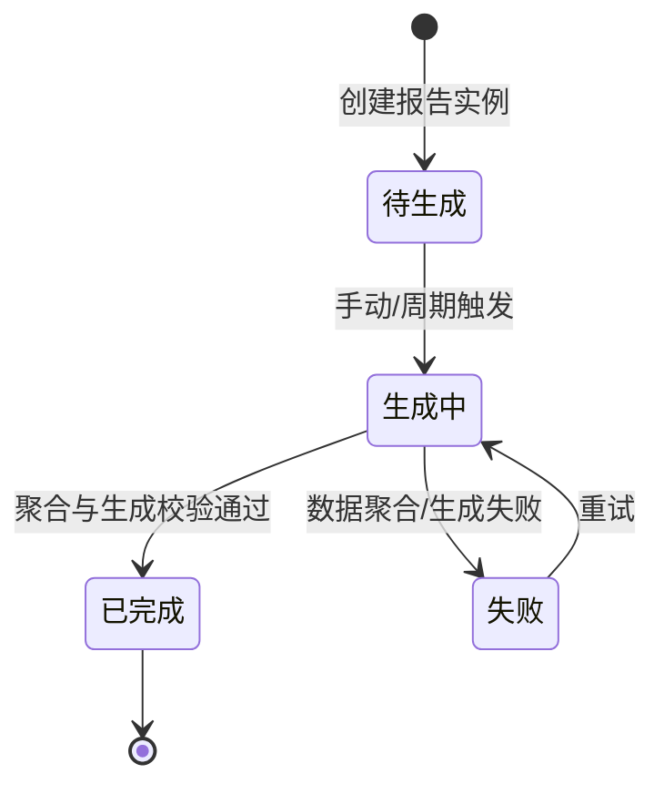
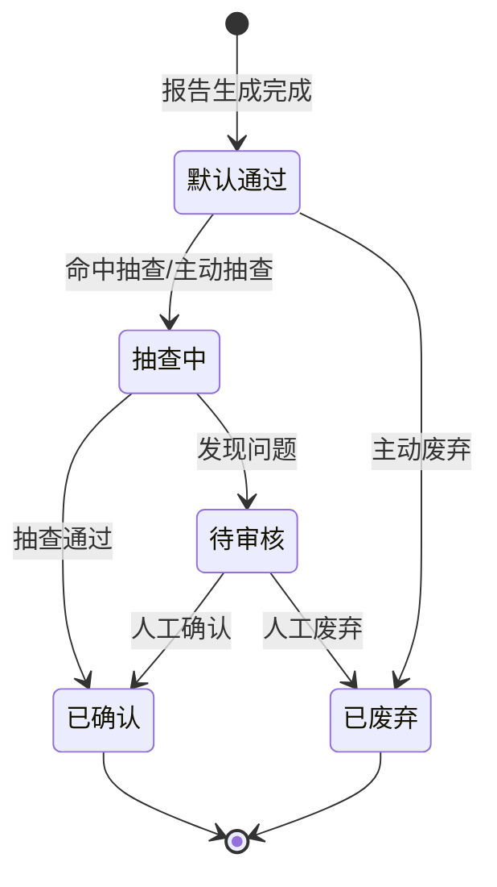
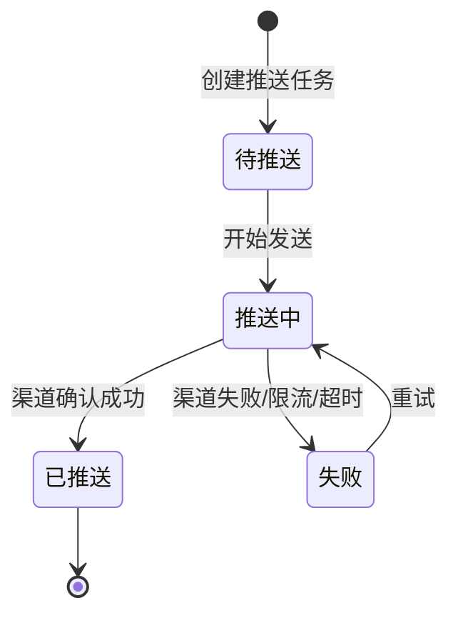

# 数据报告主PRD

> 文件定位：二期 P1 数据报告、市场分析周报及结果推送模块主 PRD
> 依据：`requirements/09-二期调研结论.md`、`prd-docs/modules/00-二期总PRD.md`、`prd-docs/modules/审核流程变更说明.md`
> 字段依据：`context/05-术语与字段口径.md`
> 范围：每周运营数据报告、市场分析周报、飞书/微信推送；本步只做文档，不做代码和原型

## 1. 模块概述

### 1.1 一句话定位

数据报告模块把一期数据分析结果、自动采集结果、研究助手报告和运营业务数据汇总成可查看的每周运营数据报告与市场分析周报，并支持将报告发送到指定的飞书/微信人或群。

### 1.2 用户与核心任务

| 用户 | 核心任务 | 期望结果 |
|---|---|---|
| 管理员/操盘手 | 配置报告范围和模板 | 周期、报告类型、来源和输出结构可控 |
| 管理员/操盘手 | 触发生成报告 | 报告按周汇总并保留来源 |
| 管理员/操盘手 | 查看运营数据 | 了解本周尽可能完整的新媒体运营数据 |
| 管理员/操盘手 | 查看市场分析 | 了解趋势、竞对动态和未知变化 |
| 管理员/操盘手 | 推送报告 | 将报告发送给指定飞书/微信人或群 |

### 1.3 要解决的问题

一期需要操盘手手动查看后台数据，再手工整理趋势和竞对变化。即使数据分析已有基础能力，结果仍分散在分析任务、采集结果、研究报告和业务数据中，难以形成固定周期的复盘材料，也缺少可追踪的外部发送记录。

### 1.4 产品目标

1. 每周形成一份可查看的运营数据报告，尽量覆盖可获得的新媒体运营数据。
2. 每周形成一份市场分析周报，兼顾趋势、竞对动态和未知变化，不把结论提前固定死。
3. 报告能够回到数据分析结果、自动采集结果、研究助手报告或业务数据来源。
4. 报告生成失败可定位、可重试，失败不丢失已保留的输入和旧报告。
5. 报告按二期默认通过规则可直接查看，同时保留 AI 轻量抽查和人工审核入口。
6. 飞书/微信推送可追踪渠道、目标对象、消息摘要、发送时间、状态和失败原因。

### 1.5 范围与非目标

| 范围 | 优先级 | 说明 |
|---|---|---|
| 每周运营数据报告 | P1 In | 汇总数据分析结果、业务运营数据和可用采集结果 |
| 市场分析周报 | P1 In | 汇总研究助手报告、自动采集结果和外部检索结论 |
| 统一报告实体 | P1 In | 推荐使用 `report_type` 区分两种报告；字段和拆分方式待确认 |
| 报告模板 | P1 In | 配置报告类型、来源范围和输出结构；实体为新增建议，待确认 |
| 飞书/微信推送 | P1 In | 指定人或群；API、授权、频率和消息格式待实测 |
| 定时生成 | P1 预留 | 周期能力需要保留，但调度器、时区和触发策略待确认 |
| Out | - | 手机端专项、多人协作/RBAC、抖音/公众号接入、平台发布 |
| Out | - | 研究助手任务、自动采集表、选题/脚本实体重设计 |

### 1.6 统一实体还是拆分实体

推荐先使用一个统一“报告”实体，并通过新增字段 `report_type` 区分 `运营数据报告` 与 `市场分析周报`。理由是两者都需要周期、来源、摘要、正文、生成状态、审核状态和推送关联，统一实体可以复用生成/查看/推送链路。

拆分为“运营数据报告表”和“市场分析周报表”只有在以下差异被实测并确认后再考虑：来源结构完全不同、权限或保留策略不同、报告章节和推送行为无法共享。无论统一还是拆分，最终表结构均为新增建议，待确认。

### 1.7 与其他模块的关系

| 模块 | 关系 | 边界 |
|---|---|---|
| 数据分析 | 提供分析结果和基础运营指标 | 沿用 R6/R7；不在本模块重定义分析结果字段 |
| 自动采集 | 提供原始采集结果和来源链 | 只引用第二步 `collection_result`，不重设计采集表 |
| 研究助手 | 提供市场研究报告和引用 | 只引用第三步研究报告，不重设计研究实体 |
| 资料库 | 接收报告沉淀资料 | 沿用资料字段、有效期、可信度和 AI 标记 |
| 选题/脚本库 | 可消费报告结论或生成结果 | 本模块不展开选题/脚本实体 |
| 权限账号 | 提供登录与现有授权 | 不新增多人协作权限 |

### 1.8 设计原则

1. 来源先于结论：每个报告结论都应尽量回到来源对象、时间窗和生成时间。
2. 报告先落库再推送：推送失败不能回滚已生成报告。
3. 默认通过但不失控：AI 报告可以直接查看，抽查和人工审核入口保留。
4. 报告类型先统一：用最小实体模型支撑两类周报，最终拆分待确认。
5. 指标先兼容后收敛：具体平台指标按真实来源逐步补充，不假定一期已有固定全量指标。
6. 渠道先实测：飞书/微信能力、授权、频率和消息格式不写成已确认依赖。

## 2. 功能清单

| # | 功能名称 | 优先级 | In/Out | 关键规则 |
|---|---|---|---|---|
| 1 | 报告类型选择 | P1 | ✅ In | 运营数据报告/市场分析周报；`report_type` 为新增建议，待确认 |
| 2 | 报告模板管理 | P1 | ✅ In | 模板类型、来源范围和输出结构为新增建议，待确认 |
| 3 | 报告周期配置 | P1 | ✅ In | 周期按周；具体周起始日、时区和窗口待确认 |
| 4 | 运营数据报告生成 | P1 | ✅ In | 聚合数据分析结果、业务数据和可用采集数据 |
| 5 | 市场分析周报生成 | P1 | ✅ In | 汇总研究助手报告、采集结果和外部检索来源 |
| 6 | 来源范围配置 | P1 | ✅ In | 来源快照、时间窗和口径可回溯；字段待确认 |
| 7 | 生成进度查看 | P1 | ✅ In | 待生成→生成中→已完成/失败；失败可重试 |
| 8 | 报告摘要/正文查看 | P1 | ✅ In | 报告类型、周期、来源、生成时间可见 |
| 9 | 默认通过查看 | P1 | ✅ In | 默认可查看，AI 报告保留 `is_ai_product=true` |
| 10 | 轻量抽查 | P1 | ✅ In | 对 AI 报告抽查；比例和时机待确认 |
| 11 | 报告沉淀资料库 | P1 | ✅ In | 遵循资料模块字段、可信度、有效期和审核规则 |
| 12 | 创建推送任务 | P1 | ✅ In | 选择报告、渠道和指定人/群；目标授权待确认 |
| 13 | 飞书推送 | P1 | ✅ In | API、授权、限流和消息格式待实测/待确认 |
| 14 | 微信推送 | P1 | ✅ In | API、授权、限流和消息格式待实测/待确认 |
| 15 | 推送结果查看 | P1 | ✅ In | 记录目标、摘要、时间、状态、错误码 |
| 16 | 推送失败重试 | P1 | ✅ In | 只重试失败任务/记录，不重复成功发送 |
| 17 | 定时报告生成 | P1 | ◇ 预留 | 只保留周期设计，不固化调度实现 |
| 18 | 手机端报告 | - | ❌ Out | 本期不做手机端专项 |
| 19 | 抖音/公众号数据接入 | - | ❌ Out | 本期不做 |
| 20 | 多人订阅权限 | - | ❌ Out | 不新增多人协作/RBAC |

### 2.1 两类报告内容

运营数据报告建议包含周期内账号、内容、互动、发布和转化等可获得数据，但具体指标集合、来源和计算公式待确认。市场分析周报建议包含趋势、竞对动态、行业/外部变化、关键结论、证据和下一步建议；结论结构不固定，以实际研究问题和来源决定。

### 2.2 推送内容

推送默认发送报告标题、报告类型、周期、摘要、生成时间和详情链接；全文、图表、附件、卡片布局和消息长度限制由渠道实测决定。推送任务不生成新的报告内容，推送记录只保存必要消息摘要和执行结果。

## 3. 交互流程

### 3.1 报告生成主流程

### 3.2 推送流程

### 3.3 页面交互说明

| 步骤 | 用户操作 | 系统反馈 |
|---|---|---|
| 1 | 进入数据报告 | 展示报告列表、类型、周期、生成状态 |
| 2 | 选择模板/报告类型 | 显示来源范围和周期配置 |
| 3 | 确认来源 | 显示数据分析、采集、研究和业务数据来源 |
| 4 | 创建并生成 | 报告进入待生成/生成中 |
| 5 | 查看完成报告 | 展示摘要、正文、结论和来源追溯 |
| 6 | 抽查或主动审核 | 通过、转审核或废弃；动作沿用审核变更说明 |
| 7 | 创建推送任务 | 选择飞书/微信和指定人/群 |
| 8 | 查看推送记录 | 显示摘要、发送时间、状态和错误码 |

### 3.4 数据来源口径

| 报告类型 | 主要来源 | 处理原则 |
|---|---|---|
| 运营数据报告 | 数据分析结果、运营业务数据、可用自动采集结果 | 先记录周期和口径，再聚合；指标公式待确认 |
| 市场分析周报 | 研究助手报告、自动采集结果、外部检索来源 | 来源先于结论；引用不可用时明确提示 |

## 4. 关键规则

### 4.1 规则索引

详细规则见《数据报告_业务规则规格.md》。

| 编号 | 规则摘要 | 来源 |
|---|---|---|
| R1/R2 | 报告沉淀资料继续使用资料状态、有效期和可信度 | `context/04`/`context/05` |
| R6/R7 | 分析结果来源和回写关系继续可追溯 | `context/04` |
| R8 | 报告 AI 产物与原始运营事实区分 | `context/04`、审核变更说明 |
| R13 | 定时能力只保留 P1 预留；本步不定义采集调度 | `context/04` |
| R17 | 深度指标按数据源实际能力迭代 | `context/04` |
| R18/R20 | 沿用现有登录和权限边界 | `context/04` |
| RPT-R1 | 报告按周生成并保留周期配置 | 二期拍板；配置待确认 |
| RPT-R2 | 报告来源按类型区分，来源先于结论 | 二期总 PRD 1.6 |
| RPT-R3 | 报告生成失败可重试且保留旧错误 | 本模块新增建议，待确认 |
| RPT-R4 | 报告默认通过，AI 报告保留轻量抽查 | 审核变更说明/总 PRD 5.3 |
| RPT-R5 | 推送前报告先落库，推送失败不回滚报告 | 本模块新增建议，待确认 |
| RPT-R6 | 推送渠道、目标、摘要、时间和结果可追溯 | 09 调研结论；字段待确认 |
| RPT-R7 | 飞书/微信的 API、授权、限流、格式待实测 | 09 调研结论；待确认 |
| RPT-R8 | 推送不得泄露敏感数据，失败可重试 | 本模块新增建议，待确认 |

### 4.2 报告类型和周期

推荐一个报告实体通过 `report_type` 区分运营数据报告和市场分析周报。每个报告实例必须有周期开始、周期结束和生成时间。周起始日、时区、自然周还是滚动七天、重复周期覆盖规则均为新增建议，待确认。

### 4.3 默认通过与轻量抽查

报告若包含 AI 生成的摘要、趋势、结论或建议，默认 `is_ai_product=true`，可直接查看和推送，但要进入轻量抽查可见范围。纯数据聚合、无模型生成的运营数据报告是否可以 `is_ai_product=false` 为例外，待确认；不得让聚合事实和 AI 结论混为同一语义。

审核状态沿用总 PRD 5.3：默认通过→抽查中→已确认/待审核/已废弃。抽查比例、时机、粒度和状态落库方式待确认。原始业务数据、数据分析结果和自动采集原始结果不因为进入报告而被改写为 AI 产物。

### 4.4 来源追溯

报告应保留来源集合、来源时间窗、数据口径和生成追溯。运营数据报告的来源优先指向分析结果和业务数据；市场分析周报优先指向研究报告、自动采集结果和外部检索。来源不可用或数据缺失时，报告需明确缺口，不能用空值或模型猜测伪装完整数据。

### 4.5 推送边界

1. 只有已完成报告可创建推送任务。
2. 推送目标必须是用户明确选择的指定人或群，目标授权校验待确认。
3. 飞书/微信 API 能力、授权方式、频率限制、消息格式、链接可见性和失败码均待实测。
4. 推送消息只包含必要摘要和可访问的报告入口，不默认发送全部原始数据。
5. 推送失败不影响报告状态；失败任务/记录可重试，成功发送不重复发送。
6. 渠道限流、目标不存在、权限不足和消息过长必须明确显示，不伪装成已推送。

### 4.6 资料沉淀

报告沉淀资料库时，沿用一期资料标题、内容、资料分类、来源类型、来源链接、可信度、有效期、状态和创建追踪字段。AI 报告沉淀资料必须 `is_ai_product=true`；报告关联字段为新增建议，待确认。资料状态和审核动作遵循 R1/R2、R8 及审核变更说明。

## 5. 状态机

### 5.1 报告生成状态

报告生成状态沿用总 PRD 的建议状态；状态和字段为新增建议，待确认。

### 5.2 审核与抽查状态

与二期总 PRD 5.3 对齐；状态映射为新增建议，待确认。

### 5.3 推送任务状态

推送状态为新增建议，待确认。

### 5.4 状态说明

| 状态 | 含义 | 允许动作 |
|---|---|---|
| 待生成 | 报告实例已创建，未开始 | 生成、修改未开始配置 |
| 生成中 | 正在聚合数据或调用生成能力 | 查看进度，禁止重复生成 |
| 已完成 | 报告内容和来源校验通过 | 查看、抽查、推送、沉淀 |
| 失败 | 聚合或生成未完成 | 查看错误、重试 |
| 默认通过 | 报告可直接使用 | 查看、抽查、推送 |
| 抽查中 | 正在轻量检查 AI 结果 | 通过、转审核、废弃 |
| 已确认 | 抽查/审核确认 | 继续使用 |
| 待审核 | 需要人工审核 | 通过或废弃 |
| 已废弃 | 不再使用 | 仅查看历史 |
| 待推送 | 推送任务已创建 | 开始推送、取消策略待确认 |
| 推送中 | 正在发送 | 查看进度 |
| 已推送 | 渠道确认成功 | 查看记录 |
| 失败 | 推送未成功 | 修正目标或重试 |

## 6. 数据字段

### 6.1 实体范围

本步只展开报告、报告模板、推送任务、推送记录四类实体。推荐报告实体统一承载两类报告，由 `report_type` 区分；是否拆分报告表待确认。

### 6.2 字段清单引用

字段明细以《数据报告字段清单.md》为准。`context/05` 已有的来源链接、创建追踪、可信度、有效期、`is_ai_product` 和 AI 原始响应语义直接复用；本模块新增映射字段均标注待确认。

### 6.3 来源与 AI 产物

- 报告包含 AI 摘要/结论/建议时，`is_ai_product=true`。
- 纯运营数据聚合是否允许 `is_ai_product=false` 是新增判断，待确认。
- 报告引用的数据分析结果、自动采集结果、研究助手报告和业务数据不在本模块重复建表。
- 推送记录保存消息摘要，不替代报告正文，不覆盖报告原始来源。

## 7. 权限

### 7.1 权限边界

本期不新增多人协作、订阅权限或自定义 RBAC。管理员/操盘手为 P1 主验收角色；成员是否可以查看或推送沿用现有授权，具体动作矩阵为新增建议，待确认。

| 动作 | 管理员 | 成员 | 说明 |
|---|---|---|---|
| 查看报告列表/详情 | ✅ | 沿用现有授权 | 受现有数据范围约束 |
| 新增/编辑报告模板 | ✅ | 沿用现有授权 | 模板权限待确认 |
| 创建/触发报告生成 | ✅ | 沿用现有授权 | 周期触发策略待确认 |
| 重试报告生成 | ✅ | 沿用现有授权 | 保留历史错误 |
| 抽查/转人工审核 | ✅ | 沿用现有授权 | 对齐审核变更说明 |
| 沉淀资料库 | ✅ | 沿用资料权限 | R1/R2/R8 生效 |
| 创建推送任务 | ✅ | 沿用现有授权 | 目标授权待确认 |
| 查看推送记录 | ✅ | 沿用现有授权 | 目标敏感信息按最小展示 |
| 删除报告/推送记录 | ❌ 默认不提供 | ❌ | 删除和归档策略待确认 |

### 7.2 推送目标授权

系统只能向用户明确选择且具备发送授权的目标推送。飞书/微信目标授权的验证方式、目标人/群可见范围、连接配置保管方式均为新增建议，待确认；本文件不写入任何凭据。

## 8. 验收标准

### 8.1 报告生成

- [ ] 可选择运营数据报告或市场分析周报。
- [ ] 推荐统一报告实体并可按报告类型筛选；拆分表方案未确认前不强制。
- [ ] 可配置或选择模板、周期、来源范围和时间窗。
- [ ] 运营数据报告能聚合数据分析结果、运营业务数据和可用采集结果。
- [ ] 市场分析周报能引用研究助手报告、自动采集结果和外部检索来源。
- [ ] 报告状态按待生成→生成中→已完成/失败，失败可重试。
- [ ] 报告生成失败保留错误和来源配置，不产生伪造完整报告。

### 8.2 报告查看与审核

- [ ] 完成报告可查看标题、类型、周期、摘要、正文、结论和生成时间。
- [ ] 报告来源和数据口径可追溯；来源缺失显式提示。
- [ ] AI 报告标记 `is_ai_product=true`；纯聚合例外待确认。
- [ ] 默认通过报告可查看和推送，轻量抽查入口保留。
- [ ] 抽查发现问题后可转审核或废弃，不覆盖原始数据来源。

### 8.3 推送

- [ ] 已完成报告可创建飞书或微信推送任务。
- [ ] 推送任务展示指定人/群、渠道和报告信息。
- [ ] 推送状态按待推送→推送中→已推送/失败，失败可重试。
- [ ] 推送记录保留渠道、目标对象、消息摘要、发送时间、状态和失败错误码。
- [ ] 成功推送不因重复点击而重复发送；失败重试不影响报告本体。
- [ ] API、授权、限流和消息格式在实测前标注待确认，不作为已确认依赖。

### 8.4 范围与安全

- [ ] 报告沉淀资料沿用一期字段、可信度、有效期和 AI 标记。
- [ ] 自动采集、研究助手、数据分析实体只作为来源引用，不在本模块重设计。
- [ ] 不展开周期报告以外的新推送渠道，不接入抖音/公众号。
- [ ] 不修改 `context/`、`requirements/`、一期模块或前两步/第三步套件。
- [ ] 文档不包含密码、token、API key 或数据库连接串。

## 9. 待确认事项

1. 报告采用统一实体+`report_type`还是拆分两类报告表。
2. `report_type` 的最终枚举、模板类型、周期和时区口径。
3. 自然周、滚动七天、周起始日和重复周期覆盖策略。
4. 运营数据报告的完整指标集合、计算公式和业务数据来源。
5. 市场分析周报的章节结构、未知变化定义和引用缺失处理。
6. 报告来源快照、数据口径、生成追溯和中间结果保存方式。
7. 纯运营数据聚合报告是否可以 `is_ai_product=false`。
8. 默认通过、抽查比例、抽查时机和报告审核状态落库方式。
9. 飞书/微信 API 可用性、授权、频率限制、消息格式和失败码。
10. 推送目标人/群的授权校验、目标标识和连接配置保存方式。
11. 推送消息全文、摘要、链接、图表和附件的输出边界。
12. 推送失败的重试上限、退避和重复发送幂等策略。
13. 报告和推送记录的归档、保留和删除策略。
14. 成员是否拥有查看、生成、抽查和推送权限；本期不新增多人协作。

