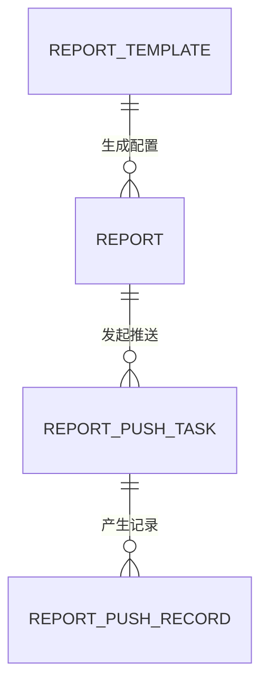

# 数据报告字段清单

> 文件定位：数据报告模块新增实体字段清单
> 字段 SSOT：`context/05-术语与字段口径.md`
> 说明：本文件只展开报告、报告模板、推送任务、推送记录四类实体。新增实体、字段、枚举、配置和关系均标注“新增建议，待确认”。

## 一、字段确认度与复用原则

1. 资料条目的来源链接、可信度、有效期、`is_ai_product`、创建人和创建时间直接沿用 `context/05`，不重造同名不同义字段。
2. 报告来源只引用数据分析结果、自动采集结果、研究助手报告和运营业务数据，不在本模块复制这些来源实体。
3. 推荐使用统一报告实体，通过 `report_type` 区分运营数据报告和市场分析周报；该字段和报告实体均为新增建议，待确认。
4. 报告包含 AI 摘要、结论或建议时 `is_ai_product=true`；纯运营数据聚合是否例外，标注待确认。
5. 推送目标可以是指定人或群；渠道、目标、消息摘要、发送时间、状态和错误码必须保留。

## 二、报告实体

> 实体确认度：新增建议，待确认。统一承载运营数据报告和市场分析周报的报告实例。

建议表名：`report`（新增建议，待确认）

| 表名 | 字段名 | 类型 | 必填 | 默认值 | 说明 |
|---|---|---|---|---|---|
| report | id | bigint | 是 | 自增 | 主键；新增建议，待确认 |
| report | report_no | varchar(64) | 是 | 系统生成 | 报告编号；新增建议，待确认 |
| report | report_type | varchar(32) | 是 | 无 | 运营数据报告/市场分析周报；枚举新增建议，待确认 |
| report | title | varchar(500) | 是 | 系统生成 | 报告标题；复用资料标题语义，报告映射字段新增建议，待确认 |
| report | period_start | datetime | 是 | 无 | 报告周期开始；周期口径新增建议，待确认 |
| report | period_end | datetime | 是 | 无 | 报告周期结束；周期口径新增建议，待确认 |
| report | template_id | bigint | 否 | NULL | 使用的报告模板；新增建议，待确认 |
| report | source_config | json | 是 | {} | 来源实体、时间窗和口径配置；新增建议，待确认 |
| report | source_snapshot | json/text | 否 | NULL | 生成时来源摘要/快照；新增建议，待确认 |
| report | summary | text | 是 | 无 | 报告摘要；复用资料内容表达，报告字段映射新增建议，待确认 |
| report | content | longtext | 是 | 无 | 报告正文；报告字段映射新增建议，待确认 |
| report | sections | json | 否 | NULL | 章节、数据表和结论结构；新增建议，待确认 |
| report | conclusions | json | 否 | NULL | 结构化结论与建议；新增建议，待确认 |
| report | generation_trace | json | 否 | NULL | 生成输入、模型/提示词快照、时间和版本；新增建议，待确认 |
| report | raw_ai_response | json/text | 否 | NULL | AI 原始响应；沿用一期 AI 原始响应留档语义，映射新增建议，待确认 |
| report | is_ai_product | boolean | 是 | true | AI 产物标记；语义与一期一致；纯运营数据聚合是否为 false 待确认 |
| report | generation_status | varchar(32) | 是 | 待生成 | 待生成/生成中/已完成/失败；状态新增建议，待确认 |
| report | review_status | varchar(32) | 是 | 默认通过 | 默认通过/抽查中/已确认/待审核/已废弃；对齐总 PRD 5.3，状态新增建议，待确认 |
| report | retry_count | int | 是 | 0 | 生成重试次数；新增建议，待确认 |
| report | error_code | varchar(64) | 否 | NULL | 生成失败错误码；新增建议，待确认 |
| report | error_message | text | 否 | NULL | 生成失败说明；新增建议，待确认 |
| report | created_by | bigint | 是 | 当前用户/系统 | 创建人；复用创建追踪语义，映射新增建议，待确认 |
| report | created_at | datetime | 是 | 当前时间 | 创建时间；复用创建追踪语义 |
| report | updated_at | datetime | 是 | 当前时间 | 修改时间；新增建议，待确认 |
| report | generated_at | datetime | 否 | NULL | 报告生成完成时间；新增建议，待确认 |

### 2.1 报告类型说明

| report_type | 内容 | 确认度 |
|---|---|---|
| 运营数据报告 | 每周聚合运营业务数据、数据分析结果和可用采集结果 | 业务范围已确认；枚举和指标待确认 |
| 市场分析周报 | 每周整理研究助手报告、采集结果和外部检索，输出趋势/竞对/未知变化 | 业务范围已确认；枚举和结构待确认 |

## 三、报告模板实体

> 实体确认度：新增建议，待确认。用于配置报告类型、周期、来源范围和输出结构。

建议表名：`report_template`（新增建议，待确认）

| 表名 | 字段名 | 类型 | 必填 | 默认值 | 说明 |
|---|---|---|---|---|---|
| report_template | id | bigint | 是 | 自增 | 主键；新增建议，待确认 |
| report_template | name | varchar(200) | 是 | 无 | 模板名称；新增建议，待确认 |
| report_template | report_type | varchar(32) | 是 | 无 | 适用报告类型；枚举新增建议，待确认 |
| report_template | period_config | json | 是 | {} | 周期、周起始日、时区；配置新增建议，待确认 |
| report_template | source_config | json | 是 | {} | 数据分析、采集、研究、业务数据来源配置；新增建议，待确认 |
| report_template | output_schema | json | 是 | {} | 摘要、章节、指标、结论和建议结构；新增建议，待确认 |
| report_template | prompt_content | text | 否 | NULL | AI 生成提示词；提示词字段映射新增建议，待确认 |
| report_template | version | varchar(32) | 是 | v1 | 模板版本；新增建议，待确认 |
| report_template | enabled | boolean | 是 | true | 是否启用；新增建议，待确认 |
| report_template | created_by | bigint | 是 | 当前用户 | 创建人；创建追踪映射新增建议，待确认 |
| report_template | created_at | datetime | 是 | 当前时间 | 创建时间；复用创建追踪语义 |
| report_template | updated_at | datetime | 是 | 当前时间 | 修改时间；新增建议，待确认 |

## 四、推送任务实体

> 实体确认度：新增建议，待确认。记录一次将已完成报告发送到指定渠道目标的任务。

建议表名：`report_push_task`（新增建议，待确认）

| 表名 | 字段名 | 类型 | 必填 | 默认值 | 说明 |
|---|---|---|---|---|---|
| report_push_task | id | bigint | 是 | 自增 | 主键；新增建议，待确认 |
| report_push_task | task_no | varchar(64) | 是 | 系统生成 | 推送任务编号；新增建议，待确认 |
| report_push_task | report_id | bigint | 是 | 无 | 关联已完成报告；新增建议，待确认 |
| report_push_task | channel | varchar(32) | 是 | 无 | 飞书/微信；渠道枚举新增建议，待确认 |
| report_push_task | recipient_type | varchar(32) | 是 | 无 | 指定人/群；目标类型新增建议，待确认 |
| report_push_task | target_object | varchar(255) | 是 | 无 | 目标人或群标识；新增建议，待确认 |
| report_push_task | message_config | json | 否 | NULL | 摘要/正文/链接/卡片配置；新增建议，待确认 |
| report_push_task | authorization_snapshot | json | 否 | NULL | 授权校验结果，不保存凭据；新增建议，待确认 |
| report_push_task | status | varchar(32) | 是 | 待推送 | 待推送/推送中/已推送/失败；状态新增建议，待确认 |
| report_push_task | retry_count | int | 是 | 0 | 任务重试次数；新增建议，待确认 |
| report_push_task | created_by | bigint | 是 | 当前用户 | 创建人；新增建议，待确认 |
| report_push_task | created_at | datetime | 是 | 当前时间 | 创建时间；复用创建追踪语义 |
| report_push_task | updated_at | datetime | 是 | 当前时间 | 修改时间；新增建议，待确认 |

## 五、推送记录实体

> 实体确认度：新增建议，待确认。保留每个渠道目标的实际发送尝试和结果。

建议表名：`report_push_record`（新增建议，待确认）

| 表名 | 字段名 | 类型 | 必填 | 默认值 | 说明 |
|---|---|---|---|---|---|
| report_push_record | id | bigint | 是 | 自增 | 主键；新增建议，待确认 |
| report_push_record | push_task_id | bigint | 是 | 无 | 关联推送任务；新增建议，待确认 |
| report_push_record | channel | varchar(32) | 是 | 无 | 目标渠道：飞书/微信；枚举新增建议，待确认 |
| report_push_record | target_object | varchar(255) | 是 | 无 | 实际目标人或群标识；新增建议，待确认 |
| report_push_record | recipient_type | varchar(32) | 是 | 无 | 人/群；新增建议，待确认 |
| report_push_record | message_summary | text | 是 | 无 | 实际发送的消息摘要；必须保留，新增字段建议，待确认 |
| report_push_record | sent_at | datetime | 否 | NULL | 实际发送时间；必须保留，新增字段建议，待确认 |
| report_push_record | status | varchar(32) | 是 | 待推送 | 待推送/推送中/已推送/失败；新增建议，待确认 |
| report_push_record | provider_message_id | varchar(255) | 否 | NULL | 渠道返回消息 ID；新增建议，待确认 |
| report_push_record | error_code | varchar(64) | 条件 | NULL | 失败时的渠道错误码；必须保留，新增字段建议，待确认 |
| report_push_record | error_message | text | 条件 | NULL | 失败时错误说明；新增建议，待确认 |
| report_push_record | response_snapshot | json/text | 否 | NULL | 渠道响应摘要，不保存敏感凭据；新增建议，待确认 |
| report_push_record | attempt_no | int | 是 | 1 | 发送尝试序号；新增建议，待确认 |
| report_push_record | created_at | datetime | 是 | 当前时间 | 记录创建时间；新增建议，待确认 |

## 六、表关系总览

报告与数据分析结果、自动采集结果、研究助手报告和运营业务数据的来源关系通过 `source_config`/`source_snapshot` 承载；本步不新增独立来源关联实体，具体来源映射为新增建议，待确认。

## 七、与一期字段 SSOT 差异对照

| 项目 | `context/05` 已有口径 | 本模块处理 |
|---|---|---|
| 标题/内容 | 资料条目标题、正文 | 报告摘要/正文复用语义，报告字段映射新增建议 |
| 来源链接 | 资料来源链接 | 报告来源追溯和推送详情链接为新增映射，待确认 |
| 可信度/有效期 | 资料核心字段 | 报告沉淀资料继续直接复用；报告自身是否存可信度待确认 |
| `is_ai_product` | 区分 AI 产物与原始事实 | AI 报告默认 true；纯运营数据聚合例外待确认 |
| 创建追踪 | 创建人/时间 | 报告、模板和推送任务沿用语义，映射字段新增建议 |
| AI 原始响应 | 分析任务留档 | 报告可复用原始响应语义，字段映射待确认 |
| 数据源/原始数据 | 业务对象、平台、账号、原始内容、结构化数据、时间窗 | 作为报告来源引用，不复制字段 |
| 报告/模板/推送 | `context/05` 未定义 | 新增实体、字段、状态和配置均待确认 |

## 八、待确认事项

1. 报告统一实体和 `report_type` 是否最终采用，或拆分两种报告表。
2. 报告周期、时区、指标和来源口径。
3. 报告来源关系是否拆成独立关联表 `report_source`，该关系建议不作为本步独立实体展开。
4. 纯运营数据聚合报告的 `is_ai_product` 是否允许为 false。
5. 报告模板提示词、版本和输出 schema 的最终字段。
6. 飞书/微信目标标识、授权校验、API 返回和消息格式。
7. 推送记录的错误码、响应快照和敏感信息脱敏策略。
8. 推送重试上限、幂等键、重复发送和限流退避策略。
9. 报告、模板、推送任务和推送记录的保留、归档和删除策略。
