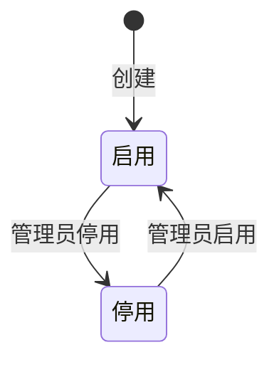

# 权限账号_业务规则规格

> 文件定位：账号登录、角色隔离、权限计算和密码规则
> 说明：权限账号无复杂业务状态机，不生成流程/用例推演文档

## 一、登录规则

- 一期仅账号密码登录；扫码/验证码二期（D7）。
- 登录成功返回 token 和当前用户；前端保存 token/user，进入主框架。
- 401 清理 token 并跳转 `/login`。
- 停用账号不得登录。
- 首次默认密码登录可返回 `must_change_password` 提示；该返回值属于接口 DTO。

## 二、角色与权限计算

| 用户角色 | 计算规则 |
|---|---|
| 管理员 | 恒拥有全部权限；权限管理菜单可见 |
| 成员 | 仅拥有 functional_permissions 显式授权；权限管理菜单隐藏 |

数据查询还需叠加 `data_scope`：全量或指定资料分类/数据源。

## 三、账号状态

停用状态禁止登录和业务访问；成员数量不设业务上限。

## 四、密码规则

| 场景 | 规则 |
|---|---|
| 新增成员 | 初始密码必填，前端最少6位 |
| 管理员重置 | 新密码最少6位，后端应再次校验 |
| 用户修改 | 需原密码+新密码；成功后旧密码失效 |
| 存储 | 只存密码哈希，不保存明文 |
| 失败锁定 | 阈值/限流待确认 |

## 五、管理员保护

- 创建/停用成员、分配角色/权限/数据范围仅管理员。
- 管理员自停用保护为新增建议，待确认。
- 完整操作审计二期，不在一期默认新增审计表。

## 六、越权处理

- 前端隐藏菜单不等于授权；后端必须根据角色、权限码和数据范围返回 403/过滤数据。
- 成员未获授权的动作不能因“页面存在按钮”而默认放权。
- `RequireAdmin` 仅用于权限管理路由，业务模块还需逐动作校验。

## 七、实现差异登记

- 当前 `MainLayout.tsx` 使用权限管理菜单按管理员过滤，符合 SSOT。
- 当前 `Users.tsx` 管理员默认全部权限、成员按勾选显式授权，符合已确认基础模型。
- 各模块页面对成员动作的显示与 context/06 部分待确认矩阵可能不完全一致，开发联调时以 SSOT 为准。

## 八、修订记录

| 日期 | 变更 |
|---|---|
| 2026-08-24 | 初稿：登录、角色、权限、数据范围和密码规则 |
