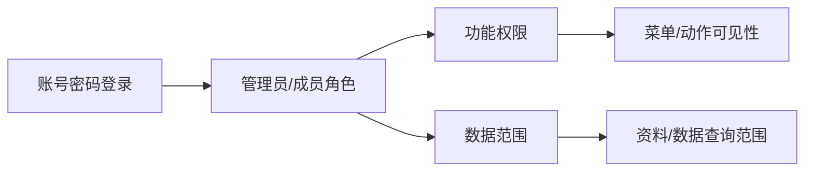
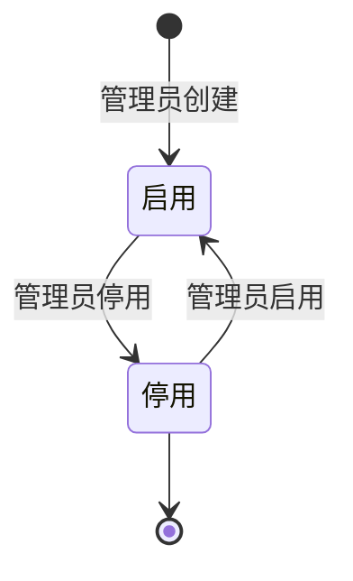

# 权限账号主PRD

> 文件定位：权限与账号模块主 PRD（背景、范围、定位、场景、规则摘要、验收）
> 权威层级：context/ > templates/ > prd-docs/
> 配套文档：权限账号字段清单.md / 权限账号_业务规则规格.md / 权限账号_Demo_成员列表页.md / 权限账号_Demo_成员编辑页.md / 权限账号_Demo_登录与个人账号页.md

## 1. 业务背景

一期需要基础账号与权限隔离：管理员通过账号密码登录，创建和停用成员账号，分配管理员/成员角色、功能权限和数据范围。成员数量不设业务上限，按系统容量控制（D7/D9）。完整 RBAC 自定义角色和操作审计为二期。

## 2. 功能范围

### 2.1 In Scope（一期）

| # | 功能 | 关键规则 |
|---|---|---|
| 1 | 账号密码登录/登出 | 一期不支持扫码/验证码（D7） |
| 2 | 管理员成员管理 | 新增、编辑角色/权限/数据范围、启用/停用 |
| 3 | 功能权限分配 | 管理员显式给成员授权；未授权默认拒绝 |
| 4 | 数据范围分配 | 全量或指定资料分类/数据源 |
| 5 | 修改/重置密码 | 密码哈希存储，不保存明文 |
| 6 | 菜单与路由隔离 | 权限管理仅管理员可见；后端必须复核 |

### 2.2 Should（非阻塞）

暂无已确认独立 Should。

### 2.3 Out of Scope / NIS

- 扫码/验证码登录（二期）
- 完整 RBAC 自定义角色体系（二期）
- 操作审计日志（二期）
- 成员数量业务上限（一期不设，D9）

## 3. 模块定位

## 4. 业务场景

### 场景 1：管理员创建成员

管理员填写账号、初始密码、角色、功能权限和数据范围。成员可用账号密码登录；权限管理菜单不显示。

### 场景 2：限制数据范围

管理员把成员范围设为指定资料分类和指定数据源，成员只能看到授权范围内数据。具体动作授权仍按 context/06 待确认矩阵执行。

### 场景 3：修改密码

用户在个人账号页输入原密码和新密码。成功后退出当前登录，使用新密码重新登录。

## 5. 账号管理态

这是账号管理态，不替代业务模块状态机。

## 6. 核心业务规则

| 编号 | 规则 | 来源 |
|---|---|---|
| R18 | 一期仅账号密码登录 | D7 / context/04 §5 |
| R20 | 成员数量不设业务上限 | D9 / context/04 §5 |
| 权限隔离 | 管理员分配账号、角色、功能权限和数据范围 | context/06 §2.2 |
| 管理员审核 | 脚本审核一期仅管理员 | context/06 §2.3 |

## 7. 权限设计

| 动作 | 管理员 | 成员 |
|---|---|---|
| 登录/修改自己的密码 | ✅ | ✅ |
| 创建/停用账号 | ✅ | ❌ |
| 分配角色/功能权限/数据范围 | ✅ | ❌ |
| 查看自己的账号信息 | ✅ | ✅ |
| 管理权限菜单 | ✅ | ❌ |

## 8. 边界与异常

| 场景 | 处理 |
|---|---|
| 账号或密码错误 | 拒绝登录；锁定/限流阈值待确认 |
| 停用账号登录 | 拒绝登录 |
| 成员数量增长 | 不设置业务上限，容量异常返回明确错误 |
| 成员访问未授权动作 | 菜单隐藏或 403；后端必须拦截 |
| 修改密码成功 | 清理当前登录态，重新登录 |
| 管理员自停用 | 保护策略待确认 |

## 9. 验收重点

- [ ] 管理员和成员均可账号密码登录
- [ ] 成员看不到权限管理菜单
- [ ] 管理员可创建、编辑、停用/启用成员
- [ ] 角色、功能权限、数据范围保存正确
- [ ] 成员数量不触发业务上限
- [ ] 修改/重置密码后旧密码失效且不保存明文
- [ ] 未登录路由跳转登录，越权请求返回拒绝

## 10. 待确认事项

- 登录失败锁定/限流阈值
- 管理员自停用保护
- 各业务模块成员动作权限的最终授权范围（见 context/06 §2.2）

## 11. 修订记录

| 日期 | 变更 |
|---|---|
| 2026-08-24 | 由原 05-权限与账号PRD.md 扩展为套件，对齐 Login/Profile/Users 页面 |
