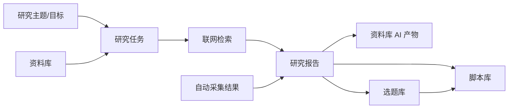
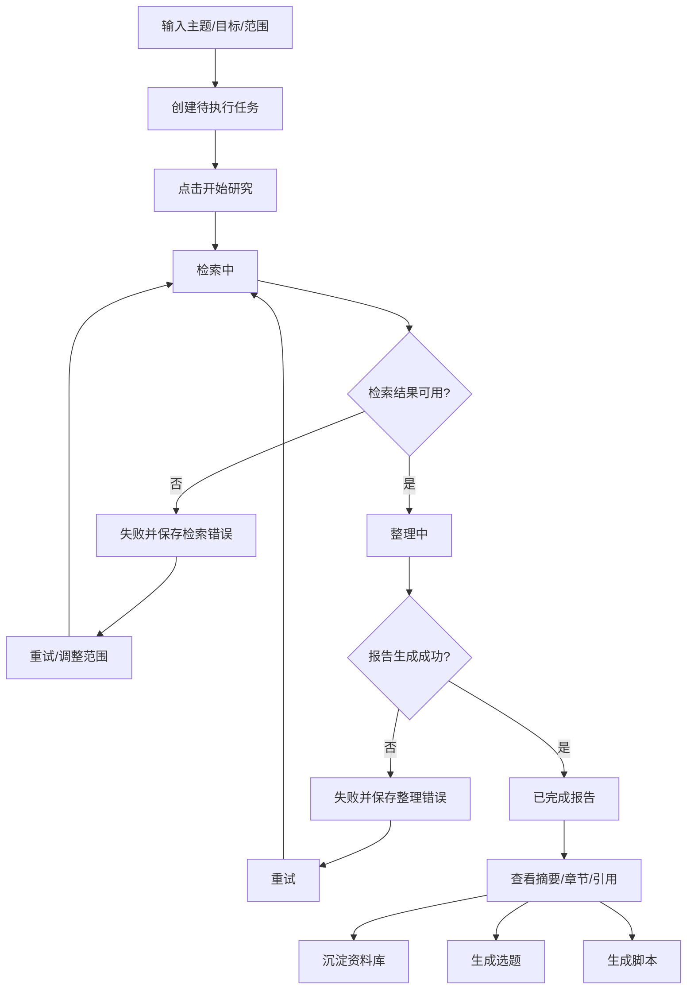
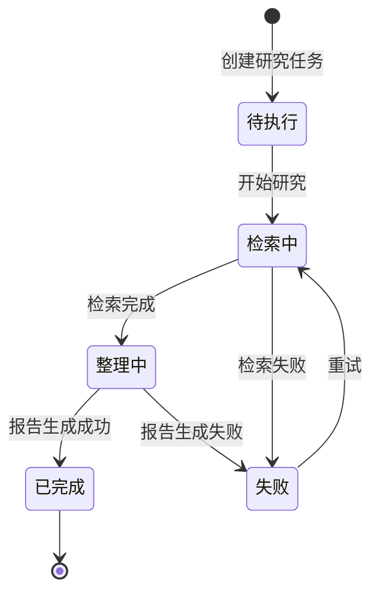

# 研究助手主PRD

> 文件定位：二期研究助手模块主 PRD
> 依据：`requirements/09-二期调研结论.md`、`prd-docs/modules/00-二期总PRD.md`、`prd-docs/modules/审核流程变更说明.md`
> 字段依据：`context/05-术语与字段口径.md`
> 范围：P0 开放式研究型 Agent；P1 周报与推送由后续模块展开

## 1. 模块概述

### 1.1 一句话定位

研究助手面向管理员/操盘手，把“输入一个主题和研究目标”转化为“联网检索、整理报告、引用追溯，并反哺资料、选题和脚本”的长任务工作流，降低精品内容研究的手工成本。

### 1.2 用户问题

操盘手常常需要为一个选题研究一整天，手动跨站搜索、判断资料可靠性、复制内容和整理结论。该工作每周可能耗时 30 小时以上，且研究过程难以复用，导致选题和脚本缺少稳定的事实依据。

### 1.3 用户与核心任务

| 用户 | 任务 | 结果 |
|---|---|---|
| 管理员/操盘手 | 创建研究任务 | 记录主题、目标、范围和时间窗 |
| 管理员/操盘手 | 查看长任务进度 | 知道当前处于待执行、检索中、整理中或失败 |
| 管理员/操盘手 | 查看研究报告 | 阅读摘要、章节、结论和来源 |
| 管理员/操盘手 | 复核来源 | 从报告结论回到 URL、采集结果或资料 |
| 管理员/操盘手 | 生成内容 | 从报告生成选题或脚本并保留关联 |

### 1.4 产品目标

1. 让用户用主题和目标启动一次可恢复的长研究任务。
2. 用联网检索扩大资料覆盖，但不预设 DeepSeek 或 Tavily 为已确认唯一供应商。
3. 让报告章节、结论、摘要和引用关系可回看、可定位、可复用。
4. 让研究报告可以沉淀到资料库，并明确标记为 AI 产物。
5. 让报告能够生成选题和脚本，且沿用一期去重、脚本版本和关联规则。

### 1.5 范围边界

| 范围 | 说明 |
|---|---|
| P0 In | 研究任务创建、长任务恢复、阶段进度展示、联网检索、研究报告整理、引用追溯 |
| P0 In | 报告沉淀资料库、报告生成选题、报告生成脚本 |
| P0 In | 引用第二步采集结果；不重设计自动采集表 |
| 待实测 | DeepSeek 联网能力、Tavily 或其他第三方检索源、成本、配额、稳定性、可引用粒度 |
| P1 Out | 每周运营数据报告、市场分析周报、飞书/微信推送，归第四步数据报告模块 |
| 本期不做 | 手机端专项、多人协作/新 RBAC、抖音/公众号接入、自动发布 |

### 1.6 与其他模块的关系

| 模块 | 关系 | 边界 |
|---|---|---|
| 自动采集 | 提供对标账号等原始采集结果作为研究来源 | 只引用第二步四类实体，不改写或重定义采集表 |
| 资料库 | 提供已有资料；接收研究报告沉淀内容 | 沿用标题、内容、可信度、有效期和 AI 标记 |
| 选题库 | 接收研究报告生成的选题 | 沿用 R4/R14 完全重复去重和历史保留 |
| 脚本库 | 接收研究报告生成的脚本 | 沿用 R5 多版本及 R9/R10 选题关联 |
| 数据分析 | 可作为研究来源或后续输入 | 本模块不改分析任务契约 |
| 数据报告 | 后续消费研究/运营结果 | P1，不在本模块展开 |

### 1.7 设计原则

1. 研究任务是长任务，阶段状态和中间结果必须可见，失败后可以恢复或重试。
2. 来源先于结论，报告关键结论必须尽量有引用关系；引用缺失要显式提示。
3. 供应商是实现选项，不把 DeepSeek 联网或 Tavily 写成已确认依赖，均待实测。
4. 原始来源和 AI 整理结果分开；报告和由报告生成的内容均标记 AI 产物。
5. 默认通过降低阻塞，但不删除抽查、废弃和人工审核入口。
6. 复用一期字段和规则，新增字段只作为建议，不成为未确认的硬性契约。

## 2. 功能清单

| # | 功能名称 | 优先级 | In/Out | 关键规则 |
|---|---|---|---|---|
| 1 | 创建研究任务 | P0 | ✅ In | 输入主题、目标和范围；研究任务为新增实体，待确认 |
| 2 | 选择研究范围 | P0 | ✅ In | 支持资料库、自动采集结果和外部检索范围 |
| 3 | 设置研究时间窗 | P0 | ✅ In | 时间窗用于检索和追溯，具体时区待确认 |
| 4 | 启动研究任务 | P0 | ✅ In | 待执行→检索中；长任务可恢复 |
| 5 | 展示阶段进度 | P0 | ✅ In | 检索中/整理中为新增建议，待确认；可用执行中+阶段字段替代 |
| 6 | 联网检索 | P0 | ✅ In | DeepSeek 联网、Tavily 等均待实测，不锁定供应商 |
| 7 | 保存检索来源 | P0 | ✅ In | URL、标题、检索时间和来源类型可追溯，字段待确认 |
| 8 | 研究报告整理 | P0 | ✅ In | 形成摘要、章节、结论和生成追溯 |
| 9 | 报告引用回点 | P0 | ✅ In | 引用可指向外部 URL、自动采集结果或资料 |
| 10 | 报告沉淀资料库 | P0 | ✅ In | 沿用资料字段，`is_ai_product=true` |
| 11 | 报告生成选题 | P0 | ✅ In | 报告作为资料上下文；沿用 R4/R14 完全重复去重 |
| 12 | 报告生成脚本 | P0 | ✅ In | 默认关联选题；独立创建须明确关联为空，沿用 R5/R9/R10 |
| 13 | 失败重试/恢复 | P0 | ✅ In | 检索或整理失败后重试，保留错误和中间结果 |
| 14 | 轻量抽查入口 | P0 | ✅ In | 报告、选题、脚本等 AI 结果可抽查；默认不阻塞 |
| 15 | 每周运营数据报告 | P1 | ❌ Out | 第四步数据报告模块展开 |
| 16 | 市场分析周报 | P1 | ❌ Out | 第四步数据报告模块展开 |
| 17 | 飞书/微信推送 | P1 | ❌ Out | 第四步推送能力展开 |

### 2.1 报告输出内容

报告至少需要有可阅读的摘要和正文结构；章节、结论、引用和生成追溯的最终字段为新增建议，待确认。报告不承诺统一固定章节模板，以适应开放式研究型 Agent；默认输出可包含：

- 研究问题和范围回顾。
- 关键发现和证据。
- 趋势、竞品或行业变化。
- 对 Forge 内容方向的启示。
- 可行动建议和待验证假设。
- 来源清单与引用标记。

## 3. 交互流程

### 3.1 主流程

### 3.2 创建任务

| 输入 | 规则 |
|---|---|
| 主题 | 必填；作为研究问题核心 |
| 研究目标 | 必填；说明希望得到的判断或产出 |
| 研究范围 | 可选但需明确是否包含外部检索、资料库、自动采集结果；字段待确认 |
| 时间窗 | 可选；填写时开始不晚于结束 |
| 关联选题 | 可选；若从选题进入必须显示关联，遵循 R10 |
| 研究偏好 | 可选；检索深度、输出方向等配置为新增建议，待确认 |

### 3.3 长任务恢复

任务详情展示当前阶段、进度信息、最近更新时间、已完成的检索来源数、已保存的中间结果和最近错误。页面刷新或重新进入后读取服务端状态，不以浏览器本地状态为准。恢复动作应从最近可用阶段继续，是否从检索中间结果继续还是全量重检为新增建议，待确认。

### 3.4 报告使用

1. 查看报告摘要和章节。
2. 点击章节引用标记，打开外部来源、采集结果或资料详情。
3. 选择沉淀到资料库，补齐资料分类、可信度和有效期等一期字段。
4. 选择生成选题，使用报告和引用内容作为上下文，执行完全重复去重。
5. 选择生成脚本，优先选择已选定选题；如独立生成，页面显示选题为空且保留研究报告关联。

## 4. 关键规则

### 4.1 规则索引

详细规则见《研究助手_业务规则规格.md》。

| 编号 | 规则摘要 | 来源 |
|---|---|---|
| R2 | 资料沉淀继续记录有效期和可信度 | `context/04`、`context/05` |
| R4 | 选题生成保留历史并完全重复去重 | `context/04` |
| R5 | 每个选题脚本 2-3 版 | `context/04` |
| R8 | 原始事实与 AI 产物区分 | `context/04` |
| R9 | 脚本默认基于选题，独立创建允许为空 | `context/04` |
| R10 | 基于选题必须关联并显示选题 | `context/04` |
| R11 | 脚本修改保留版本历史 | `context/04` |
| RS-R1 | 检索源合规、供应商和字段先实测 | 09 调研结论拍板 |
| RS-R2 | 长任务阶段可见、可恢复、失败可重试 | 二期总 PRD 3.3/5.2 |
| RS-R3 | 报告章节、结论、摘要与引用建立关系 | 二期总 PRD 4.1/6.2 |
| RS-R4 | 报告沉淀资料标记 AI 产物并沿用资料字段 | 二期审核变更、R2/R8 |
| RS-R5 | 报告生成选题沿用完全重复去重 | R4/R14 |
| RS-R6 | 报告生成脚本默认关联选题并保留追溯 | R5/R9/R10 |
| RS-R7 | 采集结果可引用但不重设计采集表 | 第二步自动采集套件 |

### 4.2 默认通过与抽查

研究报告属于 AI 整理产物，按二期默认通过规则可直接查看和使用，但必须保留 `is_ai_product=true`、来源引用、生成输入和原始响应/追溯。报告生成的选题和脚本同样属于 AI 产物，具体状态映射按审核流程变更说明，抽查比例和触发时机待确认。

### 4.3 范围边界

研究助手可以引用自动采集的 `collection_result`，但不复制其字段定义，不把采集结果变成报告原文事实。报告中的总结和判断必须和引用来源区分；若没有引用，需显示未引用提示或降低可信度的待确认提示。

## 5. 状态机

### 5.1 研究任务状态机

以下与二期总 PRD 5.2 对齐。`检索中`、`整理中`为新增建议，待确认；可复用一期“执行中”并增加阶段字段。

### 5.2 状态说明

| 状态 | 含义 | 允许动作 | 确认度 |
|---|---|---|---|
| 待执行 | 任务已创建但未启动 | 开始研究、编辑未启动配置 | 新增建议，待确认 |
| 检索中 | 正在访问已选检索源并保存来源 | 查看阶段、暂停/恢复待确认 | 新增建议，待确认 |
| 整理中 | 正在整理报告和建立引用 | 查看进度、失败后重试 | 新增建议，待确认 |
| 已完成 | 报告已生成并可查看 | 查看、沉淀、生成选题/脚本 | 新增建议，待确认 |
| 失败 | 检索或整理阶段无法完成 | 查看错误、重试 | 新增建议，待确认 |

## 6. 数据字段

### 6.1 实体范围

本步只展开研究任务、研究报告、研究引用关系三类新增实体，均为“新增建议，待确认”。字段明细以《研究助手字段清单.md》为准。

### 6.2 复用字段

- 资料沉淀复用 `context/05` 的标题、内容、资料分类、来源类型、来源链接、可信度、有效期、状态、`is_ai_product`、关联来源和创建追踪字段。
- 研究来源引用自动采集结果的业务对象、平台、账号标识、对标标记、原始内容、结构化数据、采集时间和时间窗语义；本步不重设计采集表。
- 生成选题复用标题、方向/分类、角度、状态、批次、引用资料和 AI 原始响应等一期字段。
- 生成脚本复用选题关联、版本号、正文、语言风格、内容要素、状态和修改历史。

### 6.3 AI 产物边界

研究报告必须 `is_ai_product=true`。该字段的语义和一期一致，表示报告为 AI 整理/生成产物，不代表来源事实本身由 AI 生成。引用关系保存来源，不能以报告内容反向覆盖来源。

## 7. 权限

### 7.1 权限边界

本期不新增多人协作和 RBAC。管理员/操盘手为 P0 主验收角色；成员是否可执行研究助手动作沿用现有授权，具体矩阵为新增建议，待确认。

| 动作 | 管理员 | 成员 | 说明 |
|---|---|---|---|
| 创建/启动研究任务 | ✅ | 沿用现有授权 | 不扩大成员权限 |
| 查看任务进度/失败 | ✅ | 沿用现有授权 | 来源权限仍生效 |
| 查看报告与引用 | ✅ | 沿用现有授权 | 外部来源访问受来源规则约束 |
| 重试任务 | ✅ | 沿用现有授权 | 需保留历史错误 |
| 沉淀资料库 | ✅ | 沿用资料权限 | 资料字段和状态继续生效 |
| 生成选题/脚本 | ✅ | 沿用目标模块权限 | R4/R5/R9/R10 继续生效 |
| 抽查/转人工审核 | ✅ | 沿用现有授权 | 审核入口保留 |

### 7.2 数据范围

研究任务、报告和引用的查看范围沿用现有数据范围。是否按创建人隔离、是否允许成员共享，均为新增建议，待确认；本期不设计协作空间。

## 8. 验收标准

### 8.1 研究任务

- [ ] 可输入主题、目标和研究范围并创建待执行任务。
- [ ] 用户明确点击开始后才进入检索中。
- [ ] 页面展示检索中和整理中阶段；若采用执行中+阶段字段，用户可获得同等信息。
- [ ] 刷新或重新进入任务详情可恢复服务端进度，不依赖浏览器本地状态。
- [ ] 检索阶段失败可查看错误并重试。
- [ ] 整理阶段失败可查看错误并重试。

### 8.2 报告与引用

- [ ] 完成任务后产生报告摘要、正文/章节和结论。
- [ ] 报告可查看生成时间、输入主题和研究任务关联。
- [ ] 报告关键内容可关联外部 URL、自动采集结果和资料三类来源。
- [ ] 引用详情至少能显示来源标识和回点目标；引用增强字段待确认。
- [ ] 不把 DeepSeek 联网或 Tavily 写成已确认唯一检索依赖。

### 8.3 资料和内容生成

- [ ] 报告沉淀资料库时沿用资料字段并标记 `is_ai_product=true`。
- [ ] 报告生成选题时报告可作为资料上下文，完全重复选题按 R4/R14 去重。
- [ ] 报告生成脚本时默认关联选题，独立创建时明确选题为空。
- [ ] 脚本生成遵循 R5 的每选题 2-3 版和 R9/R10 关联规则。
- [ ] 选题、脚本及报告的 AI 产物可进入轻量抽查，不阻塞默认使用。

### 8.4 范围和安全

- [ ] 只引用自动采集结果，不重设计自动采集四类实体。
- [ ] P1 周报、推送记录、报告模板不在本模块创建。
- [ ] 不修改 `context/`、`requirements/`、一期文档和 00-二期总 PRD。
- [ ] 文档和示例不包含 token、密码、API key 或数据库连接串。

## 9. 待确认事项

1. 研究任务、报告和引用关系的最终表名、主键、索引和归档策略。
2. `检索中`、`整理中`是否落为正式状态，或复用“执行中”+阶段字段。
3. 任务恢复从最近阶段继续还是重新检索，及中断/暂停策略。
4. DeepSeek 联网能力、Tavily 或其他检索源的实际可用性、成本、配额和稳定性。
5. 检索源的 robots、服务条款、版权、访问频率和内容保存边界。
6. 报告章节、结论、摘要和引用的最终结构及引用硬校验规则。
7. 引用页码、段落、证据摘要、检索源类型等增强字段是否落库。
8. 报告沉淀资料库的创建方式、默认资料状态、有效期和可信度填写策略。
9. 报告生成选题的方向、批次和来源追溯字段映射。
10. 报告生成脚本的提示词快照、版本数量和独立脚本关联展示。
11. AI 报告、选题和脚本的轻量抽查比例、触发时机和状态映射。
12. 成员使用研究助手的具体权限；本期不扩展多人协作能力。
13. 研究报告是否成为数据报告模块的输入，留待第四步确定。

