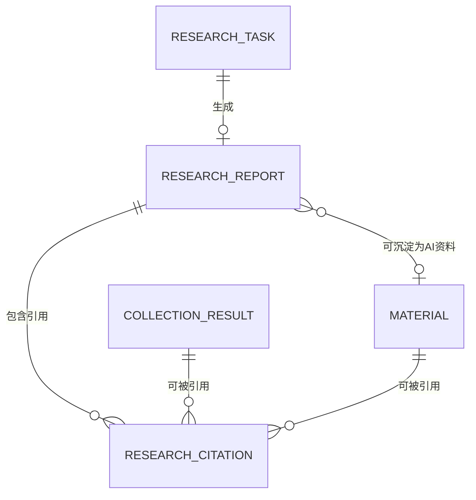

# 研究助手字段清单

> 文件定位：研究助手模块新增实体字段清单
> 字段 SSOT：`context/05-术语与字段口径.md`
> 说明：本文件只展开研究任务、研究报告、研究引用关系三类实体。新增实体和新增映射字段均为“新增建议，待确认”。

## 一、字段确认度与复用原则

1. 资料条目的标题、内容、可信度、有效期、`is_ai_product` 等字段直接沿用 `context/05`，不在本文件重造同名不同义字段。
2. 自动采集结果沿用第二步的 `collection_result` 关联和 `context/05` 的数据源/原始数据语义；本模块不重设计采集表。
3. 研究报告是 AI 整理产物，报告实体必须使用一期一致的 `is_ai_product` 语义，默认值为 `true`。
4. URL、检索源、采集结果和资料的关系字段是二期新增映射，统一标注“新增建议，待确认”。
5. 页面展示字段、数据库字段、JSON 容器和索引是否最终落库需技术评审确认，不把本清单当作已回写的 context SSOT。

## 二、研究任务实体

> 实体确认度：新增建议，待确认。用于保存一次开放式、可恢复的长研究任务。

建议表名：`research_task`（新增建议，待确认）

| 表名 | 字段名 | 类型 | 必填 | 默认值 | 说明 |
|---|---|---|---|---|---|
| research_task | id | bigint | 是 | 自增 | 主键；新增建议，待确认 |
| research_task | task_no | varchar(64) | 是 | 系统生成 | 研究任务编号；新增建议，待确认 |
| research_task | topic | varchar(500) | 是 | 无 | 研究主题；新增建议，待确认 |
| research_task | objective | text | 是 | 无 | 研究目标/希望回答的问题；新增建议，待确认 |
| research_task | scope_config | json | 是 | {} | 外部检索、资料库、自动采集结果等范围；新增建议，待确认 |
| research_task | time_window_start | datetime | 否 | NULL | 研究时间窗开始；沿用时间窗语义，映射字段新增建议，待确认 |
| research_task | time_window_end | datetime | 否 | NULL | 研究时间窗结束；沿用时间窗语义，映射字段新增建议，待确认 |
| research_task | status | varchar(32) | 是 | 待执行 | 待执行/检索中/整理中/已完成/失败；状态映射新增建议，待确认 |
| research_task | current_stage | varchar(32) | 否 | NULL | 阶段进度；若复用执行中状态，此字段承担阶段信息；新增建议，待确认 |
| research_task | progress_percent | decimal(5,2) | 否 | NULL | 阶段进度百分比；计算口径新增建议，待确认 |
| research_task | progress_message | text | 否 | NULL | 面向用户的最近进度说明；新增建议，待确认 |
| research_task | checkpoint_data | json | 否 | NULL | 可恢复的检索游标、中间来源和整理上下文；新增建议，待确认 |
| research_task | retry_count | int | 是 | 0 | 任务重试次数；新增建议，待确认 |
| research_task | last_error_code | varchar(64) | 否 | NULL | 最近错误码；新增建议，待确认 |
| research_task | last_error_message | text | 否 | NULL | 最近错误说明；新增建议，待确认 |
| research_task | started_at | datetime | 否 | NULL | 开始时间；新增建议，待确认 |
| research_task | finished_at | datetime | 否 | NULL | 完成时间；新增建议，待确认 |
| research_task | requested_by | bigint | 是 | 当前用户 | 创建人；用户外键映射新增建议，待确认 |
| research_task | created_at | datetime | 是 | 当前时间 | 创建时间；新增建议，待确认 |
| research_task | updated_at | datetime | 是 | 当前时间 | 最近更新时间；新增建议，待确认 |

### 2.1 scope_config 建议内容

`scope_config` 可记录外部检索范围、已选资料 ID、第二步 `collection_result` ID、语言和时间范围等。具体 JSON schema、是否保存资料快照和外部源白名单均为新增建议，待确认。

## 三、研究报告实体

> 实体确认度：新增建议，待确认。用于保存研究任务产出的 AI 报告及生成追溯。

建议表名：`research_report`（新增建议，待确认）

| 表名 | 字段名 | 类型 | 必填 | 默认值 | 说明 |
|---|---|---|---|---|---|
| research_report | id | bigint | 是 | 自增 | 主键；新增建议，待确认 |
| research_report | research_task_id | bigint | 是 | 无 | 关联研究任务；新增建议，待确认 |
| research_report | title | varchar(500) | 是 | 主题生成 | 报告标题；映射字段新增建议，待确认 |
| research_report | summary | text | 是 | 无 | 报告摘要；新增建议，待确认 |
| research_report | content | longtext | 是 | 无 | 报告正文；与资料“内容”语义可复用，但报告映射字段新增建议，待确认 |
| research_report | sections | json | 否 | NULL | 章节、章节结论和章节排序；新增建议，待确认 |
| research_report | conclusions | json | 否 | NULL | 结构化结论集合；新增建议，待确认 |
| research_report | generation_trace | json | 否 | NULL | 输入快照、提示词/模型版本、生成时间和阶段信息；新增建议，待确认 |
| research_report | raw_ai_response | json/text | 否 | NULL | AI 原始响应；语义沿用一期 AI 原始响应，映射字段新增建议，待确认 |
| research_report | is_ai_product | boolean | 是 | true | 是否 AI 产物；字段语义直接沿用一期，研究报告固定为 true |
| research_report | status | varchar(32) | 是 | 已完成 | 报告可用/废弃等状态；枚举新增建议，待确认 |
| research_report | source_count | int | 是 | 0 | 关联引用数量；新增建议，待确认 |
| research_report | created_at | datetime | 是 | 当前时间 | 生成时间；新增建议，待确认 |
| research_report | updated_at | datetime | 是 | 当前时间 | 修改时间；新增建议，待确认 |

### 3.1 报告与资料字段复用

报告沉淀为资料时，不复制另一套资料字段定义。目标资料直接沿用 `context/05` 的标题、内容、资料分类、标签、来源类型、来源链接、可信度、有效期、状态、审核字段、创建追踪字段和 `is_ai_product=true`。目标资料与报告的关联字段为新增建议，待确认。

## 四、研究引用关系实体

> 实体确认度：新增建议，待确认。一个报告可引用外部来源、自动采集结果和资料；一条来源可被多个报告引用。

建议表名：`research_citation`（新增建议，待确认）

| 表名 | 字段名 | 类型 | 必填 | 默认值 | 说明 |
|---|---|---|---|---|---|
| research_citation | id | bigint | 是 | 自增 | 主键；新增建议，待确认 |
| research_citation | report_id | bigint | 是 | 无 | 关联研究报告；新增建议，待确认 |
| research_citation | source_kind | varchar(32) | 是 | external_url | `external_url`/`collection_result`/`material`；枚举新增建议，待确认 |
| research_citation | source_url | varchar(1000) | 条件 | NULL | 外部来源 URL；外部来源关系必填；字段新增建议，待确认 |
| research_citation | source_title | varchar(500) | 否 | NULL | 来源标题；新增建议，待确认 |
| research_citation | search_provider | varchar(128) | 否 | NULL | 检索源/供应商名称；DeepSeek/Tavily 均只是待实测选项，字段新增建议，待确认 |
| research_citation | collection_result_id | bigint | 条件 | NULL | 关联第二步 `collection_result`；采集结果关系必填；映射新增建议，待确认 |
| research_citation | material_id | bigint | 条件 | NULL | 关联资料条目；资料关系必填；映射新增建议，待确认 |
| research_citation | source_snapshot | json/text | 否 | NULL | 引用时的标题、摘要或原文快照；新增建议，待确认 |
| research_citation | page_number | varchar(64) | 否 | NULL | 来源页码；引用增强字段，新增建议，待确认 |
| research_citation | paragraph_locator | varchar(255) | 否 | NULL | 段落/章节定位；引用增强字段，新增建议，待确认 |
| research_citation | evidence_summary | text | 否 | NULL | 支持报告结论的证据摘要；引用增强字段，新增建议，待确认 |
| research_citation | source_type | varchar(64) | 否 | NULL | 检索源类型，如官方、行业报告、社交内容；引用增强字段，新增建议，待确认 |
| research_citation | cited_at | datetime | 是 | 当前时间 | 建立引用时间；新增建议，待确认 |
| research_citation | created_at | datetime | 是 | 当前时间 | 创建时间；新增建议，待确认 |

### 4.1 三类引用关系约束

| 关系 | 必须字段 | 说明 |
|---|---|---|
| 报告→外部来源 | `source_kind=external_url`、`source_url` | 保存 URL、来源标题、检索源和引用快照；均为新增映射建议，待确认 |
| 报告→采集结果 | `source_kind=collection_result`、`collection_result_id` | 只引用第二步结果，不重定义对标账号、采集任务、采集记录、采集结果字段 |
| 报告→资料 | `source_kind=material`、`material_id` | 沿用一期资料字段；引用定位增强字段待确认 |

## 五、表关系总览

关系说明：报告必须关联研究任务；引用关系三选一指向外部 URL、自动采集结果或资料；报告沉淀资料是可选动作。`COLLECTION_RESULT` 指第二步已定义实体，本模块不重设计其表；`MATERIAL` 指一期资料条目。

## 六、与一期字段 SSOT 差异对照

| 项目 | `context/05` 已有口径 | 本模块处理 |
|---|---|---|
| 资料标题/内容 | 资料条目标题、正文 | 报告字段映射建议；沉淀后直接复用一期资料字段 |
| 可信度/有效期 | 资料必填核心字段 | 沉淀资料继续填写；报告自身是否存可信度待确认 |
| `is_ai_product` | 区分 AI 产物与原始事实 | 报告固定为 `true`；采集结果保持第二步口径 |
| 来源链接 | 资料来源 URL | 外部引用 `source_url` 为新增关系映射，待确认 |
| 数据源/原始数据 | 平台、账号、原始内容、结构化数据、采集时间和时间窗 | 通过 `collection_result_id` 引用，不复制字段 |
| 分析任务 AI 原始响应 | 已有留档字段 | 报告的 `raw_ai_response` 复用语义，映射待确认 |
| 选题字段 | 标题、方向、角度、批次、状态、引用资料 | 报告生成选题时复用一期字段，关联报告为新增建议 |
| 脚本字段 | 选题关联、版本号、正文和状态 | 报告生成脚本时复用 R5/R9/R10，关联报告为新增建议 |
| 研究任务/报告/引用 | 未定义 | 三类实体和字段均为新增建议，待确认 |

## 七、待确认事项

1. 三类实体的最终表名、主键、唯一约束、索引和归档策略。
2. `sections`/`conclusions` 是否拆表，及报告章节级引用是否必须独立记录。
3. 外部 URL、采集结果和资料引用的互斥校验与多目标引用方式。
4. 页码、段落、证据摘要和检索源类型的实际可用性。
5. `source_snapshot` 的保存范围、版权和过期处理。
6. 报告与资料、选题、脚本的双向关联字段。
7. `is_ai_product=true` 与默认通过、轻量抽查的精确状态映射。

