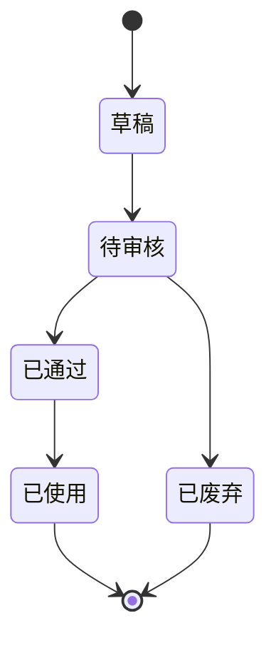

# 脚本库_业务规则规格

> 文件定位：脚本状态机、版本、校验、权限和异常规格

## 一、状态流转

| 当前状态 | 动作 | 目标状态 | 权限/校验 |
|---|---|---|---|
| 新建/生成 | 创建 | 草稿 | 正文、风格等字段有效 |
| 草稿 | 提交审核 | 待审核 | 正文非空 |
| 待审核 | 通过 | 已通过 | 仅管理员 |
| 待审核 | 驳回 | 已废弃 | 仅管理员 |
| 已通过 | 标记已使用 | 已使用 | 人工动作；仅已通过 |
| 草稿/待审核/已通过 | 废弃 | 已废弃 | 依现有页面动作；回流策略以业务确认优先 |

## 二、版本规则

- 新建脚本创建初始版本，`current_version` 从 1 开始。
- 编辑保存：正文快照写入 script_version，版本号 +1，脚本当前内容同步更新。
- 版本对比：选择任意两个版本，展示差异和左右正文。
- 回退：读取目标快照作为当前正文，生成一个新的版本记录；不删除原版本。
- “修改备注”目前是前端字段，SSOT 未确认，标记为新增建议、待确认。

## 三、生成规则

- 主路径只能选择状态为已选定的选题。
- 每个选题生成 2-3 版，前端默认 3，输入范围 2-3。
- 独立创建页允许 topic_id 为空；编辑时可补选题。
- 仅已生效资料可作为参考资料。
- 提示词模板可选，不选则使用内置模板。

## 四、校验规则

| 校验 | 规则 |
|---|---|
| topic_id | 主路径必填；独立创建可空 |
| style | 必须为确认枚举 |
| content | 必填且不能全为空白 |
| content_elements | 使用确认值；可为空由当前页面允许，是否强制选择待确认 |
| mark-used | status 必须为已通过 |
| review | 仅管理员；待审核才可审核 |

## 五、权限规则

| 动作 | 管理员 | 成员 | 来源 |
|---|---|---|---|
| 生成/挑选 | ✅ | ✅（授权） | context/06 §2.2 |
| 修改 | ✅ | 待确认 | context/06 §2.2 |
| 审核 | ✅ | ❌ | 4.8/D2 |
| 版本查看/对比 | ✅ | 待确认 | context/06 §2.2 |
| 版本回退 | ✅ | 待确认 | context/06 §2.2 |
| 已使用标记 | ✅ | 待确认 | D4；成员动作未确认 |

## 六、错误与幂等

- 生成按钮 loading 期间防止重复提交。
- AI 失败按系统重试策略执行，失败不得产生不完整脚本。
- 审核和标记已使用应幂等；重复点击不重复生成状态记录。
- 回退操作必须保留新的版本记录。

## 七、实现差异登记

- 当前 `ScriptList.tsx` 对已通过脚本显示“废弃”按钮；SSOT 明确审核流和已使用状态，但未单独确认“已通过→已废弃”是否允许，开发需人工确认。
- 当前 `ScriptReview.tsx` 未在组件内自行检查管理员，路由权限由菜单/后端承担；一期审核人仍仅管理员。

## 八、修订记录

| 日期 | 变更 |
|---|---|
| 2026-08-24 | 初稿：状态、版本、生成、审核、权限和实现差异 |
