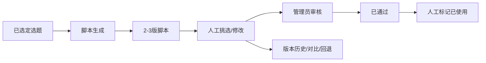
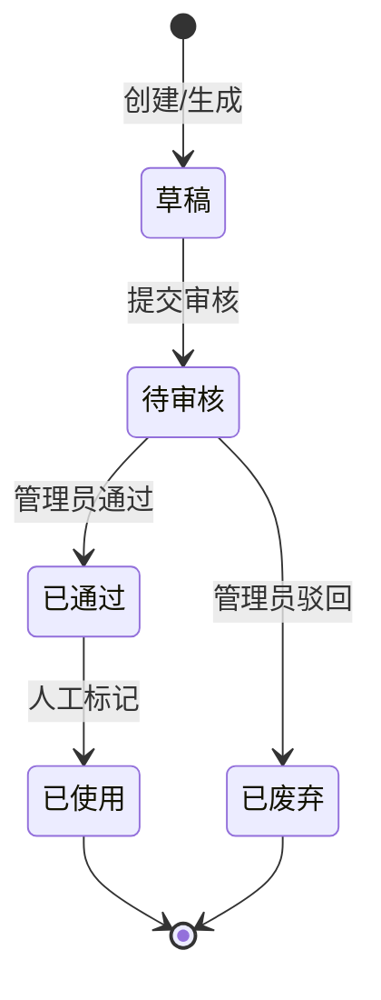

# 脚本库主PRD

> 文件定位：脚本库模块主 PRD（背景、范围、定位、场景、规则摘要、验收）
> 权威层级：context/ > templates/ > prd-docs/
> 配套文档：脚本库字段清单.md / 脚本库_业务规则规格.md / 脚本库_用例数据推演.md / 脚本库_Demo_*.md

## 1. 业务背景

脚本库承接“选题 → 内容生产”环节。系统按已选定选题生成 2-3 版脚本，允许人工挑选、修改并保留每次修改历史，随后由管理员审核。独立创建是辅助路径：脚本可以暂时没有选题，之后补录关联。

## 2. 功能范围

### 2.1 In Scope（一期）

| # | 功能 | 关键规则 |
|---|---|---|
| 1 | 基于选题生成 | 仅已选定选题可进入主路径；每选题 2-3 版（R5） |
| 2 | 独立创建/后补关联 | `topic_id` 可空，后续可补录（R9/R10） |
| 3 | 人工挑选和修改 | 语言风格、内容要素可编辑 |
| 4 | 版本历史 | 每次保存产生新版本，可查看、对比、回退（R11） |
| 5 | 管理员审核 | 待审核→已通过/已废弃；一期仅管理员审核 |
| 6 | 已使用标记 | 已通过脚本由人工标记为已使用（R15/D4） |
| 7 | 资料/提示词追溯 | 可选，不阻塞脚本创建（R10） |

### 2.2 Should（非阻塞）

暂无额外已确认 Should；多角色审批、平台发布等不属于一期。

### 2.3 Out of Scope / NIS

- 完整审批流和多角色审核（二期）
- 系统向视频号/小红书发布或上传内容
- 脚本“已发布”作为独立存储状态；界面可使用“已使用”展示
- 独立提示词版本表（新增建议，待确认）

## 3. 模块定位

## 4. 业务场景

### 场景 1：基于选题生成

用户从“已选定”选题进入生成页，选择语言风格和内容要素，系统同步生成 2-3 版，结果卡显示选题标题、版本和状态。

### 场景 2：独立创建

用户在独立创建页不选择选题，直接填写正文和风格保存为草稿；后续编辑时可补录选题关联。

### 场景 3：版本修订与回退

脚本正文每次保存递增版本号。用户选择两个版本查看差异，确认后回退旧版本；回退会生成新版本并保留记录。

### 场景 4：审核与使用

管理员审核待审核脚本。已通过脚本实际使用后，人工点击“标记已使用”；该标记不代表系统向平台发布。

## 5. 状态机

草稿是内部派生态；已使用是一期正式用户可见状态（D4）。每次编辑仍产生脚本版本，不改变脚本业务状态。

## 6. 核心业务规则

| 编号 | 规则 | 来源 |
|---|---|---|
| R5 | 每选题生成 2-3 版脚本 | context/04 §3 |
| R9 | 默认基于选题，偶尔允许独立创建 | context/04 §5 |
| R10 | 基于选题创建必须关联并显示；独立创建可空、可后补；资料/提示词追溯可选 | context/04 §5 |
| R11 | 每次修改保留历史版本，可对比和回退 | context/04 §5 |
| R15 | 已使用由人工从已通过标记 | context/04 §5 / D4 |

## 7. 权限设计

| 动作 | 管理员 | 成员 |
|---|---|---|
| 生成/挑选 | ✅ | ✅（受数据范围/授权） |
| 修改 | ✅ | 待确认 |
| 审核 | ✅ | ❌（一期） |
| 查看/对比版本 | ✅ | 待确认 |
| 回退版本 | ✅ | 待确认 |
| 标记已使用 | ✅ | 待确认 |

来源：`context/06-系统边界与角色权限.md` §2.2。未确认动作不得默认扩权。

## 8. 边界与异常

| 场景 | 处理 |
|---|---|
| 基于选题生成未选题 | 前端仅加载已选定；后端再次校验 |
| 独立创建未选题 | 允许保存，topic_id 为空 |
| 正文为空 | 阻止保存 |
| AI 返回失败 | 按系统重试策略处理，原始响应留档 |
| 版本回退 | 生成新版本，不覆盖历史快照 |
| 待审核脚本标记已使用 | 拒绝；必须先已通过 |
| 已使用/已废弃脚本再次审核 | 不提供一期回流入口 |

## 9. 验收重点

- [ ] 已选定选题生成 2-3 版，结果显示所属选题
- [ ] 独立创建允许 topic_id 为空并可后补
- [ ] 每次修改版本号递增，版本快照可查看
- [ ] 两版本差异可查看，回退生成新版本
- [ ] 管理员审核通过/驳回状态正确
- [ ] 已通过脚本可人工标记已使用，其他状态不可标记
- [ ] 资料/提示词追溯为空不阻塞创建

## 10. 修订记录

| 日期 | 变更 |
|---|---|
| 2026-08-24 | 由原 03-脚本库PRD.md 扩展为套件，对齐前端脚本页面和 R5/R9/R10/R11/R15 |
