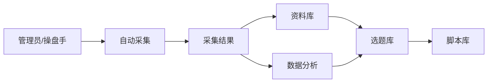
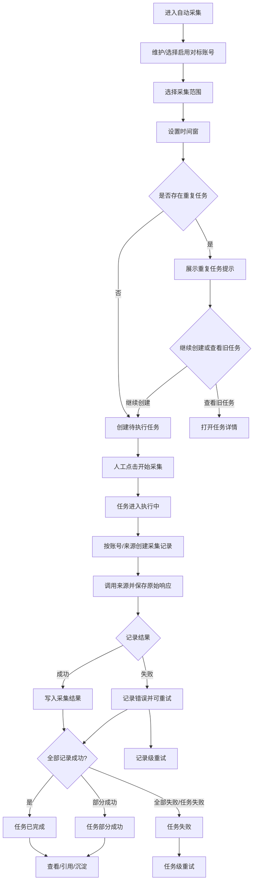
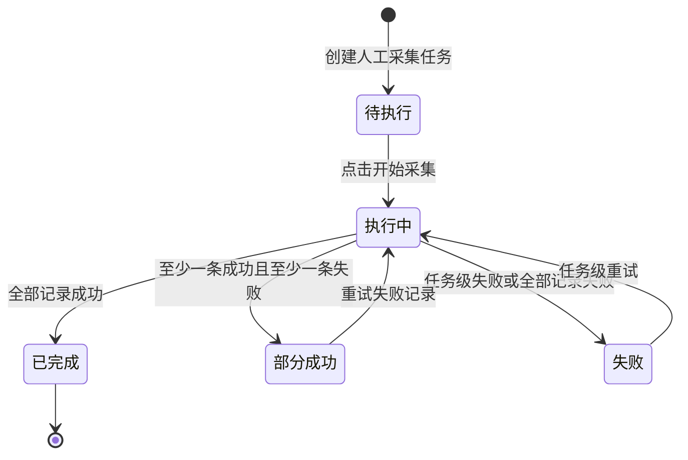

# 自动采集主PRD

> 文件定位：二期自动采集模块主 PRD
> 依据：`requirements/09-二期调研结论.md`（2026-08-26 拍板）、`prd-docs/modules/00-二期总PRD.md`
> 权威层级：`context/` > `templates/` > `prd-docs/`
> 范围：P0 人工触发自动采集；P1 定时采集仅预留，不设计细节

## 1. 模块概述

### 1.1 一句话定位

自动采集模块为管理员/操盘手提供“维护对标账号、人工触发采集、保留原始来源、将结果送入资料库和分析链路”的信息获取能力，优先解决对标账号信息与数据长期手动盯盘的问题。

### 1.2 用户与核心任务

| 用户 | 核心任务 | 本期目标 |
|---|---|---|
| 管理员/操盘手 | 维护对标账号 | 可启用、停用和补充账号来源信息 |
| 管理员/操盘手 | 触发一次采集 | 选择账号、平台、时间窗和范围后开始采集 |
| 管理员/操盘手 | 判断采集质量 | 查看任务状态、记录级成功/失败、错误和重试 |
| 管理员/操盘手 | 使用采集事实 | 将结果作为资料或分析输入，并保留来源追溯 |

### 1.3 要解决的问题

一期仅支持手动录入和 CSV/TXT 导入，无法稳定获取对标账号的更新频率、选题、内容和表现信息。自动采集模块先给出全量能力，再根据真实使用反馈收敛范围，避免在需求尚不清晰时过早砍掉重要采集对象。

### 1.4 产品目标

1. 对标账号采集优先可用，评论、热点、行业报告作为次优先采集对象并标注待实测。
2. 一次人工触发能够形成可追溯的任务、记录和结果链路。
3. 原始采集事实独立落库，默认不进入 AI 审核阻塞队列。
4. 采集失败可定位到任务级或记录级，并支持可控重试。
5. 采集结果能够被资料库和数据分析引用，不改变一期 API 契约和既有数据。

### 1.5 范围与非目标

| 范围 | 说明 |
|---|---|
| P0 In | 对标账号管理、人工触发采集、对标账号内容/数据采集、采集记录与结果落库、失败重试、重复任务提示 |
| P0 In | 采集结果来源追溯、原始事实与 AI 产物区分、进入资料库/分析链路 |
| P1 预留 | 定时采集入口、频率、调度器、时区和告警方案；本文件不设计实现细节 |
| 待实测 | 评论、热点、行业报告的具体来源、接口能力、字段完整度和成本 |
| Out | 手机端专项、多人协作、抖音/公众号内容接入、语义去重、自动推送 |

### 1.6 与一期及二期其他模块的关系

| 模块 | 关系 | 约束 |
|---|---|---|
| 资料库 | 采集结果可沉淀为资料或作为资料上下文 | 仍需区分原始事实与 AI 产物；资料状态遵循 R1/R2，具体默认通过变化见审核说明 |
| 数据分析 | 采集结果可作为分析任务输入 | 沿用 R6/R7 的分析、回写和反哺边界；本模块不直接改分析 API |
| 选题库 | 采集事实经资料/分析后支持选题生成 | 沿用 R3/R4/R14；二期默认通过映射仅在审核变更说明中定义 |
| 脚本库 | 间接使用采集衍生选题 | 本模块不直接生成脚本 |
| 研究助手 | 后续可引用采集结果作为研究来源 | 本步不设计研究任务和报告实体 |

## 2. 功能清单

| # | 功能名称 | 优先级 | In/Out | 关键规则 |
|---|---|---|---|---|
| 1 | 对标账号新增 | P0 | ✅ In | 账号标识、平台、来源和启用状态必填口径待确认；沿用“对标账号”术语 |
| 2 | 对标账号编辑 | P0 | ✅ In | 不覆盖历史采集结果；编辑后新任务使用最新配置 |
| 3 | 对标账号停用/启用 | P0 | ✅ In | 停用账号不能进入新任务；历史记录仍可查看 |
| 4 | 对标账号列表筛选 | P0 | ✅ In | 按平台、启用状态、账号标识和关键词筛选，具体字段待确认 |
| 5 | 新建采集任务 | P0 | ✅ In | 人工触发；支持一个或多个启用账号、时间窗和采集范围 |
| 6 | 重复任务提示 | P0 | ✅ In | 同账号、同时间窗、同范围提示已有任务；幂等键为新增建议，待确认 |
| 7 | 执行对标账号采集 | P0 | ✅ In | 对标账号优先；官方 API 优先，网页抓取合规边界待实测 |
| 8 | 评论采集 | P0 | ✅ In | 作为次优先能力；平台来源、权限和字段待实测 |
| 9 | 热点采集 | P0 | ✅ In | 作为次优先能力；来源、时间范围和版权边界待实测 |
| 10 | 行业报告采集 | P0 | ✅ In | 作为次优先能力；来源、全文获取和版权边界待实测 |
| 11 | 任务进度查看 | P0 | ✅ In | 展示待执行、执行中、已完成、部分成功、失败 |
| 12 | 采集记录查看 | P0 | ✅ In | 记录级成功、失败、错误和来源信息独立展示 |
| 13 | 采集结果查看 | P0 | ✅ In | 原始内容、结构化内容、来源 URL、账号和时间窗可追溯 |
| 14 | 记录级重试 | P0 | ✅ In | 只重试失败记录，成功结果不重复生成 |
| 15 | 任务级重试 | P0 | ✅ In | 任务整体不可执行时重试；保留原任务及错误信息 |
| 16 | 进入资料库 | P0 | ✅ In | 原始事实可形成资料草稿或独立引用；目标映射待确认 |
| 17 | 进入数据分析 | P0 | ✅ In | 作为分析任务输入；沿用数据源/原始数据口径 |
| 18 | AI 摘要/结构化 | P0 | ✅ In | 仅作为可选衍生结果；必须标记 `is_ai_product=true`，字段待确认 |
| 19 | 定时采集 | P1 | ◇ 预留 | 仅保留产品边界，不设计调度、频率、时区和告警细节 |
| 20 | 采集结果推送 | P1 | ❌ 本模块不展开 | 后续数据报告/推送模块负责，结果必须先落库 |

### 2.1 采集优先级

1. 第一优先级：对标账号的信息与数据，包括账号更新、内容、选题和可获得的平台指标。
2. 第二优先级：评论、热点、行业报告；具体源和抓取方式必须先实测。
3. 采集对象采取“先全量给，用后再收敛”策略，不能因字段尚未精确而提前删除对象类型。

### 2.2 技术边界

- 官方 API、授权接口或平台允许的公开数据优先。
- 网页抓取必须检查 robots、服务条款、访问频率、版权和数据使用范围；所有结论待实测。
- 本 PRD 不承诺绕过登录、验证码、风控或付费墙。
- 本模块不存储密码、token、API key 或连接串；连接配置的存储方式属于新增建议，待确认。

## 3. 交互流程

### 3.1 主流程

### 3.2 页面操作说明

| 步骤 | 操作 | 系统反馈 |
|---|---|---|
| 1 | 打开对标账号管理 | 展示账号标识、平台、启用状态和最近采集时间 |
| 2 | 新增或启用账号 | 校验必填项；成功后可选入采集任务 |
| 3 | 选择账号和范围 | 只允许启用账号；展示预计记录数属于待确认能力 |
| 4 | 设置时间窗 | 开始时间不得晚于结束时间；时区口径待确认 |
| 5 | 点击创建任务 | 创建待执行任务，不立即隐式执行 |
| 6 | 点击开始采集 | 防重复点击，任务进入执行中 |
| 7 | 查看任务详情 | 展示任务级状态、记录计数和错误摘要 |
| 8 | 打开采集记录 | 查看单个来源的请求结果、错误和重试 |
| 9 | 打开采集结果 | 查看原始事实、结构化内容及来源追溯 |
| 10 | 选择使用链路 | 进入资料库或数据分析，动作和映射待确认 |

### 3.3 重复任务交互

当用户提交的账号集合、时间窗和采集范围与已有任务完全一致时，系统展示已有任务编号、状态、创建时间和结果数量。用户可以打开已有任务；是否允许强制创建新任务属于新增建议，待确认。即使允许强制创建，也不能覆盖旧结果。

## 4. 关键规则

### 4.1 规则索引

详细规则见《自动采集_业务规则规格.md》。

| 编号 | 规则摘要 | 来源 |
|---|---|---|
| R8 | 原始事实与 AI 产物区分 | `context/04` |
| R13 | 自动采集人工触发，定时属于 P1 | `context/04` / 二期拍板 |
| R16 | 一期采集仅预留，二期启用自动采集 | `context/04` / 二期拍板 |
| R17 | 基础数据与分析框架沿用，深度指标按实际迭代 | `context/04` |
| AC-R1 | 对标账号优先、其他来源次之，先全量后收敛 | 09 调研结论 2026-08-26 拍板 |
| AC-R2 | 官方 API 优先，网页采集合规边界待实测 | 09 调研结论 2026-08-26 拍板 |
| AC-R3 | 原始采集事实直接信，不走 AI 审核阻塞 | 09 调研结论 2026-08-26 拍板 |
| AC-R4 | 任务级和记录级失败可区分并支持重试 | 本模块新增建议，待确认 |
| AC-R5 | 同账号同时间窗同范围重复任务提示 | 本模块新增建议，待确认 |
| AC-R6 | 每条结果必须保留来源追溯链 | R8 延展；新增字段待确认 |
| AC-R7 | AI 衍生摘要必须标记 AI 产物 | R8；字段语义沿用一期 |

### 4.2 原始事实边界

采集结果是来源返回或公开可获取的原始事实，不因落入系统而变成 AI 产物。系统可以对其做格式解析、字段标准化和去重，但不能把 AI 摘要覆盖原始内容。AI 摘要、分类、标签建议和分析结论必须另存或明确标记 `is_ai_product=true`。

### 4.3 依赖的一期规则

- R1/R2：若结果沉淀为资料，资料的状态、有效期和可信度仍按资料口径处理。
- R4/R14：采集结果进入选题生成时，选题完全重复去重继续生效；本模块不做语义去重。
- R6/R7：分析任务的审核、回写和反哺沿用一期字段与二期默认通过说明。
- R8：来源事实和 AI 产物不能混写。
- R13：采集触发方式为人工触发；定时只作 P1 预留。
- R16/R17：平台和指标能力按实际可用数据源逐步验证，不假定一期不存在的固定指标。

### 4.4 错误处理原则

1. 任务创建失败：不创建半成品任务，返回可理解的校验错误。
2. 任务执行失败：任务保留为失败，记录失败原因和可重试动作。
3. 单个来源失败：保留失败记录，不影响其他账号记录执行。
4. 部分成功：成功结果立即可查；失败记录单独重试；该状态为新增建议，待确认。
5. 重试不得覆盖原始失败响应，需保留尝试次数、最后错误和时间。
6. 来源合规不可执行时，停止该来源调用并明确显示“来源不可达/不可采集”，不以空数据伪装成功。

## 5. 状态机

### 5.1 采集任务状态机

以下状态与二期总 PRD 5.1 对齐；“部分成功”为新增建议，待确认。

### 5.2 状态说明

| 状态 | 含义 | 允许动作 |
|---|---|---|
| 待执行 | 任务已创建，尚未人工启动 | 开始采集、取消动作待确认 |
| 执行中 | 正在调用一个或多个来源 | 查看进度；禁止重复启动 |
| 已完成 | 所有采集记录成功 | 查看、引用、沉淀 |
| 部分成功 | 至少一条成功、至少一条失败；新增建议，待确认 | 查看、重试失败记录、引用成功结果 |
| 失败 | 任务级初始化失败或全部记录失败 | 查看错误、任务级重试 |

### 5.3 记录状态

采集记录至少需要表达待执行、执行中、成功、失败四类过程。具体状态枚举属于新增建议，待确认；若不新增枚举，可用现有任务状态加记录级 `error_message` 和成功标记表达，但不得丢失记录级失败。

## 6. 数据字段

### 6.1 实体范围

本步只展开以下四类二期新增实体，均为“新增建议，待确认”：

1. 对标账号。
2. 采集任务。
3. 采集记录。
4. 采集结果。

字段明细以《自动采集字段清单.md》为准。`data_source` 中的业务对象、平台、账号标识、对标标记、原始数据内容、结构化数据、采集时间和时间窗引用 `context/05`；本模块不重新定义同名不同义字段。

### 6.2 结果与 AI 产物

- 采集结果默认 `is_ai_product=false`，语义沿用一期资料/数据结果口径。
- AI 摘要或 AI 分类若落库，必须使用独立字段或关联记录并标记 `is_ai_product=true`；字段为新增建议，待确认。
- 任何使用链路都必须保留 `source_url`、账号标识、采集时间窗、采集任务和采集记录关联；字段名与必填性均以字段清单的待确认标注为准。

### 6.3 数据保留

原始响应和结构化结果需可追溯；保存周期、对象存储方式、单条大小和脱敏规则属于新增建议，待确认。系统不因重试而删除旧尝试。

## 7. 权限

### 7.1 本期权限边界

二期不新增多人协作产品能力，当前以管理员/操盘手完成验收。成员是否可执行二期动作沿用现有权限系统，具体授权矩阵属于新增建议，待确认。

| 动作 | 管理员 | 成员 | 说明 |
|---|---|---|---|
| 查看对标账号 | ✅ | 沿用现有授权 | 不扩大既有成员权限 |
| 新增/编辑/启停对标账号 | ✅ | 沿用现有授权 | 具体授权待确认 |
| 创建采集任务 | ✅ | 沿用现有授权 | 人工触发 |
| 开始/重试采集 | ✅ | 沿用现有授权 | 不允许无权限执行 |
| 查看原始记录/结果 | ✅ | 沿用数据范围 | 原始事实不等于 AI 产物 |
| 沉淀资料/创建分析输入 | ✅ | 沿用现有授权 | 目标模块权限继续生效 |
| 删除采集结果 | ❌ 默认不提供 | ❌ | 删除策略待确认，优先保留来源链 |

### 7.2 数据范围

账号、任务、记录和结果的可见范围沿用现有用户数据范围。是否按创建人或账号组隔离属于新增建议，待确认；不得在本模块自行引入新的角色或权限枚举。

## 8. 验收标准

### 8.1 P0 功能验收

- [ ] 管理员可以新增、编辑、启用和停用对标账号。
- [ ] 停用账号不能进入新的人工采集任务，历史记录仍可查看。
- [ ] 任务支持选择一个或多个启用账号、采集范围和时间窗。
- [ ] 任务创建后为待执行，必须由用户明确点击开始采集。
- [ ] 对标账号采集优先执行，评论/热点/行业报告能力按实测结果接入或明确不可用。
- [ ] 执行中展示任务级进度和记录级结果。
- [ ] 全部成功时进入已完成；部分成功路径按新增建议实现或以等价 DTO 表达并明确标注。
- [ ] 任务级失败和记录级失败可区分，均可查看错误原因。
- [ ] 任务级重试和记录级重试不会覆盖旧尝试或重复成功结果。
- [ ] 同账号、同时间窗、同范围再次创建时出现重复任务提示。

### 8.2 数据与链路验收

- [ ] 采集任务、采集记录、采集结果独立保存并可相互追溯。
- [ ] 采集结果保存原始内容和结构化内容，不以 AI 摘要覆盖原文。
- [ ] 采集结果默认 `is_ai_product=false`。
- [ ] AI 摘要或分析衍生结果有独立标记，`is_ai_product=true` 语义与一期一致。
- [ ] 结果能够作为资料库或数据分析输入，具体映射不伪造一期未定义字段。
- [ ] 来源 URL、平台、账号标识、采集时间和时间窗可回看。

### 8.3 范围与合规验收

- [ ] 定时采集只作为 P1 预留，不出现本期强制实现细节。
- [ ] robots、服务条款、频率、版权、官方 API 可用性均标记待实测/待确认。
- [ ] 不接入抖音/公众号，不建设手机端和多人协作。
- [ ] 不修改 `context/`、`requirements/`、一期模块文档和 API 契约。

## 9. 待确认事项

1. 四类新增实体的最终表名、主键策略、索引和归档方式，待确认。
2. 对标账号支持的平台范围目前沿用视频号+小红书的二期口径，具体官方接口待实测。
3. 对标账号可采集的内容、更新频率、播放/点赞/评论等指标集合待实测；不固化为一期字段。
4. 评论、热点和行业报告的优先来源、授权、配额、全文范围和成本待实测。
5. 官方 API 与网页抓取的 robots、服务条款、版权、频率和存储边界待实测。
6. 采集记录状态枚举、任务级/记录级错误字段和重试上限为新增建议，待确认。
7. “部分成功”是否增加任务状态，或以成功/失败计数 DTO 表达，待确认。
8. 同账号同时间窗同范围的幂等键、重复任务提示后的强制创建策略待确认。
9. 采集时间窗是否按北京时间、来源平台时区或任务创建人时区解释，待确认。
10. 原始响应保存周期、对象存储、大小限制、脱敏和版权删除请求处理待确认。
11. 采集结果进入资料库时是新建资料、引用原始结果还是建立关联表，待确认。
12. AI 摘要是否 P0 默认执行、是否异步执行及其模型/提示词版本追溯字段待确认。
13. 成员使用采集能力的具体授权沿用现有系统还是新增动作权限，待确认。
14. P1 定时采集的调度器、频率、时区、失败告警和暂停策略不在本步展开，待确认。

