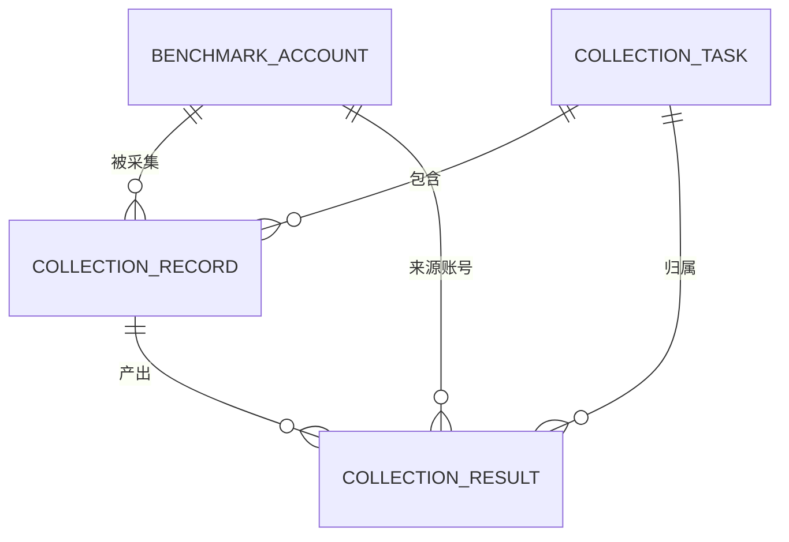

# 自动采集字段清单

> 文件定位：自动采集模块新增实体字段清单
> 字段 SSOT：`context/05-术语与字段口径.md`
> 说明：本文件只展开对标账号、采集任务、采集记录、采集结果四类实体。除 `context/05` 已确认字段外，新增字段统一标注“新增建议，待确认”。

## 一、字段确认度与复用原则

1. `context/05` 已定义的数据源/原始数据字段直接复用其业务含义，不在本文件重造同名不同义字段。
2. 数据库主键、外键、时间戳等技术字段如果是本模块新增映射，标注“新增建议，待确认”。
3. 采集结果默认是原始事实，`is_ai_product=false`；若后续生成 AI 摘要或分类，必须另存并使用 `is_ai_product=true`。
4. 播放量、点赞、评论、涨粉等平台指标字段不视为一期固定字段；可先放在结构化 JSON 中，具体列拆分待实测。
5. 表名、枚举、索引和是否拆表均需技术评审确认，不把本清单的建议当作已回写 SSOT。

## 二、对标账号实体

> 实体确认度：新增建议，待确认。用于维护自动采集的账号对象，不覆盖历史结果。

建议表名：`benchmark_account`（新增建议，待确认）

| 表名 | 字段名 | 类型 | 必填 | 默认值 | 说明 |
|---|---|---|---|---|---|
| benchmark_account | id | bigint | 是 | 自增 | 主键；新增建议，待确认 |
| benchmark_account | platform | varchar(32) | 是 | 无 | 平台；沿用视频号/小红书范围，最终枚举待实测；新增建议，待确认 |
| benchmark_account | account_identifier | varchar(255) | 是 | 无 | 平台账号标识；业务语义复用 `context/05`“账号标识”，映射字段名新增建议，待确认 |
| benchmark_account | account_name | varchar(255) | 否 | NULL | 页面展示名称；新增建议，待确认 |
| benchmark_account | profile_url | varchar(1000) | 否 | NULL | 账号主页 URL；来源链接扩展映射，新增建议，待确认 |
| benchmark_account | benchmark_flag | boolean | 是 | true | 对标标记；复用 `context/05`“对标标记”语义，字段映射新增建议，待确认 |
| benchmark_account | enabled | boolean | 是 | true | 是否允许新任务选择；新增建议，待确认 |
| benchmark_account | notes | text | 否 | NULL | 操盘手备注；新增建议，待确认 |
| benchmark_account | created_by | bigint | 是 | 当前用户 | 创建人；复用用户追踪语义，模块外键映射新增建议，待确认 |
| benchmark_account | created_at | datetime | 是 | 当前时间 | 创建时间；新增建议，待确认 |
| benchmark_account | updated_at | datetime | 是 | 当前时间 | 修改时间；新增建议，待确认 |
| benchmark_account | last_collected_at | datetime | 否 | NULL | 最近采集时间；新增建议，待确认 |

## 三、采集任务实体

> 实体确认度：新增建议，待确认。一次任务可包含多个对标账号或其他来源范围。

建议表名：`collection_task`（新增建议，待确认）

| 表名 | 字段名 | 类型 | 必填 | 默认值 | 说明 |
|---|---|---|---|---|---|
| collection_task | id | bigint | 是 | 自增 | 主键；新增建议，待确认 |
| collection_task | task_no | varchar(64) | 是 | 系统生成 | 页面任务编号；新增建议，待确认 |
| collection_task | trigger_type | varchar(32) | 是 | manual | 触发方式；P0 仅人工，定时 P1 预留；枚举新增建议，待确认 |
| collection_task | status | varchar(32) | 是 | 待执行 | 待执行/执行中/已完成/失败；部分成功为新增建议，待确认 |
| collection_task | scope_type | varchar(64) | 是 | benchmark_account | 采集范围类型；对标账号优先，其他范围待实测；新增建议，待确认 |
| collection_task | scope_config | json | 是 | {} | 账号集合、来源和范围配置；新增建议，待确认 |
| collection_task | time_window_start | datetime | 是 | 无 | 采集时间窗开始；业务时间窗映射新增建议，待确认 |
| collection_task | time_window_end | datetime | 是 | 无 | 采集时间窗结束；业务时间窗映射新增建议，待确认 |
| collection_task | requested_by | bigint | 是 | 当前用户 | 发起人；新增建议，待确认 |
| collection_task | started_at | datetime | 否 | NULL | 实际开始时间；新增建议，待确认 |
| collection_task | finished_at | datetime | 否 | NULL | 实际结束时间；新增建议，待确认 |
| collection_task | total_count | int | 是 | 0 | 记录总数；新增建议，待确认 |
| collection_task | success_count | int | 是 | 0 | 成功记录数；新增建议，待确认 |
| collection_task | failure_count | int | 是 | 0 | 失败记录数；新增建议，待确认 |
| collection_task | retry_count | int | 是 | 0 | 任务级重试次数；新增建议，待确认 |
| collection_task | error_message | text | 否 | NULL | 任务级错误；新增建议，待确认 |
| collection_task | idempotency_key | varchar(255) | 否 | NULL | 同账号/时间窗/范围幂等键；新增建议，待确认 |
| collection_task | created_at | datetime | 是 | 当前时间 | 创建时间；新增建议，待确认 |

## 四、采集记录实体

> 实体确认度：新增建议，待确认。记录一次任务内对单个账号或单个来源的执行尝试。

建议表名：`collection_record`（新增建议，待确认）

| 表名 | 字段名 | 类型 | 必填 | 默认值 | 说明 |
|---|---|---|---|---|---|
| collection_record | id | bigint | 是 | 自增 | 主键；新增建议，待确认 |
| collection_record | task_id | bigint | 是 | 无 | 关联采集任务；新增建议，待确认 |
| collection_record | benchmark_account_id | bigint | 否 | NULL | 关联对标账号；非账号来源时可为空，新增建议，待确认 |
| collection_record | source_type | varchar(64) | 是 | benchmark_account | 来源类型；不得与资料 `source_type` 混用，新增建议，待确认 |
| collection_record | source_url | varchar(1000) | 否 | NULL | 来源 URL；复用来源链接语义，映射新增建议，待确认 |
| collection_record | status | varchar(32) | 是 | 待执行 | 记录执行状态；具体枚举新增建议，待确认 |
| collection_record | attempt_no | int | 是 | 1 | 当前尝试序号；新增建议，待确认 |
| collection_record | requested_at | datetime | 是 | 当前时间 | 请求时间；新增建议，待确认 |
| collection_record | completed_at | datetime | 否 | NULL | 完成时间；新增建议，待确认 |
| collection_record | raw_response | json/text | 否 | NULL | 来源原始响应；复用原始数据留档语义，字段映射新增建议，待确认 |
| collection_record | http_status | int | 否 | NULL | 来源响应状态；新增建议，待确认 |
| collection_record | item_count | int | 是 | 0 | 本次得到的条目数；新增建议，待确认 |
| collection_record | error_code | varchar(64) | 否 | NULL | 结构化错误码；新增建议，待确认 |
| collection_record | error_message | text | 否 | NULL | 记录级错误原因；新增建议，待确认 |
| collection_record | retryable | boolean | 是 | false | 是否允许重试；新增建议，待确认 |

## 五、采集结果实体

> 实体确认度：新增建议，待确认。独立保存原始采集事实及可选结构化内容。

建议表名：`collection_result`（新增建议，待确认）

| 表名 | 字段名 | 类型 | 必填 | 默认值 | 说明 |
|---|---|---|---|---|---|
| collection_result | id | bigint | 是 | 自增 | 主键；新增建议，待确认 |
| collection_result | record_id | bigint | 是 | 无 | 关联采集记录；新增建议，待确认 |
| collection_result | task_id | bigint | 是 | 无 | 冗余关联任务，便于查询；新增建议，待确认 |
| collection_result | benchmark_account_id | bigint | 否 | NULL | 关联对标账号；新增建议，待确认 |
| collection_result | business_object | varchar(64) | 是 | 对标账号 | 业务对象；直接复用 `context/05` 业务对象口径 |
| collection_result | platform | varchar(32) | 否 | NULL | 平台；直接复用 `context/05` 平台口径，具体值待实测 |
| collection_result | account_identifier | varchar(255) | 否 | NULL | 账号标识；直接复用 `context/05` 账号标识口径 |
| collection_result | is_benchmark | boolean | 是 | true | 对标标记；直接复用 `context/05` 对标标记口径 |
| collection_result | source_url | varchar(1000) | 否 | NULL | 来源链接；直接复用 `context/05` 来源链接语义 |
| collection_result | raw_content | longtext/json | 是 | 无 | 原始数据内容；直接复用 `context/05` 原始数据内容口径 |
| collection_result | structured_data | json | 否 | NULL | 结构化数据；直接复用 `context/05` 结构化数据口径 |
| collection_result | collected_at | datetime | 是 | 无 | 原始数据获取时间；直接复用 `context/05` 采集时间口径 |
| collection_result | window_start | datetime | 是 | 无 | 采集任务时间窗开始；直接复用 `context/05` 时间窗口径 |
| collection_result | window_end | datetime | 是 | 无 | 采集任务时间窗结束；直接复用 `context/05` 时间窗口径 |
| collection_result | data_cleaning_note | text | 否 | NULL | 数据清洗/去重记录；直接复用 `context/05` 数据清洗/去重语义 |
| collection_result | is_ai_product | boolean | 是 | false | 是否 AI 产物；语义与一期一致，采集原始事实默认 false |
| collection_result | ai_derivative_id | bigint | 否 | NULL | AI 摘要/分类衍生结果关联；新增建议，待确认 |
| collection_result | created_at | datetime | 是 | 当前时间 | 入库时间；新增建议，待确认 |

### 5.1 结构化数据建议内容

`structured_data` 只作为待确认的兼容容器，不固定指标列。可在实测后承载标题、正文摘要、发布时间、内容 URL、互动指标或报告元数据；具体字段、数据类型和来源可信度待确认。

## 六、字段关系总览

关系约束说明：一个任务包含多个记录；一个记录可以产生零到多条结果；结果必须能回溯任务和记录；非账号来源时对标账号外键可为空。以上关系均为新增建议，待确认。

## 七、与一期字段 SSOT 的差异

| 项目 | 一期/`context/05` 口径 | 本模块处理 |
|---|---|---|
| 业务对象 | 自己账号/对标账号/行业报告/相关热点/评论和私信 | 复用，具体来源范围待实测 |
| 平台 | 视频号；非平台资料可为空 | 复用，视频号+小红书接口待实测 |
| 账号标识 | 账号类数据必填 | 结果表复用，非账号来源可为空 |
| 对标标记 | 是否对标账号 | 结果默认 true，字段语义复用 |
| 原始数据内容 | 全量原始字段或对象存储引用 | 原始事实必保留，存储方式待确认 |
| 结构化数据 | 可解析字段 JSON | 作为兼容容器，不固化平台指标 |
| 采集方式 | 手动录入/CSV 导入；自动采集预留 | 二期新增自动采集实体，新增建议，待确认 |
| 采集配置 | API/OAuth/调度配置，待确认 | 本步不写入具体凭据或配置值 |

## 八、待确认事项

1. 四类实体的最终表名、枚举、主键和索引待确认。
2. 是否将 `collection_result` 拆为内容结果、指标结果和报告结果待确认。
3. 平台官方 API 返回字段和频率限制待实测。
4. 原始响应与原始内容的对象存储策略、保留期限和版权处理待确认。
5. AI 衍生结果是否独立成表、如何关联 `is_ai_product` 待确认。

