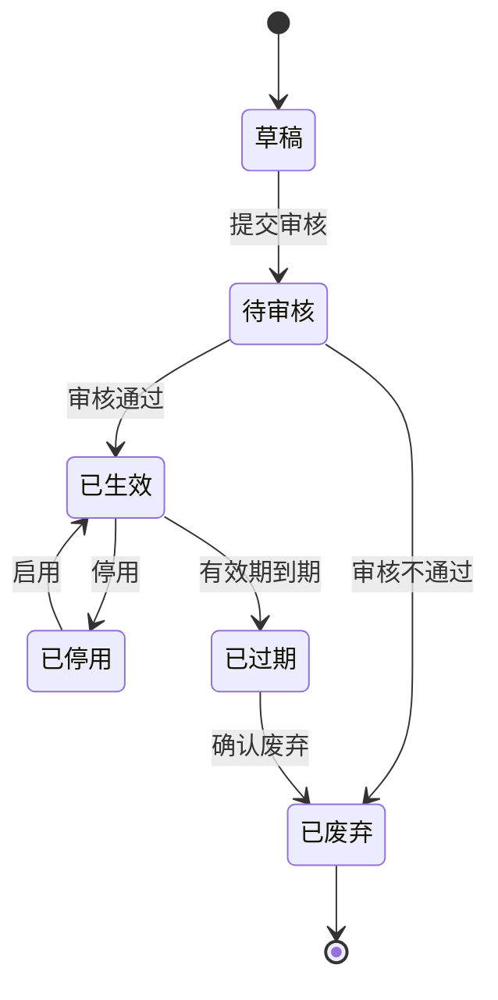

# 资料库_业务规则规格

> 文件定位：资料状态机、校验、权限和导入规则规格
> 配套：资料库主PRD.md / 资料库字段清单.md / 资料库_用例数据推演.md

## 一、状态机规格

### 1.1 流转表

| 当前状态 | 动作 | 目标状态 | 校验 |
|---|---|---|---|
| 新建 | 存为草稿 | 草稿 | 核心字段校验通过 |
| 草稿 | 提交审核 | 待审核 | 内容完整 |
| 待审核 | 审核通过 | 已生效 | 写入审核人/时间 |
| 待审核 | 审核不通过 | 已废弃 | 写入审核人/时间 |
| 已生效 | 停用 | 已停用 | 人工动作 |
| 已停用 | 启用 | 已生效 | 未超过有效期 |
| 已生效 | 到期检查 | 已过期 | 当前日期超过有效期止 |
| 已过期 | 确认废弃 | 已废弃 | 人工动作 |

### 1.2 使用能力矩阵

| 状态 | 可编辑 | 可审核 | 可被引用 | 可停用/启用 |
|---|---|---|---|---|
| 草稿 | ✅ | ❌ | ❌ | ❌ |
| 待审核 | 以实现为准，不得绕过审核 | ✅ | ❌ | ❌ |
| 已生效 | ✅（修改后的再审策略待确认） | ❌ | ✅ | 可停用 |
| 已停用 | ✅ | ❌ | ❌ | 可启用 |
| 已过期 | ❌ | ❌ | ❌ | 可废弃 |
| 已废弃 | ❌ | ❌ | ❌ | ❌ |

> “已生效资料修改后是否回到待审核”未在 SSOT 明确，保持待确认，不自行定义。

## 二、字段校验

| 字段 | 规则 | 错误提示建议 |
|---|---|---|
| title | 必填，≤200 | 标题必填 |
| content | 必填，非空白 | 正文必填 |
| class_id | 必填且分类存在 | 请选择分类 |
| source_type | 必须为确认枚举 | 请选择来源类型 |
| source_url | 可空 | 链接格式错误 |
| trust_level | 高/中/低 | 请选择可信度 |
| valid_from/valid_until | 必填 | 请选择有效期 |
| tags | 可空，可自由创建 | 标签名重复时复用已有标签 |

## 三、导入规则

- 接受 `.csv`、`.txt`；采用固定模板。
- 必填列：标题、内容、分类、来源类型、可信度、有效期起、有效期止。
- 多标签使用 `|` 分隔。
- 成功行进入待审核；失败行不影响成功行入库。
- 原文件留档；错误结果返回行号与原因。
- 模板具体列映射受问卷 5.7 影响，当前实现为固定模板，仍需人工确认长期格式。

## 四、AI 回写规则（R8）

| 项 | 规则 |
|---|---|
| 来源 | 仅已确认分析结果可触发 |
| 标记 | `is_ai_product=true` |
| 追溯 | `source_analysis_task_id` 必填 |
| 初始状态 | 待审核 |
| 使用条件 | 再次审核为已生效后可引用 |

## 五、权限规则

| 动作 | 管理员 | 成员 | 来源 |
|---|---|---|---|
| 查看/搜索 | ✅ | ✅（数据范围） | context/06 §2.2 |
| 新增/修改 | ✅ | ✅（数据范围） | context/06 §2.2 |
| 审核 | ✅ | ✅（数据范围） | context/06 §2.2 |
| 删除 | ✅ | 待确认 | context/06 §2.2 |
| 分类配置 | ✅ | ❌ | context/06 §2.2 |
| 标签创建 | ✅ | 待确认 | context/06 §2.2 |

实现差异：`MaterialReview.tsx` 当前对成员显示管理员专用空态；应由开发按 SSOT 修正或经业务方重新确认，本文不将其提升为规则。

## 六、异常与并发

- 重复提交审核应幂等，避免重复写审核记录。
- 已过期/已停用资料不出现在下游选择器。
- 删除被引用资料的保护策略未确认；成员不得默认获得删除权限。
- 导入按钮 loading 期间防重复上传。

## 七、修订记录

| 日期 | 变更 |
|---|---|
| 2026-08-24 | 初稿：状态、校验、导入、AI 回写和权限规格 |
