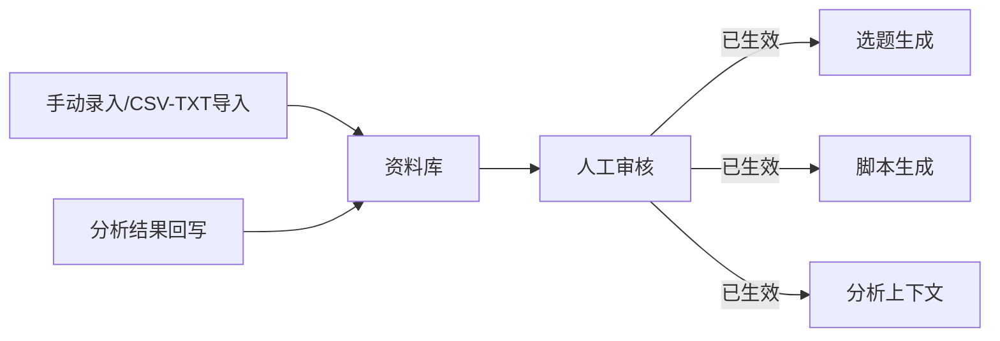
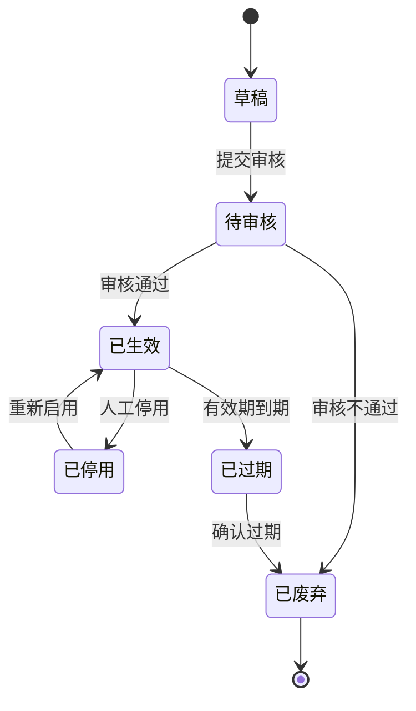

# 资料库主PRD

> 文件定位：资料库模块主 PRD（背景、范围、定位、场景、规则摘要、验收）
> 权威层级：context/ > templates/ > prd-docs/
> 配套文档：资料库字段清单.md / 资料库_业务规则规格.md / 资料库_业务流程推演.md / 资料库_用例数据推演.md / 资料库_Demo_*.md

## 1. 业务背景

资料库是内容生产和分析的知识底座。操盘手需要把商业研究结论、案例、评论和私信、个人观点、对标账号分析和热点统一沉淀，经审核后提供给选题、脚本和分析任务使用。

一期解决三件事：资料可录入/导入、事实质量可审核、已生效资料可检索和引用。AI 分析回写的资料必须标记为 AI 产物并重新审核，避免污染原始事实（R8）。

## 2. 功能范围

### 2.1 In Scope（一期）

| # | 功能 | 关键规则 |
|---|---|---|
| 1 | 手动新增/编辑资料 | 标题、正文、分类、来源、可信度、有效期为核心输入 |
| 2 | 保存草稿/提交审核 | 草稿与待审核分步流转（M01） |
| 3 | 资料审核 | 审核通过才可使用（R1） |
| 4 | 分类与标签 | 分类来自确认枚举；标签自由创建，标签组可选（R12/D1） |
| 5 | 搜索和查询 | 按关键词、分类、标签、状态组合筛选 |
| 6 | 有效期/停启用 | 记录有效期起止和可信度（R2） |
| 7 | CSV/TXT 导入 | 一期主路径；成功记录进入待审核（R16/D5） |
| 8 | AI 回写资料 | 标记 AI 产物和来源分析任务，审核后生效（R8） |

### 2.2 Should（非阻塞）

暂无已确认的独立 Should 功能。分类排序、资料版本等未确认能力不得作为一期阻塞验收。

### 2.3 Out of Scope / NIS

- 自动采集实际接入与定时采集（二期，D2/D5）
- 资料独立版本表（新增建议，待确认）
- 结果导出（二期）
- 平台发布、上传和电商交易

## 3. 模块定位

- 上游：人工录入、文件导入、已确认分析结果回写
- 下游：选题库、脚本库、数据分析
- 约束：未生效资料不得进入下游引用集合

## 4. 业务场景

### 场景 1：日常沉淀资料

管理员新增一条商业研究结论，填写来源、可信度和有效期，先保存草稿，确认内容后提交审核。审核通过后，该资料可被选题生成页和分析任务选择。

### 场景 2：批量导入历史资料

用户下载固定模板，填写 CSV/TXT 后上传。系统逐行校验，成功行进入待审核，失败行展示行号和原因，原文件留档。

### 场景 3：分析结果回写

已确认的分析结果生成候选资料，用户补齐分类、来源、可信度和有效期后回写。资料带 AI 产物标记，状态为待审核，审核后才生效。

## 5. 状态机

## 6. 核心业务规则

| 编号 | 规则 | 来源 |
|---|---|---|
| R1 | 资料必须审核后才能使用 | context/04 §1/§5 |
| R2 | 记录有效期起止和可信度 | context/04 §1/§5 |
| R8 | AI 产物与原始事实区分，AI 回写后重新审核 | context/04 §5 |
| R12 | 标签自由创建，标签组可选且不强制 | D1 |
| R16 | MVP 以手动录入 + CSV/TXT 导入为主 | D5 |

## 7. 权限设计

| 动作 | 管理员 | 成员 |
|---|---|---|
| 查看/搜索 | ✅ | ✅（受数据范围限制） |
| 新增/修改 | ✅ | ✅（受数据范围限制） |
| 审核 | ✅ | ✅（受数据范围限制） |
| 删除 | ✅ | 待确认 |
| 分类配置 | ✅ | ❌ |
| 标签创建 | ✅ | 待确认 |

> 以上以 `context/06-系统边界与角色权限.md` §2.2 为准。当前前端审核页仅管理员可操作，属于实现差异，不改变 SSOT。

## 8. 边界与异常

| 场景 | 处理 |
|---|---|
| 标题/正文为空 | 阻止保存并定位必填项 |
| 有效期缺失 | 阻止保存 |
| 未生效资料被下游选择 | 后端拒绝；选择器仅返回已生效资料 |
| 导入部分失败 | 成功行入库，失败行保留行号和原因 |
| AI 回写资料 | 强制 `is_ai_product=true`，状态待审核 |
| 已过期资料 | 不可被下游引用，可确认废弃 |

## 9. 验收重点

- [ ] 保存草稿与提交审核为两个明确动作
- [ ] 审核通过后资料可搜索/引用，驳回后为已废弃
- [ ] 分类、标签、关键词和状态组合查询正确
- [ ] 标签可在新增页自由创建，标签组可为空
- [ ] 有效期到期进入已过期，停用/启用流转正确
- [ ] CSV/TXT 成功行入待审核，失败行提示明确，原文件可追溯
- [ ] AI 回写资料有 AI 标记和来源任务，未经审核不可使用

## 10. 修订记录

| 日期 | 变更 |
|---|---|
| 2026-08-24 | 由原 01-资料库PRD.md 扩展为模块套件主 PRD；对齐 frontend 资料页与 R1/R2/R8/R12/R16 |
