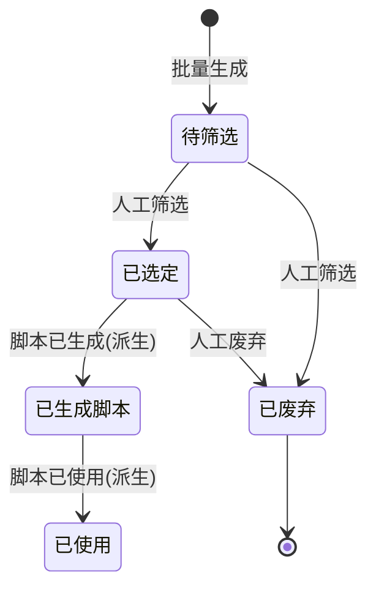

# 选题库_业务规则规格

> 文件定位：选题库状态机、校验、权限、方向联动规则的唯一定义
> 配套：选题库主PRD.md / 选题库字段清单.md / 选题库_业务流程推演.md / 选题库_用例数据推演.md

## 一、状态机设计

### 1.1 状态定义

| 状态 | 含义 | 触发方式 |
|---|---|---|
| 待筛选 | AI 生成后的初始态，未人工处理 | 批量生成成功自动进入 |
| 已选定 | 人工判定可用，可进入脚本生成 | 列表"选定"按钮（人工） |
| 已废弃 | 人工判定不可用 | 列表"废弃"按钮（人工） |
| 已生成脚本（派生） | 该选题已生成脚本 | 脚本库生成脚本成功（派生） |
| 已使用（派生） | 脚本已标记已使用 | 脚本库标记已使用（派生） |

### 1.2 状态流转图

### 1.3 状态流转表

| 当前状态 | 动作 | 目标状态 | 权限 | 校验 |
|---|---|---|---|---|
| 待筛选 | 选定 | 已选定 | 管理员/成员 | 无 |
| 待筛选 | 废弃 | 已废弃 | 管理员/成员 | 无 |
| 已选定 | 废弃 | 已废弃 | 管理员/成员 | 无（允许改判） |
| 已选定 | 生成脚本 | 已生成脚本（派生） | 管理员/成员 | 由脚本库生成动作触发 |
| 已生成脚本 | 标记已使用 | 已使用（派生） | 管理员/成员 | 由脚本库标记触发 |
| 已废弃 | — | 不可回流 | — | 废弃后不可恢复（如需恢复走"撤销废弃"二期） |

### 1.4 动作能力矩阵

| 状态 | 选定 | 废弃 | 修改标题 | 生成脚本（下游） | 删除 |
|---|---|---|---|---|---|
| 待筛选 | ✅ | ✅ | ✅ | ❌ | 管理员 |
| 已选定 | — | ✅ | ✅ | ✅ | 管理员 |
| 已废弃 | ❌ | — | ❌ | ❌ | 管理员 |
| 已生成脚本 | ❌ | ❌ | ❌ | — | ❌（保护下游） |
| 已使用 | ❌ | ❌ | ❌ | ❌ | ❌（保护下游） |

## 二、业务方向/专业方向联动规则（2026-08-24 确认）

### 2.1 数据结构

- 业务方向（一级）：独立表，name 唯一
- 专业方向（二级）：独立表，`business_direction_id` 外键挂业务方向，组内 name 唯一

### 2.2 即建即用规则

| 场景 | 行为 |
|---|---|
| 生成页选业务方向 | 下拉显示全部 active 业务方向；底部"+ 新增业务方向"弹输入框，提交成功自动选中并刷新下拉 |
| 生成页选专业方向 | 下拉只显示**当前选中业务方向**下的专业方向；底部"+ 新增专业方向"弹输入框（需已选业务方向），提交成功自动选中 |
| 未选业务方向 | 专业方向下拉**禁用**，提示"请先选择业务方向" |
| 切换业务方向 | 已选的专业方向**清空重置**，重新按新业务方向过滤 |
| 重名处理 | 业务方向重名拒绝；专业方向同业务方向下重名拒绝，均提示"已存在" |
| 输入校验 | 名称必填、长度 ≤50、去除首尾空格 |

### 2.3 接口规格

| 接口 | 方法 | 说明 |
|---|---|---|
| /api/directions | GET | 返回树：业务方向列表 + 每个下的专业方向列表 |
| /api/directions/business | POST | 新增业务方向 {name} |
| /api/directions/specialties | POST | 新增专业方向 {business_direction_id, name} |
| /api/topics/generate | POST | 生成选题（direction 名称 + specialty 名称/id） |

## 三、校验规则规格

### 3.1 生成校验

| 校验 | 规则 | 错误提示 |
|---|---|---|
| 业务方向必填 | direction 非空 | "请选择或新增业务方向" |
| 专业方向 | 可选；若填则必须存在且属于所选业务方向 | "专业方向不存在或不属于所选业务方向" |
| 生成条数 | 1-10 整数，默认 10 | "生成条数需在 1-10 之间" |
| 参考资料 | 仅可选 status=已生效 的资料 | "仅可选择已生效资料" |
| 提示词模板 | 可选；不选用内置模板 | — |

### 3.2 方向新增校验

| 校验 | 规则 |
|---|---|
| 业务方向重名 | name 在 business_direction 表唯一，冲突拒绝 |
| 专业方向组内重名 | (business_direction_id, name) 联合唯一，冲突拒绝 |
| 名称格式 | 非空、≤50 字符、trim 后校验 |

### 3.3 去重校验（R4/R14）

- 完全重复定义：**标题完全一致**（trim 后比对，忽略大小写?——一期按大小写敏感完全一致，二期优化）
- 去重范围：同批次内 + 跨批次（全表历史 + 本批新生成）
- 去重时机：AI 返回后、入库前，逐条比对；重复条目标记并跳过，不移除批次记录（保留"生成了但去重"的痕迹，可在返回结果中提示"N 条重复已跳过"）

## 四、AI 调用规则

| 项 | 规格 |
|---|---|
| 模型 | DeepSeek（deepseek-chat），OpenAI 兼容 chat/completions |
| 超时 | 120s 单次 |
| 重试 | 失败重试 3 次，指数退避 |
| 输出格式 | JSON 数组 [{"title","angle","why"}]，解析失败重试 |
| 提示词模板 | 内置模板（业务方向+专业方向+字数要求+输出格式）；可选择自定义模板覆盖 |
| 原始响应 | ai_raw_response 全量留档，S04 验收可查 |

## 五、权限规则

| 动作 | 管理员 | 普通成员 |
|---|---|---|
| 批量生成 | ✅ | ✅ |
| 新增业务/专业方向 | ✅ | ✅ |
| 选定/废弃 | ✅ | ✅ |
| 修改标题 | ✅ | ✅ |
| 删除选题 | ✅ | ❌ |
| 查看列表 | ✅ | ✅ |

## 六、边界与异常

| 场景 | 处理 |
|---|---|
| AI 返回空数组 | 提示"未生成有效选题，请调整方向或重试" |
| AI 返回格式错误 | 重试 3 次；失败提示并留档原始响应 |
| 生成中重复点击 | 按钮 loading + 防重入 |
| 已废弃选题误操作 | 不可恢复（一期）；提示"废弃后不可撤销" |

## 七、修订记录

| 日期 | 变更 |
|---|---|
| 2026-08-24 | 初稿：状态机/联动规则/校验/AI 规则定稿，对齐 D2/D3/D8 |