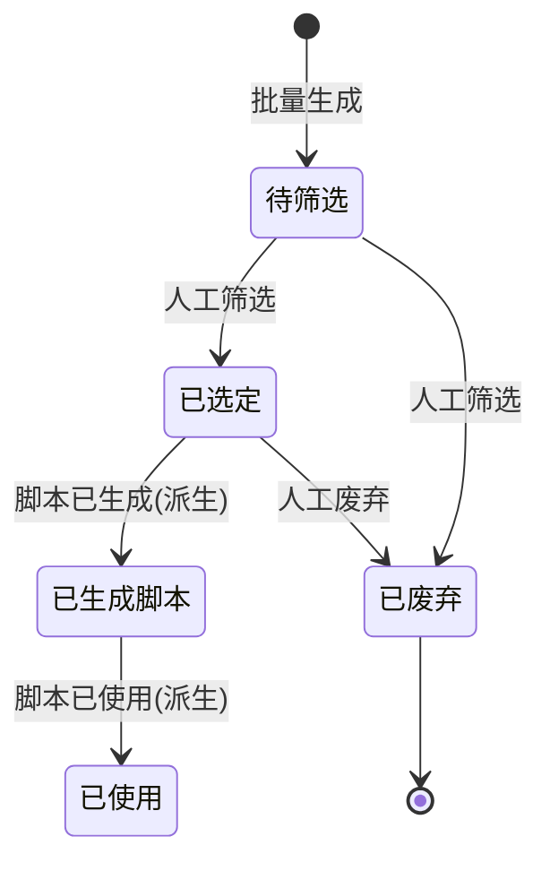

# 选题库主PRD

> 文件定位：选题库模块主 PRD（背景、范围、定位、场景、规则摘要、验收）
> 参照：forge-erp 采购入库单套件结构；权威层级 context/ > templates/ > prd-docs/
> 配套文档：选题库字段清单.md / 选题库_业务规则规格.md / 选题库_业务流程推演.md / 选题库_用例数据推演.md / 选题库_Demo_列表页.md / 选题库_Demo_生成页.md

## 1. 业务背景

姐夫（新媒体操盘手）运营企业类账号（视频号/公众号），需要持续产出选题。选题是内容生产的第一环：从"商业研究结论、案例、用户评论私信、对标账号、热点"等资料中提炼出可创作的方向，经人工筛选后进入脚本生成。

选题库解决的核心问题：**选题来源稳定、批量可生成、历史可追溯、避免重复**。AI（DeepSeek）按业务方向批量生成选题，人工筛选把关，保证"量够、质可控、不重复"。

## 2. 功能范围

### 2.1 In Scope（一期）

| # | 功能 | 关键规则 |
|---|---|---|
| 1 | 批量生成选题 | 按业务方向+专业方向，每批默认 10 条（上限 10），AI 生成 |
| 2 | 业务方向/专业方向管理 | **即建即用**：生成页可直接新增业务方向/专业方向；二级联动（专项挂业务方向下） |
| 3 | 完全重复去重 | 同批次+跨批次完全重复自动去掉（R14/D3） |
| 4 | 生成历史保留 | 每次生成留痕：批次号、方向、时间、AI 原始响应 |
| 5 | 人工筛选 | 待筛选 → 已选定 / 已废弃 |
| 6 | 选题人工修改 | 可编辑标题/角度（不建版本表，D8） |
| 7 | 选题列表/查询 | 按状态/方向/关键词筛选 |
| 8 | 参考资料引用 | 生成时可勾选"已生效"资料作为上下文 |

### 2.2 In Scope（希望有）

| # | 功能 |
|---|---|
| 1 | 选题批量导出（CSV） |

### 2.3 Out of Scope（二期/NIS）

- 语义去重（意思接近自动合并）——二期（D3）
- 选题版本历史表——二期评估（D8）
- 自动采集/定时生成——二期（D2/D5）
- 选题与脚本的追溯可视化——二期

## 3. 模块定位

选题库是"资料库 → 选题 → 脚本"链路的中间环节：

- 上游：资料库（参考资料）、业务方向/专业方向（自主维护）
- 下游：脚本库（选题 → 脚本生成）
- 辅助：AI 服务（DeepSeek 批量生成）、提示词模板

## 4. 业务场景

### 场景 1：日常批量薅选题（主场景）
姐夫今天想围绕"制造业获客"做一期内容 → 打开选题库 → 选业务方向"制造业获客"（可新建）→ 选专业方向"短视频获客"（可新建）→ 勾 3 条参考资料（可选）→ 点"开始生成" → 系统调 DeepSeek 返回 10 条选题 → 姐夫逐条筛选：5 条选定、3 条废弃、2 条改标题后选定。

### 场景 2：临时补方向（即建即用）
姐夫发现"招商加盟"值得做，但系统里没有这个方向 → 生成页业务方向下拉点"+ 新增"→ 输入"招商加盟" → 立刻出现在下拉并选中 → 继续选专业方向 → 直接生成，不用去基础数据页。

### 场景 3：重复检查
上次已生成过《企业如何低成本获客》，这批再次生成时系统自动去掉完全重复的，只保留新选题。

## 5. 状态机

状态说明（详见业务规则规格）：

- **待筛选**：AI 生成后初始态，未处理
- **已选定**：人工勾选可用，进入脚本生成候选
- **已废弃**：人工判定不可用
- 派生态（已生成脚本/已使用）由下游动作自动推进，不手动设置

## 6. 核心业务规则（摘要，详见业务规则规格）

| 编号 | 规则 | 来源 |
|---|---|---|
| R3 | 选题必须人工筛选后才能使用 | context/04 |
| R4 | 批量生成每方向 10 条，保留历史，跨批次完全重复去重 | context/04 |
| R14 | 一期只做完全重复去重，语义去重二期 | D3 |
| R19 | 一期允许人工修改选题，不建版本表 | D8 |
| 新增 | 业务方向/专业方向即建即用，专业方向挂业务方向（二级联动） | 2026-08-24 确认 |
| 新增 | 生成页未选业务方向时，专业方向下拉禁用 | 2026-08-24 确认 |

## 7. 权限设计

| 动作 | 管理员（姐夫） | 普通成员 |
|---|---|---|
| 批量生成选题 | ✅ | ✅ |
| 新增业务方向/专业方向 | ✅ | ✅ |
| 人工筛选（选定/废弃） | ✅ | ✅ |
| 修改选题标题 | ✅ | ✅ |
| 删除选题 | 仅管理员 | ❌ |

## 8. 边界与异常处理

| 场景 | 处理 |
|---|---|
| DeepSeek 返回超时 | 重试 3 次指数退避；仍失败提示"生成失败，请重试"，不产生脏数据 |
| AI 返回格式非 JSON | 解析失败重试；原始响应留档可查 |
| 新增业务方向重名 | 拒绝并提示"该业务方向已存在" |
| 新增专业方向组内重名 | 拒绝并提示"该专业方向已存在" |
| 生成时未选专业方向 | 允许（只填业务方向也可生成），或不选业务方向时专业方向禁用 |
| 参考资料未选 | 允许，用内置提示词模板 |

## 9. 验收重点

- [ ] 生成页业务方向/专业方向可即建即用（+ 新增入口有效）
- [ ] 二级联动：选业务方向后专业方向只显示该方向下的；切换业务方向清空专业方向
- [ ] 批量生成 10 条，跨批次完全重复去重
- [ ] 生成历史保留（批次号/方向/时间/AI 原始响应）
- [ ] 人工筛选（选定/废弃）状态流转正确
- [ ] 选题标题可修改，无版本表
- [ ] DeepSeek 失败重试与原始响应留档

## 10. 修订记录

| 日期 | 变更 |
|---|---|
| 2026-08-24 | 初稿：按 forge-erp 套件结构重写选题库主 PRD；新增业务方向/专业方向即建即用+二级联动；对齐 D2/D3/D5/D8 决策 |