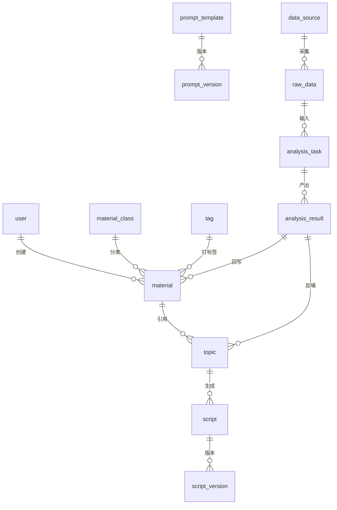

# 核心字段清单（MySQL Schema 前身）

> 状态：✅ 基于 context/05 展开（2026-08-24）
> 用途：正式开发（Opus 后端）建表依据；字段口径以 context/05 为唯一事实源
> 约定：主键=id 自增/雪花；时间=datetime；状态枚举见 context/04

## 1. 资料库

### 资料分类 material_class

| 字段 | 类型 | 必填 | 说明 |
|---|---|---|---|
| id | bigint PK | ✅ | 主键 |
| name | varchar(50) | ✅ | 分类名（唯一） |
| parent_id | bigint | 否 | 父级分类，可选层级 |
| sort | int | 否 | 排序 |
| created_at | datetime | ✅ | 创建时间 |

### 资料条目 material

| 字段 | 类型 | 必填 | 说明 |
|---|---|---|---|
| id | bigint PK | ✅ | 主键 |
| title | varchar(200) | ✅ | 资料标题 |
| content | longtext | ✅ | 资料正文 |
| class_id | bigint FK | ✅ | 所属分类 |
| source_type | enum | ✅ | 公众号/报告/社交/客户/思考/对标 |
| source_url | varchar(500) | 视情况 | 来源链接 |
| trust_level | enum | ✅ | 高/中/低 |
| valid_from | date | ✅ | 有效期起 |
| valid_until | date | ✅ | 有效期止 |
| status | enum | ✅ | 草稿/待审核/已生效/已停用/已过期/已废弃 |
| is_ai_product | bool | ✅ | 是否 AI 产物 |
| ref_source_id | bigint | 否 | 关联源资料（AI 回填） |
| reviewer_id | bigint | 条件 | 审核人 |
| reviewed_at | datetime | 条件 | 审核时间 |
| created_by | bigint | ✅ | 创建人 |
| created_at | datetime | ✅ | 创建时间 |

索引：class_id、status、valid_until、title(全文)

### 标签 tag

| 字段 | 类型 | 必填 | 说明 |
|---|---|---|---|
| id | bigint PK | ✅ | 主键 |
| name | varchar(50) | ✅ | 标签名（唯一） |
| group_name | varchar(50) | 否 | 标签组（客户行业/内容主题等维度） |
| created_by | bigint | ✅ | 创建人 |
| created_at | datetime | ✅ | 创建时间 |

### 资料-标签关联 material_tag

| 字段 | 类型 | 必填 | 说明 |
|---|---|---|---|
| id | bigint PK | ✅ | 主键 |
| material_id | bigint FK | ✅ | 资料 id（唯一+tag_id） |
| tag_id | bigint FK | ✅ | 标签 id |

## 2. 提示词体系

### 提示词模板 prompt_template

| 字段 | 类型 | 必填 | 说明 |
|---|---|---|---|
| id | bigint PK | ✅ | 主键 |
| task_type | enum | ✅ | 选题生成/脚本生成/资料分析/数据分析 |
| name | varchar(100) | ✅ | 模板名称 |
| content | text | ✅ | 提示词正文 |
| version | int | ✅ | 当前版本号 |
| status | enum | ✅ | 启用/停用 |
| created_by | bigint | ✅ | 创建人 |
| created_at | datetime | ✅ | 创建时间 |

### 提示词版本 prompt_version

| 字段 | 类型 | 必填 | 说明 |
|---|---|---|---|
| id | bigint PK | ✅ | 主键 |
| template_id | bigint FK | ✅ | 模板 id |
| version | int | ✅ | 版本号 |
| content_snapshot | text | ✅ | 内容快照 |
| changed_by | bigint | ✅ | 修改人 |
| changed_at | datetime | ✅ | 修改时间 |

## 3. 内容生产

### 选题 topic

| 字段 | 类型 | 必填 | 说明 |
|---|---|---|---|
| id | bigint PK | ✅ | 主键 |
| title | varchar(200) | ✅ | 选题标题 |
| direction | varchar(50) | ✅ | 方向（营销/企业/用户/需求链条/场景/用户视角/经营方向） |
| specialty | varchar(50) | ✅ | 专业方向 |
| status | enum | ✅ | 待筛选/已选定/已生成脚本/已使用/已废弃 |
| batch_no | varchar(50) | 否 | 生成批次号 |
| gen_task_id | bigint | 否 | 生成任务 id |
| created_by | bigint | ✅ | 创建人 |
| created_at | datetime | ✅ | 创建时间 |

索引：status、direction、batch_no

### 选题-资料引用 topic_material

| 字段 | 类型 | 必填 | 说明 |
|---|---|---|---|
| id | bigint PK | ✅ | 主键 |
| topic_id | bigint FK | ✅ | 选题 id（唯一+material_id） |
| material_id | bigint FK | ✅ | 引用资料 id |

### 脚本 script

| 字段 | 类型 | 必填 | 说明 |
|---|---|---|---|
| id | bigint PK | ✅ | 主键 |
| topic_id | bigint FK | 条件 | 所属选题（独立创建为空） |
| title | varchar(200) | ✅ | 脚本标题 |
| content | longtext | ✅ | 脚本正文 |
| style | enum | ✅ | 专业严谨/轻松口语/讲故事 |
| current_version | int | ✅ | 当前版本号 |
| status | enum | ✅ | 待审核/已通过/已使用/已废弃 |
| reviewer_id | bigint | 条件 | 审核人 |
| reviewed_at | datetime | 条件 | 审核时间 |
| created_by | bigint | ✅ | 创建人 |
| created_at | datetime | ✅ | 创建时间 |

索引：topic_id、status

### 脚本版本 script_version

| 字段 | 类型 | 必填 | 说明 |
|---|---|---|---|
| id | bigint PK | ✅ | 主键 |
| script_id | bigint FK | ✅ | 脚本 id |
| version | int | ✅ | 版本号（每改+1） |
| content_snapshot | longtext | ✅ | 正文快照 |
| changed_by | bigint | ✅ | 修改人 |
| changed_at | datetime | ✅ | 修改时间 |
| note | varchar(200) | 否 | 修改备注 |

## 4. 数据与分析

### 数据源 data_source

| 字段 | 类型 | 必填 | 说明 |
|---|---|---|---|
| id | bigint PK | ✅ | 主键 |
| name | varchar(100) | ✅ | 名称 |
| type | enum | ✅ | 自己账号/对标账号/行业报告/热点/评论私信 |
| platform | enum | ✅ | 视频号/其他 |
| config | json | 否 | 采集配置 |
| status | enum | ✅ | 启用/停用 |

### 原始数据 raw_data

| 字段 | 类型 | 必填 | 说明 |
|---|---|---|---|
| id | bigint PK | ✅ | 主键 |
| source_id | bigint FK | ✅ | 数据源 id |
| collected_at | datetime | ✅ | 采集时间 |
| raw_content | longtext | 否 | 原始内容（或对象存储路径） |
| structured | json | 否 | 结构化字段 |
| status | enum | ✅ | 已入库/已用/已废弃 |

### 分析任务 analysis_task

| 字段 | 类型 | 必填 | 说明 |
|---|---|---|---|
| id | bigint PK | ✅ | 主键 |
| name | varchar(100) | ✅ | 任务名称 |
| type | enum | ✅ | 数据分析/资料分析 |
| prompt_version_id | bigint FK | ✅ | 使用的提示词版本快照 |
| input_ref | json | ✅ | 输入数据引用（原始数据id/资料id集合） |
| output_result | json | 否 | 输出结果 |
| status | enum | ✅ | 待执行/执行中/已完成/失败/待审核/已确认/已废弃 |
| reviewer_id | bigint | 条件 | 审核人 |
| reviewed_at | datetime | 条件 | 审核时间 |
| created_by | bigint | ✅ | 创建人 |
| created_at | datetime | ✅ | 创建时间 |
| retry_count | int | ✅ | 重试次数 |

索引：status、created_at

### 分析结果 analysis_result

| 字段 | 类型 | 必填 | 说明 |
|---|---|---|---|
| id | bigint PK | ✅ | 主键 |
| task_id | bigint FK | ✅ | 任务 id |
| result_content | json | ✅ | 结构化结果（效果好坏/结论/建议） |
| writeback_status | enum | ✅ | 未回写/已回写资料库/已生成选题 |
| writeback_material_id | bigint | 否 | 回写生成的资料 id |
| writeback_topic_id | bigint | 否 | 反哺生成的选题 id |

## 5. 权限

### 用户 user

| 字段 | 类型 | 必填 | 说明 |
|---|---|---|---|
| id | bigint PK | ✅ | 主键 |
| username | varchar(50) | ✅ | 用户名（唯一） |
| password_hash | varchar(200) | ✅ | 密码哈希 |
| role | enum | ✅ | 管理员/成员 |
| status | enum | ✅ | 启用/停用 |
| data_scope | json | 否 | 数据权限范围（分类/数据源） |
| created_by | bigint | ✅ | 创建人 |
| created_at | datetime | ✅ | 创建时间 |
| last_login_at | datetime | 否 | 最后登录时间 |

## 表关系总览

