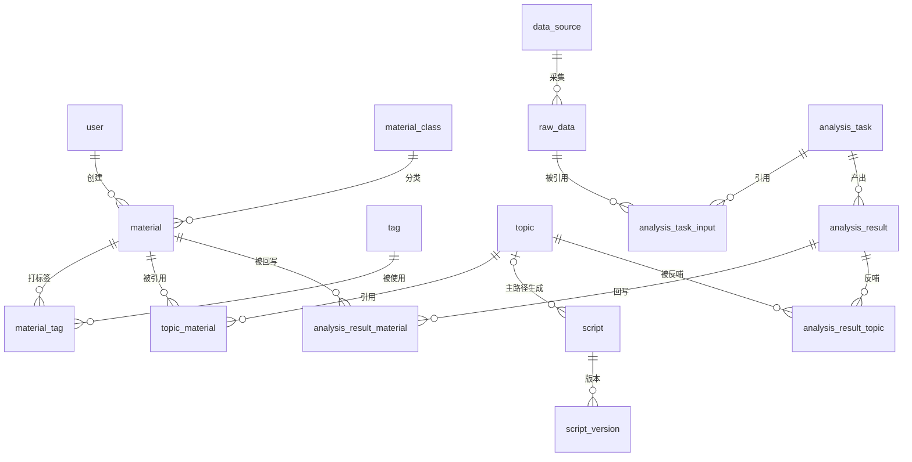

# 核心字段清单（MySQL Schema 前身）

> 状态：✅ 基于 `context/05-术语与字段口径.md` 展开（2026-08-24）
> 用途：正式开发（Opus 后端）建表依据；字段口径以 `context/05-术语与字段口径.md` 为唯一事实源
> 约定：主键=id 自增/雪花；时间=datetime；状态枚举见 `context/04-业务规则与状态机.md`
> 确认度：业务字段必须来自 `context/05-术语与字段口径.md`；主键/外键/必要时间戳属于数据库技术映射。标注“⚠️ 新增建议，待确认”的字段或实体不得作为 MVP 强制业务字段。

## 1. 资料库

### 资料分类 material_class

| 字段 | 类型 | 必填 | 说明 |
|---|---|---|---|
| id | bigint PK | ✅ | 主键 |
| name | varchar(50) | ✅ | 分类名（唯一） |
| parent_id | bigint | 否 | 父级分类，可选层级 |
| sort | int | 否 | ⚠️ 新增建议，待确认：排序技术字段 |
| created_at | datetime | ✅ | 数据库必要时间戳 |

### 资料条目 material

| 字段 | 类型 | 必填 | 说明 |
|---|---|---|---|
| id | bigint PK | ✅ | 主键 |
| title | varchar(200) | ✅ | 资料标题 |
| content | longtext | ✅ | 资料正文 |
| class_id | bigint FK | ✅ | 所属分类 |
| source_type | enum | ✅ | 公众号/报告/社交/客户/思考/对标 |
| source_url | varchar(500) | 视情况 | 来源链接 |
| trust_level | enum | ✅ | 高/中/低 |
| valid_from | date | ✅ | 有效期起 |
| valid_until | date | ✅ | 有效期止 |
| status | enum | ✅ | 草稿/待审核/已生效/已停用/已过期/已废弃 |
| is_ai_product | bool | ✅ | 是否 AI 产物 |
| source_analysis_task_id | bigint FK | 条件 | AI 回写资料关联的来源分析任务 |
| reviewer_id | bigint | 条件 | 审核人 |
| reviewed_at | datetime | 条件 | 审核时间 |
| created_by | bigint | ✅ | 创建人 |
| created_at | datetime | ✅ | 创建时间 |

索引：class_id、status、valid_until、title(全文)

### 标签 tag

| 字段 | 类型 | 必填 | 说明 |
|---|---|---|---|
| id | bigint PK | ✅ | 主键 |
| name | varchar(50) | ✅ | 标签名（唯一） |
| group_name | varchar(50) | 否 | ⚠️ 新增建议，待确认：标签组 |
| created_by | bigint | 否 | ⚠️ 数据库技术映射：创建人 |
| created_at | datetime | ✅ | 创建时间 |

### 资料-标签关联 material_tag

| 字段 | 类型 | 必填 | 说明 |
|---|---|---|---|
| id | bigint PK | ✅ | 主键 |
| material_id | bigint FK | ✅ | 资料 id（唯一+tag_id） |
| tag_id | bigint FK | ✅ | 标签 id |

## 2. 提示词体系

### 提示词模板 prompt_template

| 字段 | 类型 | 必填 | 说明 |
|---|---|---|---|
| id | bigint PK | ✅ | 主键 |
| task_type | enum | ✅ | 选题生成/脚本生成/资料分析/数据分析 |
| name | varchar(100) | ✅ | 模板名称 |
| content | text | ✅ | 提示词正文 |
| version | int | 否 | ⚠️ 新增建议，待确认：当前版本号 |
| material_combo | json | 否 | 固定关联资料组合 |
| output_schema | json | 条件 | 分析任务必填；选题/脚本为新增建议、待确认 |
| status | enum | 否 | ⚠️ 新增建议，待确认：启用/停用 |
| created_by | bigint | ✅ | 创建人 |
| created_at | datetime | ✅ | 创建时间 |

### 提示词版本 prompt_version

> ⚠️ 新增建议，待确认：是否作为 MVP 独立实体。以下结构不作为 MVP 必建表。

| 字段 | 类型 | 必填 | 说明 |
|---|---|---|---|
| id | bigint PK | ✅ | 主键 |
| template_id | bigint FK | ✅ | 模板 id |
| version | int | ✅ | 版本号 |
| content_snapshot | text | ✅ | 内容快照 |
| changed_by | bigint | ✅ | 修改人 |
| changed_at | datetime | ✅ | 修改时间 |

## 3. 内容生产

### 选题 topic

| 字段 | 类型 | 必填 | 说明 |
|---|---|---|---|
| id | bigint PK | ✅ | 主键 |
| title | varchar(200) | ✅ | 选题标题 |
| direction | varchar(50) | ✅ | 方向/分类 |
| specialty | enum | ✅ | 市场营销/企业经营/自媒体平台流量与规划算法逻辑/用户需求与痛点 |
| customer_scenario | varchar(200) | ✅ | 结合场景 |
| user_perspective | varchar(200) | ✅ | 用户视角 |
| business_direction | varchar(100) | ✅ | 经营方向 |
| core_angle | varchar(500) | ✅ | 核心角度 |
| topic_principle | varchar(200) | ✅ | 选题原则 |
| topic_angle | varchar(200) | ✅ | 选题角度 |
| status | enum | ✅ | 待筛选/已选定/已生成脚本/已使用/已废弃 |
| batch_no | varchar(50) | 否 | 生成批次号 |
| prompt_version_snapshot | json | 否 | 可选提示词版本追溯；仅 AI 批量生成路径写入 |
| ai_raw_response | longtext | 条件 | AI 批量生成时必填留档；独立/手动创建无 DeepSeek 调用，可为空 |
| screening_result | enum | 条件 | 选中/淘汰；完成筛选后必填 |
| created_by | bigint | ✅ | 创建人 |
| created_at | datetime | ✅ | 创建时间 |

索引：status、direction、batch_no

### 选题-资料引用 topic_material

> 可选追溯表；不记录资料引用时不阻塞选题生成、筛选或脚本生成。

| 字段 | 类型 | 必填 | 说明 |
|---|---|---|---|
| id | bigint PK | ✅ | 主键 |
| topic_id | bigint FK | ✅ | 选题 id（唯一+material_id） |
| material_id | bigint FK | ✅ | 引用资料 id |

### 选题版本 topic_version（待确认扩展）

> ⚠️ 新增建议，待确认；MVP 不作为必建表。

### 脚本 script

| 字段 | 类型 | 必填 | 说明 |
|---|---|---|---|
| id | bigint PK | ✅ | 主键 |
| topic_id | bigint FK | 条件 | 基于选题创建时必填并展示；独立创建时允许为空、可后补关联 |
| content | longtext | ✅ | 脚本正文 |
| style | enum | ✅ | 专业严谨/轻松口语/讲故事 |
| content_elements | json | ✅ | 案例/数据/个人观点 |
| current_version | int | ✅ | 当前版本号 |
| status | enum | ✅ | 草稿/待审核/已通过/已使用/已废弃；草稿/已使用为派生 |
| reviewer_id | bigint | 条件 | 审核人 |
| reviewed_at | datetime | 条件 | 审核时间 |
| created_by | bigint | ✅ | 创建人 |
| created_at | datetime | ✅ | 创建时间 |
| modified_by | bigint | ✅ | 最后修改人 |
| modified_at | datetime | ✅ | 最后修改时间 |
| material_refs | json | 否 | 可选资料追溯 |
| prompt_version_snapshot | json | 否 | 可选提示词版本追溯 |

索引：topic_id、status

### 脚本版本 script_version

| 字段 | 类型 | 必填 | 说明 |
|---|---|---|---|
| id | bigint PK | ✅ | 主键 |
| script_id | bigint FK | ✅ | 脚本 id |
| version | int | ✅ | 版本号（每改+1） |
| content_snapshot | longtext | ✅ | 正文快照 |
| changed_by | bigint | ✅ | 修改人 |
| changed_at | datetime | ✅ | 修改时间 |
| note | varchar(200) | 否 | ⚠️ 新增建议，待确认：修改备注 |

## 4. 数据与分析

### 数据源 data_source

| 字段 | 类型 | 必填 | 说明 |
|---|---|---|---|
| id | bigint PK | ✅ | 主键 |
| name | varchar(100) | ✅ | 名称 |
| collection_method | enum | ✅ | 自动采集/手动录入/CSV 导入 |
| business_object | enum | ✅ | 自己账号/对标账号/行业报告/相关热点/评论和私信 |
| platform | enum | 条件 | 视频号；非平台文本资料可为空 |
| account_identifier | varchar(200) | 条件 | 账号类数据必填 |
| is_benchmark | bool | ✅ | 是否对标账号 |
| config | json | 否 | ⚠️ 新增建议，待确认：API/OAuth/调度配置 |
| status | enum | 否 | ⚠️ 新增建议，待确认：启用/停用 |

### 原始数据 raw_data

| 字段 | 类型 | 必填 | 说明 |
|---|---|---|---|
| id | bigint PK | ✅ | 主键 |
| source_id | bigint FK | ✅ | 数据源 id |
| collected_at | datetime | ✅ | 采集时间 |
| raw_content | longtext | 否 | 原始内容（或对象存储路径） |
| structured | json | 否 | 结构化字段 |
| window_start | datetime | ✅ | 采集时间窗开始 |
| window_end | datetime | ✅ | 采集时间窗结束 |
| clean_dedup_record | json | ✅ | 清洗/去重规则或处理记录 |

### 分析任务输入 analysis_task_input

| 字段 | 类型 | 必填 | 说明 |
|---|---|---|---|
| id | bigint PK | ✅ | 主键 |
| task_id | bigint FK | ✅ | 分析任务 id |
| raw_data_id | bigint FK | ✅ | 原始数据 id；与 task_id 组成唯一约束 |

### 分析任务 analysis_task

| 字段 | 类型 | 必填 | 说明 |
|---|---|---|---|
| id | bigint PK | ✅ | 主键 |
| name | varchar(100) | 否 | ⚠️ 新增建议，待确认：任务名称 |
| type | enum | ✅ | 指定分析任务类型 |
| prompt_version_snapshot | json | 否 | 可选提示词版本快照 |
| material_context_snapshot | json | 否 | 可选资料库上下文快照 |
| output_schema | json | ✅ | 输出字段定义 |
| ai_raw_response | longtext | ✅ | AI 原始响应留档 |
| status | enum | ✅ | 待执行/执行中/已完成/失败/待审核/已确认/已废弃 |
| reviewer_id | bigint | 条件 | 审核人 |
| reviewed_at | datetime | 条件 | 审核时间 |
| created_by | bigint | ✅ | 创建人 |
| created_at | datetime | ✅ | 创建时间 |
| retry_count | int | 否 | ⚠️ 新增建议，待确认：重试次数 |

索引：status、created_at

### 分析结果 analysis_result

| 字段 | 类型 | 必填 | 说明 |
|---|---|---|---|
| id | bigint PK | ✅ | 主键 |
| task_id | bigint FK | ✅ | 任务 id |
| result_content | json | ✅ | 结构化结果（效果好坏/结论/建议） |
| writeback_material_status | enum | ✅ | 未回写/已回写 |
| writeback_topic_status | enum | ✅ | 未反哺/已反哺 |

### 分析结果-回写资料 analysis_result_material

| 字段 | 类型 | 必填 | 说明 |
|---|---|---|---|
| id | bigint PK | ✅ | 主键 |
| result_id | bigint FK | ✅ | 分析结果 id |
| material_id | bigint FK | ✅ | 回写生成的资料 id |

### 分析结果-反哺选题 analysis_result_topic

| 字段 | 类型 | 必填 | 说明 |
|---|---|---|---|
| id | bigint PK | ✅ | 主键 |
| result_id | bigint FK | ✅ | 分析结果 id |
| topic_id | bigint FK | ✅ | 反哺生成的选题 id |

## 5. 权限

### 用户 user

| 字段 | 类型 | 必填 | 说明 |
|---|---|---|---|
| id | bigint PK | ✅ | 主键 |
| account_identifier | varchar(100) | ✅ | 唯一登录标识 |
| credential_hash | varchar(200) | 否 | ⚠️ 新增建议，待确认：凭证摘要；具体登录方式待确认 |
| role | enum | ✅ | 管理员/成员 |
| status | enum | ✅ | 启用/停用 |
| functional_permissions | json | ✅ | 管理员分配的功能权限集合 |
| data_scope | json | ✅ | 数据权限范围（全量/指定资料分类/指定数据源） |
| created_by | bigint | ✅ | 创建人 |
| created_at | datetime | ✅ | 创建时间 |
| last_login_at | datetime | 否 | ⚠️ 新增建议，待确认：最后登录时间 |

## 表关系总览

## 待确认扩展实体

- `material_version`：资料版本，⚠️ 新增建议，待确认；MVP 不作为必建表。
- `topic_version`：选题版本，⚠️ 新增建议，待确认；MVP 不作为必建表。
- `prompt_version`：独立提示词版本，⚠️ 新增建议，待确认；MVP 不作为必建表。
- 资料来源不单独建表，MVP 使用 `material.source_type/source_url`。
