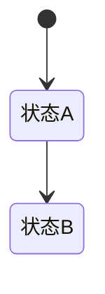

# PRD 模板（模块级）

> 模板用途：forge-scrm 各模块 PRD 统一结构。生成新模块 PRD 时按本模板填充。
> 权威层级：context/ > templates/ > prd-docs/

## 1. 模块概述

一句话定位（本模块做什么、服务谁）+ 与主PRD/其他模块的关系（依赖/被依赖）。

## 2. 功能清单

| # | 功能 | In/Out | 关键规则 |
|---|---|---|---|
| 1 | 功能名 | ✅ In | 规则引用（context/04 R编号） |

## 3. 交互流程

或分步文字说明。

## 4. 关键规则

引用 context/04 的 R 编号（R1-R11）；本模块新增规则需标注来源与确认度。

## 5. 状态机

引用 context/04 对应状态机，仅列本模块涉及的状态。

## 6. 数据字段

引用 context/05 字段 SSOT，只列本模块涉及字段及关系，标注必填/可选；不重复定义。

## 7. 权限

本模块操作权限（context/06 两级角色：管理员/成员）。

## 8. 验收标准

可勾选测试用例：正常路径 + 边界 + 异常。

## 9. 待确认事项

本模块遗留问题；无则写"无"。